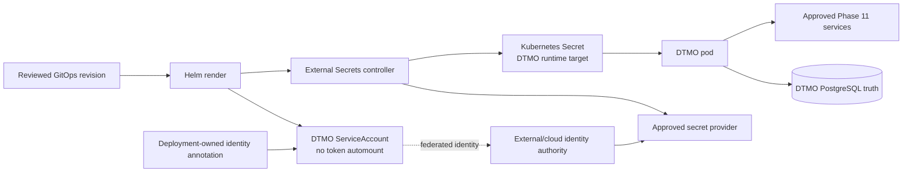

# Phase 11.8b — Workload Identity and External Secret Delivery

Status: **IN PROGRESS / EXACT-HEAD VALIDATION REQUIRED**

## Objective

This bounded Phase 11.8 slice removes runtime secret material from GitOps-managed configuration and establishes a workload-identity attachment point for the DTMO application ServiceAccount. It does not introduce provider credentials, cloud-specific IAM policy, production secrets or deployment evidence into the repository.

## Security contract

The DTMO pod continues to run with `automountServiceAccountToken=false`. Cloud or platform workload identity is attached only through explicit ServiceAccount annotations supplied by the deployment owner. The chart never stores identity credentials.

External secret delivery is optional and fail closed. When enabled, the Helm chart renders an `ExternalSecret` that references an explicitly named `SecretStore` or `ClusterSecretStore`, requires at least one explicit remote-key mapping and writes only to the configured Kubernetes Secret target. DTMO consumes that resulting Secret through `envFrom`; it never reads the external provider API directly.

No default remote secret names, provider endpoints, account identifiers, tokens or secret values are committed to Git.

## Trust boundary

The External Secrets controller, cloud IAM system and secret provider remain separate operational and licensing boundaries. Their installation, entitlement, identity federation, secret ACLs and availability are deployment responsibilities and are not proven by repository CI.

## Authority invariants

Workload identity grants only the minimum machine capability required to obtain approved runtime secrets. It does not grant analyst permissions, publication/share authority, Cortex responder authority, TheHive case-handoff authority or any right to change MISP/OpenCTI/Taranis/IntelOwl service policy.

Secret availability also does not prove service entitlement, lawful disclosure, local compromise or production readiness. Missing identity, store reference, remote mapping or rendered target Secret is a deployment blocker.

## Acceptance boundary

Repository acceptance can prove Helm rendering contracts, absence of committed secret material, explicit identity/store configuration points and synchronized documentation. Live provider authentication, rotation, revocation, cloud audit events, controller admission, secret propagation and production-equivalent behavior require later deployment-bound validation.
