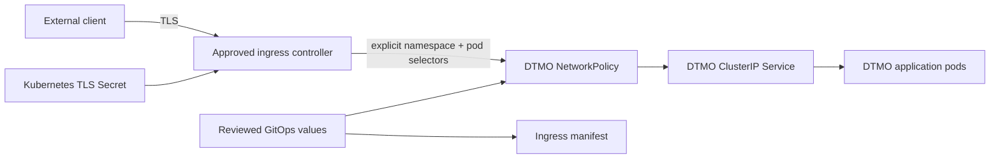

# Phase 11.8c — Ingress TLS and network segmentation

## Scope

This bounded Phase 11.8 slice establishes a governed north-south entry boundary for the DTMO Kubernetes workload. It adds an optional Kubernetes Ingress that is TLS-only when enabled and narrows application ingress to an explicitly selected ingress-controller namespace and pod set. It does not establish live certificate issuance, controller admission, CNI enforcement, external availability or production readiness.

## Security invariants

- `ingress.enabled=false` remains the **fail closed** default.
- Enabling ingress requires an explicit `ingressClassName`, hostname and TLS Secret name.
- Plain HTTP-only ingress is not an accepted configuration; `ingress.tls.enabled` must remain true.
- The DTMO Service remains `ClusterIP`; the ingress controller is the only intended north-south path in this slice.
- NetworkPolicy remains enabled when ingress is enabled.
- The ingress peer must be constrained by both an explicit namespace selector and an explicit pod selector.
- DTMO application pods do not gain publication/share authority, case authority, responder authority or evidence authority through network reachability.
- Missing or ambiguous ingress/TLS/network policy configuration **fails closed**.

## Trust boundary

TLS termination and certificate material remain deployment-environment responsibilities. The repository stores only the configured Secret reference, never private key material.

## Evidence boundary

Repository CI can prove static Helm values/template and documentation contracts. It does not prove DNS ownership, certificate validity, external routing, ingress-controller behavior, CNI enforcement, cloud load-balancer policy, WAF behavior, availability, HA or production authorization. Those require later production-equivalent validation and independent assurance against the integrated candidate.
