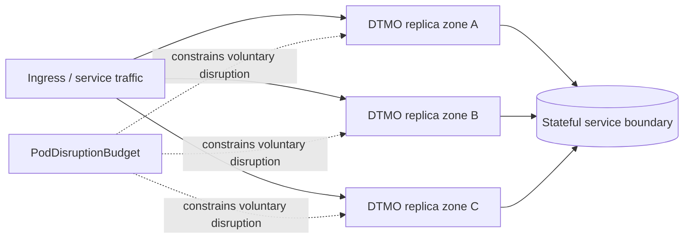

# Phase 11.8d — HA and disruption hardening

## Scope

This bounded Phase 11.8 slice strengthens application-level multi-zone scheduling and defines the stateful dependency HA boundary without claiming live provider failover. DTMO application replicas are spread across zones and hosts with fail closed scheduling constraints, protected by a PodDisruptionBudget and graceful termination settings.

## Availability boundary

The Helm contract requires at least two DTMO replicas, enables zone and hostname topology spread with `DoNotSchedule`, and uses required pod anti-affinity across hosts. These controls reduce correlated application-pod failure risk but do not prove cluster, node-pool or availability-zone resilience.

Stateful services remain separate deployment responsibilities. PostgreSQL, Redis, OpenSearch and object storage must have provider-appropriate replication, quorum, failover and durability designs before production-equivalent validation. This repository slice does not vendor or manufacture stateful HA implementations.

## Security and authority invariants

Availability controls do not alter service licensing boundaries, provenance, RBAC, human publication/share authority, case-handoff authority or local-compromise evidence rules. Missing required HA configuration fails closed.

## Evidence boundary

Repository CI does not prove live multi-zone placement, zone failure survival, stateful quorum, provider failover, storage durability, recovery objectives, production-equivalent behavior, independent assurance or production authorization. Those claims require deployment-bound evidence later in Phase 11.
