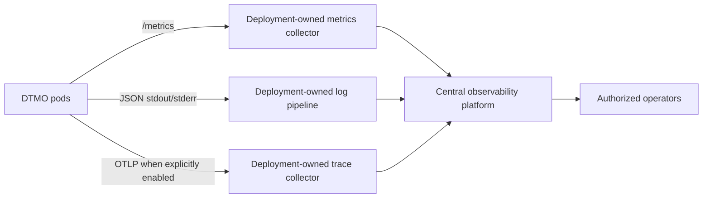

# Phase 11.8e — Observability hardening

## Scope

This bounded slice establishes the repository-side contract for centralized metrics, structured logs and distributed traces for the Kubernetes runtime. It does not claim a live monitoring backend or production observability.

## Architecture

## Governed boundaries

- Metrics discovery is opt-in. `ServiceMonitor` is disabled by default and may only be rendered when metrics exposure is explicitly enabled.
- The repository defines the metrics path and scrape contract; the Prometheus Operator/CRD and monitoring backend remain deployment-owned dependencies.
- Application logs remain structured JSON on stdout/stderr. Credentials, secret values and raw authorization tokens must not be logged.
- Trace export is disabled by default. An OTLP endpoint is deployment configuration, not a credential store.
- Observability data is diagnostic evidence only. It does not grant publication/share authority, case authority, responder authority or production authorization.
- Missing collectors, CRDs, endpoints or credentials fail closed: telemetry export is not silently treated as proven.

## Evidence boundary

Repository CI can prove Helm rendering, opt-in/fail-closed configuration and documentation contracts. It does not prove live metric ingestion, log completeness, trace continuity, alert delivery, retention, SLO attainment, production-equivalent behavior or independent assurance.
