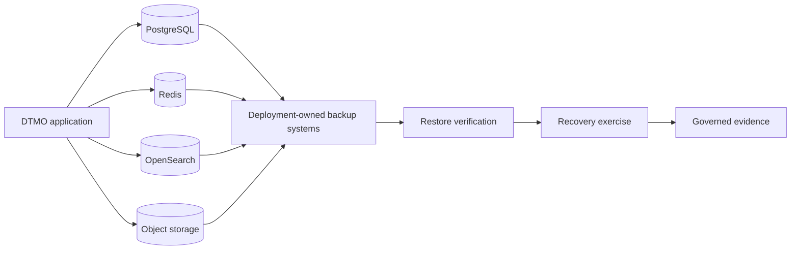

# Phase 11.8f — Backup, restore and recovery hardening

## Scope

This bounded Phase 11.8 slice defines the governed recovery contract for the integrated DTMO runtime. It covers PostgreSQL, Redis, OpenSearch and object storage as separate stateful recovery domains and requires deployment-owned backup, restore and recovery evidence before production-equivalent validation.

## Recovery model

## Invariants

- Backup success is never inferred from scheduler, CI or provider configuration alone.
- Each stateful domain must have an explicit owner, backup method, retention policy, restore procedure and recovery-test cadence.
- RPO and RTO are deployment-owned policy targets and must be verified against measured recovery evidence.
- Restore evidence must preserve provenance and must not expose credentials, secret values, personal data or restricted CTI payloads.
- Application availability, publication/share authority, case authority and responder authority are not expanded by recovery tooling.
- Missing backup ownership, restore verification or recovery evidence must **fail closed** for later production-equivalent acceptance; absence of evidence can never be interpreted as successful recovery capability.

## Evidence boundary

Repository CI can prove documentation and recovery-contract tests. It does not prove successful live backups, point-in-time recovery, provider durability, achieved RPO/RTO, disaster failover, production-equivalent behavior, independent assurance or production authorization.
