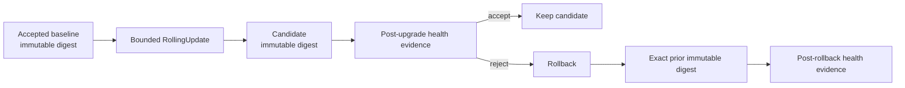

# Phase 11.8i — Upgrade and rollback architecture

## Scope
This bounded slice turns the DTMO application rollout path into an explicit, evidence-producing upgrade and rollback contract. It covers the stateless DTMO Kubernetes Deployment only. It does not prove live-cluster behavior, stateful data rollback, production-equivalent availability, independent assurance or production authorization.

## Controlled transition model

## Invariants
- Every baseline, candidate and rollback application image uses an immutable digest.
- The rollback target is the exact prior accepted digest, not a mutable tag or a newly rebuilt approximation.
- `maxUnavailable` remains `0`; `maxSurge` remains at least `1`.
- Kubernetes revision history preserves at least two revisions.
- A finite progress deadline and non-zero minimum-ready period bound rollout acceptance.
- Upgrade success requires health evidence after the candidate transition.
- Rollback success requires health evidence after restoration of the prior digest.
- Missing baseline identity, candidate identity, prior-revision identity or required health evidence must **fail closed**.
- Human change authority remains required. An automated rollout mechanism does not grant production authorization.

## Database and state boundary
Application rollback is not equivalent to database rollback. **Automatic database down migration is forbidden** by this Phase 11.8i contract. Schema changes must remain backward-compatible across the bounded application rollback window or be governed through a separately reviewed migration/recovery procedure. A destructive or irreversible migration blocks any claim that application rollback alone is safe.

Stateful PostgreSQL, Redis, OpenSearch and object-storage recovery remain governed by Phase 11.8f recovery controls. This slice does not reinterpret backup/restore evidence as deployment rollback evidence and does not reinterpret deployment rollback evidence as data recovery evidence.

## Evidence boundary
CI exercises a deterministic repository transition from one synthetic immutable digest to a second immutable digest and back to the exact first digest. That proves the contract and evidence mechanism, not a live Kubernetes rollback. Phase 11.10 must exercise upgrade, rollback, health, saturation and recovery behavior against one immutable production-equivalent integrated candidate. Phase 11.11 remains independent assurance. Phase 12 remains the formal production authorization decision.
