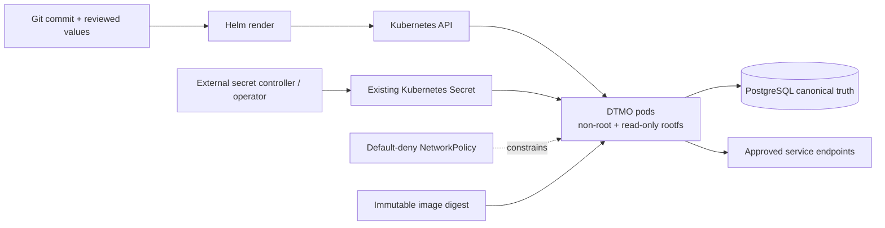

# Phase 11.8 Runtime Foundation Architecture

## Status

`IN PROGRESS / EXACT-HEAD VALIDATION REQUIRED`

## Objective

This bounded Phase 11.8 slice establishes the governed Kubernetes/Helm/GitOps foundation for the DTMO application workload. It does not claim production readiness, live cluster evidence, HA acceptance, disaster-recovery proof or supply-chain attestation completion.

## Trust and authority boundaries

DTMO remains canonical application truth in PostgreSQL. Taranis AI, IntelOwl, Cortex, OpenCTI, MISP and TheHive remain separate service boundaries with their existing licensing, identity and human-authority rules. Kubernetes placement does not collapse those boundaries and does not grant publication/share authority or prove local compromise.

## Foundation invariants

- Runtime images are referenced by immutable digest; mutable tags alone are rejected by the chart.
- Secrets are not committed to Git values. The workload consumes an existing Kubernetes Secret populated by an approved external-secret mechanism or equivalent deployment control.
- Pods run as UID/GID 10001, non-root, with `RuntimeDefault` seccomp, dropped Linux capabilities, no privilege escalation and a read-only root filesystem.
- Service-account token automounting is disabled.
- NetworkPolicy is enabled by default. Same-namespace traffic and cluster DNS are permitted; external CIDRs require explicit configuration.
- Two replicas and a PodDisruptionBudget form the minimum availability foundation, but do not prove end-to-end HA of stateful dependencies.
- Health probes use `/health`; resource requests and limits are mandatory defaults.

## Explicitly deferred within Phase 11.8

This slice does not complete multi-zone/stateful HA, backup/restore exercises, centralized metrics/logs/traces, ingress/TLS policy, workload identity federation, External Secrets Operator installation, SBOM generation, vulnerability scanning, signing/verification, provenance attestations, capacity tests or upgrade/rollback exercises. Those remain subsequent bounded Phase 11.8 work and must not be inferred from this repository contract.

## Evidence boundary

Repository tests may prove chart and policy contracts. They cannot prove cluster admission, cloud IAM, secret-provider permissions, network enforcement by a specific CNI, runtime availability, recovery objectives or production-equivalent behavior.
