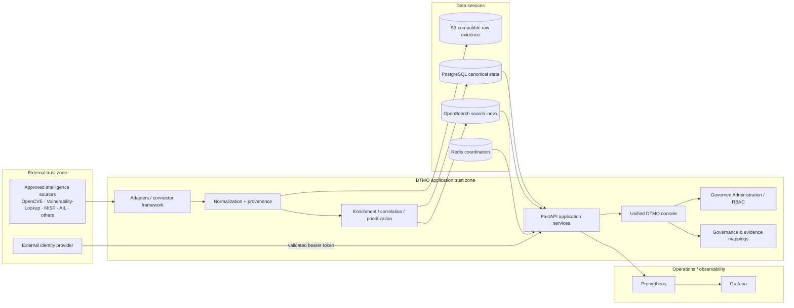

# DTMO System Architecture

Last updated: **2026-08-15**  
Software baseline: **16.0.0rc12 plus accepted post-RC13/E8 repository enhancements**  
Functional product state: **RC13 PASS / OWNER_ACCEPTED**

## 1. Purpose and architectural goals

DTMO is an education-focused Cyber Threat Intelligence platform for governed collection, raw-evidence retention, provenance-preserving normalization, vulnerability/CTI enrichment and correlation, investigation/review, native analytics, Administration and Governance.

The architecture is designed around durable canonical intelligence, explicit provenance, fail-closed source execution, least privilege, separation of duties, human review/share authority, privacy/data minimization, auditable privileged state changes and explicit evidence boundaries between repository CI, owner acceptance, staging evidence, independent assurance and production authorization.

## 2. Logical architecture

## 3. Architecture layers

### 3.1 Source ingress

Provider-specific adapters and governed source profiles operate through a common connector framework with explicit source identity, endpoint/profile validation, timeout/retry/replay/freshness behavior, provenance, raw-evidence retention and logical secret references.

The repository-complete source ecosystem includes OpenCVE, CIRCL Vulnerability-Lookup, governed MISP read and separately governed outbound export, governed AIL read/enrichment/correlation, and the previously supported curated source framework. MISP sharing remains human-approved and source/distribution restrictions remain authoritative. AIL integration does not create autonomous crawler or mutation authority.

### 3.2 Normalization and provenance

Provider payloads become canonical intelligence candidates through fail-closed normalization. DTMO preserves source identity, source references, timestamps, confidence/context and only derives fields supported by explicit contracts. Missing data is not invented.

Vulnerability processing may preserve or derive governed CVE, vendor/product, CWE, CVSS, EPSS, KEV and sighting context where supported by source evidence. These fields retain semantic boundaries and do not imply local exposure, exploitability or compromise.

### 3.3 Canonical persistence

| Component | Responsibility | Authority |
|---|---|---|
| PostgreSQL | Canonical intelligence, RBAC, mappings and application state | **Canonical application truth** |
| OpenSearch | Search/index representation | Supporting index |
| S3-compatible object storage | Raw source/evidence objects | Evidence retention |
| Redis | Cache, coordination and queue/runtime state | Ephemeral/supporting state |

Successful durable ingestion is not reported before canonical PostgreSQL commit completes. Search/index or raw-object success alone is not canonical application success.

### 3.4 Application services

FastAPI services expose authenticated APIs for source/catalog operations, intelligence investigation, vulnerability analytics/prioritization, MISP/AIL governed capabilities, dashboard/analytics summaries, Administration/RBAC, Governance mappings/evidence and operational health/metrics.

### 3.5 Canonical browser product

The canonical navigation comprises:

1. **Overview** — KPIs, source state, severity and vulnerability trends;
2. **Intelligence** — normalized records, provenance, classification and vulnerability/CTI context;
3. **Sources & Catalog** — governed source onboarding, activation and execution;
4. **Visual Analytics** — native analytical and vulnerability trend/facet views;
5. **Administration** — governed principals, roles, permissions and privileged controls;
6. **Governance** — framework knowledge, control crosswalks and evidence mappings.

Grafana remains a separately authenticated operational/advanced dashboard surface and is not required for normal application analytics.

### 3.6 Identity and authentication

Bearer tokens are externally issued and cryptographically validated according to configured issuer/audience/signature and DTMO claim constraints. Managed local principal/role state does not silently mint or rewrite externally issued token claims.

### 3.7 Authorization and Administration

Server-side RBAC remains authoritative. DTMO preserves human/service-account separation, least privilege, privileged Administration controls, self-management/final-admin safeguards, resource/permission scoping, attributable audit records and request correlation. Client-supplied role/identity values do not establish privilege.

### 3.8 Review and external-share authority

Technical ingestion creates candidate intelligence. Analysis/review and external sharing are separate authorities. Connectors, service accounts, CI, Administration, Governance, analytics or staging access cannot authorize publication or sharing. Governed MISP export remains separately feature-controlled, review/share-approved and replay-protected.

### 3.9 Observability

Prometheus receives bounded operational metrics; Grafana provides separately authenticated operational/advanced dashboards. Observability includes API health, connector state/freshness, queue behavior, search/storage health, request/correlation context, alerts and runbook-linked operational signals.

### 3.10 Governance knowledge and framework mapping

DTMO now implements explicit, versioned and provenance-backed governance relationships rather than an unmapped placeholder model.

- **Normenkader IBP** — explicit partial DTMO control crosswalks and governed evidence relationships, including vulnerability-management evidence for `SM.07` and supporting controls;
- **MITRE ATT&CK** — explicit threat/detection/classification context and governed technique relationships;
- **NIST CSF 2.0** — explicit DTMO control/outcome relationships;
- **CVSS 4.0** — vulnerability-scoring context with explicit claim boundaries rather than a compliance framework.

The authoritative mapping registry is `docs/governance/GOVERNANCE_MAPPING_REGISTRY.md`. Mappings never imply blanket compliance, certification, maturity, local exploitability or remediation completion.

## 4. Trust boundaries

Important boundaries include:

1. external provider → source adapter framework;
2. external identity provider → bearer-token validation;
3. unauthenticated client → authenticated API;
4. authenticated principal → privileged Administration/review/share actions;
5. service identity → human decision authority;
6. application → PostgreSQL/OpenSearch/Redis/object storage;
7. normalized candidate → canonical commit boundary;
8. canonical application → separately authenticated Grafana;
9. governance registry/evidence → visible mapping claims;
10. repository CI/emulator → accountable external evidence;
11. accepted staging candidate → independent external assurance;
12. technical access/execution → human publication/share authority.

## 5. Deployment architecture

### 5.1 Local/reference environment

Docker Compose provides a reproducible engineering/reference topology. Development-only bootstrap/admin credential compatibility patterns must not cross into staging or production.

### 5.2 Phase 8 staging

The post-E8 candidate has been externally deployed and owner-tested in an approved production-equivalent staging environment. Formal Phase 8 closure still requires one immutable deployment identity containing/referencing environment/owner, access path, exact release/commit, immutable image digests, runtime inventory, configuration parity/deviations, least-privilege IAM/secrets, TLS/network controls, controlled data handling, change/rollback evidence and deployment-time security review.

Repository contracts for platform/identity, source-to-intelligence, operations/recovery and accountable staging acceptance are complete; external evidence acceptance remains required.

## 6. Release and evidence architecture

DTMO uses exact-head CI discipline: final PR head is the automated evidence unit; a new commit invalidates earlier exact-head evidence; queued/skipped/cancelled/failed/stale/inaccessible results are not `PASS`; protected merge uses expected-head protection; repository CI cannot manufacture external acceptance.

Current acceptance state:

- Phases 1–7: `PASS`;
- RC13: `PASS / OWNER_ACCEPTED`;
- E8.1–E8.10: `PASS / REPOSITORY_COMPLETE`;
- post-E8 staging deployment: `PASS / OWNER_VERIFIED_EXTERNAL_EVIDENCE`;
- Phase 8.2–8.4: repository contracts complete, external acceptance required;
- Phase 8.5: repository contract complete, external owner decision required;
- Phase 9: `NOT COMPLETE`;
- Phase 10: `NOT STARTED`.

## 7. Principal technology stack

- Python 3.12+
- FastAPI / Uvicorn
- SQLAlchemy / Alembic
- PostgreSQL
- Redis
- OpenSearch
- S3-compatible object evidence storage
- Prometheus
- Grafana
- Nginx
- Docker Compose reference topology

## 8. Security invariants

- server-side RBAC and least privilege;
- strict human/service-account separation;
- protected privileged Administration;
- externally validated identity trust;
- explicit, non-inferred framework mappings;
- human review/share approval separate from technical execution;
- provenance/confidence preservation;
- privacy/data minimization;
- auditable privileged transitions and request correlation;
- no raw secret values in repository evidence;
- no automatic publication authority from connectors, CI, analytics, Administration, Governance or staging;
- no anonymous Grafana access for convenience.

## 9. Planned architectural extensions

Further product evolution is intentionally secondary to the active production-readiness evidence path. Any new extension must preserve the canonical persistence, provenance, security and governance boundaries above and must trigger staging/assurance revalidation when it materially changes the candidate under evidence.
