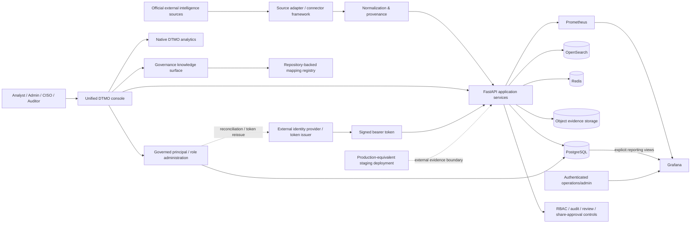

# DTMO System Architecture

Last updated: **2026-08-12**  
Current baseline: **16.0.0rc12**

## Purpose

DTMO is an education-focused Cyber Threat Intelligence platform that collects official threat/vulnerability intelligence, normalizes it with provenance, supports governed investigation and administration, and presents operational and intelligence analytics without collapsing human approval boundaries.

## Logical architecture

## Architecture layers

### Source ingress and canonical intelligence

Provider-specific adapters operate through the governed source framework with explicit source identity, supported execution profiles, timeout/retry behavior, fail-closed parsing and provenance retention. Credentialed sources use logical secret references only.

Provider payloads are normalized into canonical intelligence records while preserving source identity, evidence references, confidence and publication metadata. Missing enrichment is not invented.

### Application and persistence

The Python 3.12+/FastAPI application provides authenticated APIs, source operations, search/investigation, administration, metrics and governance workflows. The canonical browser product is the **unified DTMO console**.

PostgreSQL stores application and governed assignment state; OpenSearch provides intelligence search/index state; Redis provides cache/queue coordination; S3-compatible object storage retains evidence objects.

### Identity and RBAC administration

Production bearer tokens are externally issued and cryptographically validated. Managed principal/role state does not rewrite an already issued token; production role changes require identity-provider reconciliation or token reissue.

Built-in roles remain code-controlled. Service accounts cannot combine machine and human/admin roles. RBAC administration requires human administrator authority, blocks self-management, protects the final active managed admin and appends allowed mutations to the tamper-evident audit chain with request correlation.

### Observability and analytics

Prometheus collects bounded application/operational metrics. Grafana remains separately authenticated for advanced/operations use.

Normal product analytics are **native DTMO chart/table views** backed by application APIs. Canonical product navigation does not require or request a Grafana second-login path.

### Governance knowledge

The repository-backed Governance surface distinguishes framework context from actual mappings:

- Normenkader IBP — `UNMAPPED`;
- MITRE ATT&CK — `UNMAPPED`;
- CVSS — `CONTEXT_ONLY`;
- DTMO internal security/release governance — `MAPPED_INTERNAL` to explicit repository evidence.

No semantic similarity creates a mapping. Future external framework crosswalks require explicit versioned datasets with provenance and review.

## Canonical browser boundary and RC13 acceptance

Source operations, recent Intelligence, native Visual analytics, governed Administration and read-only Governance knowledge all use the same FastAPI/unified-console application boundary.

RC13.5 proved the accepted RC13 slices operate together in one Chromium browser context and canonical session. On 2026-08-12 the accountable project owner separately accepted the repaired product with `RC13 owner retest akkoord`.

**RC13 = PASS.**

## Phase 8 external deployment boundary

The next trust boundary is the **real production-equivalent staging deployment**. Repository intent and emulator behavior are not equivalent to an external deployment identity.

Before deployed-environment acceptance begins, Phase 8.1 must bind all later evidence to one immutable identity containing, at minimum:

- approved environment identifier and accountable owner;
- approved reachable endpoint;
- deployed release/commit and immutable image/container digests;
- infrastructure/runtime and configuration-parity evidence;
- least-privilege identity/secrets references;
- TLS/network evidence;
- data-handling/no-production-credential evidence;
- deployment, rollback and security-review evidence.

`docs/staging/PHASE8_DEPLOYMENT_IDENTITY_RECORD.md` is the fail-closed intake record. Its initial state is `PENDING_EXTERNAL_DEPLOYMENT_IDENTITY` with `evidence_complete: false`.

## Trust boundaries

Important trust boundaries are:

1. external provider networks → connector/source ingress;
2. external identity provider/token issuer → bearer-token trust validation;
3. unauthenticated client → authenticated application boundary;
4. authenticated role → privileged administration/review/share actions;
5. managed assignment state → external identity-provider reconciliation/token reissue;
6. application → database/search/cache/object services;
7. Grafana → separately authenticated reporting/operations boundary;
8. canonical browser → FastAPI/unified-console native product boundary;
9. repository mapping registry → visible framework/mapping claims;
10. repository CI/emulator → owner-observed local product;
11. repository/local evidence → real production-equivalent staging deployment identity;
12. staging deployment → later production environment;
13. technical execution → human publication/share authority.

## CI and release architecture

The release process is exact-head gated. Pull requests pass registered quality, security, connector, recovery, performance, browser/accessibility, observability and functional-console workflows before expected-head protected merge.

Historical RC13.5 machine-readable evidence continues to record that its browser fixtures were synthetic and that owner retest was required at that time. The later explicit owner acceptance is a separate evidence event; historical CI is not rewritten.

Phase 8 external deployment evidence cannot be manufactured by repository CI. CI can validate the evidence contract and fail-closed placeholders, but real environment facts must be independently observable.

## Current acceptance boundary

- Phases 1–7: `PASS`.
- RC13: `PASS`.
- Phase 8: `READY_FOR_EXTERNAL_VALIDATION / PENDING_EXTERNAL_DEPLOYMENT_IDENTITY`.
- Phase 9: `NOT COMPLETE`.
- Phase 10: `NOT STARTED`.

## Security invariants

RBAC and least privilege, code-controlled roles, strict human/service-account separation, administrator safety protections, identity-provider reconciliation, no inferred external framework mapping, separation of duties, separate human share approval, provenance/confidence preservation, privacy/data minimization, auditable state transitions, no secret values in repository evidence, no automatic publication from technical execution and no anonymous Grafana access remain authoritative.