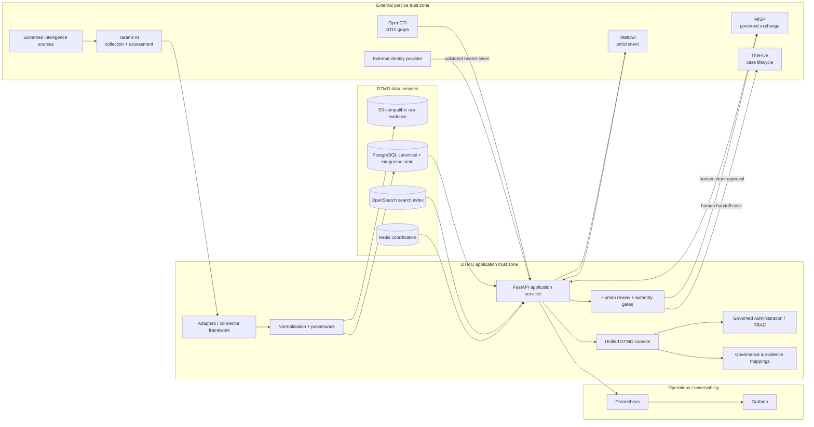

# DTMO System Architecture

Last updated: **2026-08-17**  
Software baseline: **16.0.0rc12 plus accepted post-RC13/E8/Phase-11 repository enhancements**  
Programme state: **Phase 11 Platform Industrialisation — active**

## 1. Purpose and architectural goals

DTMO is an education-focused Cyber Threat Intelligence platform for governed collection, provenance-preserving canonical intelligence, vulnerability/CTI enrichment and correlation, investigation/review, native analytics, Administration, Governance and controlled incident/case handoff.

The architecture is designed around durable canonical intelligence, explicit provenance, fail-closed integration boundaries, least privilege, separation of human and service identities, independent human publication/share authority, dedicated human case-handoff authority, privacy/data minimization and explicit evidence boundaries. Repository CI, owner acceptance, production-equivalent validation, independent assurance and production authorization remain distinct claims.

DTMO is **not production authorized**. Phase 10 concluded `NO-GO / BLOCKED — PLATFORM INDUSTRIALISATION REQUIRED`. Phase 11 is the active successor programme.

## 2. Logical architecture



The service arrows describe technical integration paths only. They do not transfer DTMO human review, publication/share or case-handoff authority to external platforms.

## 3. Architecture layers

### 3.1 Source ingress

Provider-specific adapters and governed source profiles operate through explicit source identity, endpoint/profile validation, timeout/retry/replay/freshness behavior and provenance. Taranis AI remains a separate service boundary for collection and assessment. MISP and AIL preserve their own governed read semantics. No external collector receives DTMO publication authority.

### 3.2 Normalization and provenance

Provider payloads become canonical intelligence candidates through fail-closed normalization. DTMO preserves source identity, source references, timestamps, confidence/context and only derives fields supported by explicit contracts. Missing evidence is not invented.

Vulnerability processing may preserve or derive governed CVE, vendor/product, CWE, CVSS, EPSS, KEV and sighting context where supported by source evidence. These fields do not imply local exposure, exploitability or compromise.

Phase 11 integrations retain provenance across Taranis, IntelOwl, OpenCTI, MISP and TheHive boundaries. External service output is context, not self-authenticating evidence of local compromise.

### 3.3 Canonical persistence

| Component | Responsibility | Authority |
|---|---|---|
| PostgreSQL | Canonical intelligence, RBAC, governance mappings and durable integration state | **Canonical DTMO application truth** |
| OpenSearch | Search/index representation | Supporting index |
| S3-compatible object storage | Raw source/evidence objects | Evidence retention |
| Redis | Cache, coordination and runtime support | Ephemeral/supporting state |
| External Phase 11 services | Their own service-domain lifecycle/state | Never DTMO canonical application truth |

Successful durable ingestion is not reported before canonical PostgreSQL commit. Phase 11 durable integration state includes Taranis checkpoint/reconciliation, IntelOwl history, OpenCTI identity/revision mapping, MISP synchronization authority state and the bounded TheHive handoff reservation/reconciliation state.

For TheHive, `thehive_handoff_state` is committed before `POST /api/v1/case`. A stable returned case identity is required for `delivered`; uncertain delivery is `ambiguous` and blocks blind replay.

### 3.4 Application services

FastAPI services expose authenticated APIs for source/catalog operations, intelligence investigation, vulnerability analytics/prioritization, bounded IntelOwl enrichment, governed MISP exchange, TheHive handoff/history, dashboard/analytics summaries, Administration/RBAC, Governance mappings/evidence and operational health/metrics.

The active Phase 11.6 TheHive API is intentionally narrow: one human-authorized case-create path plus read-only DTMO handoff history. Task/observable creation, responders, Cortex, case deletion, external sharing and TheHive administration are excluded.

### 3.5 Canonical browser product

The canonical navigation comprises:

1. **Overview** — KPIs, source state, severity and vulnerability trends;
2. **Intelligence** — normalized records, provenance, classification and vulnerability/CTI context;
3. **Sources & Catalog** — governed source onboarding, activation and execution;
4. **Visual Analytics** — native analytical and vulnerability trend/facet views;
5. **Administration** — governed principals, roles, permissions and privileged controls;
6. **Governance** — framework knowledge, control crosswalks and evidence mappings.

The bounded TheHive slice is API-governed and does not introduce a synthetic browser surface or screenshot that could imply a live tenant. Grafana remains a separately authenticated operational/advanced dashboard surface.

### 3.6 Identity and authentication

Bearer tokens are externally issued and cryptographically validated according to configured issuer/audience/signature and DTMO claim constraints. Managed local principal/role state does not silently mint or rewrite externally issued token claims.

External Phase 11 services use dedicated non-human runtime identities. Service identities execute already-authorized technical operations; they do not possess DTMO human publication/share or case-handoff authority.

### 3.7 Authorization and Administration

Server-side RBAC remains authoritative. DTMO preserves human/service-account separation, least privilege, privileged Administration controls, self-management/final-admin safeguards, resource/permission scoping, attributable audit records and request correlation.

`handoff:case` is the dedicated TheHive case-handoff permission and is separate from `approve:share`. The bounded repository assignment grants it to CISO, CERT, Senior Analyst and Administrator roles. Publisher authority alone does not authorize handoff; service accounts cannot authorize it.

### 3.8 Review and external-share authority

Technical ingestion creates candidate intelligence. Analysis/review, case handoff and external sharing are separate authorities. Connectors, service accounts, CI, Administration, Governance, analytics and external platforms cannot authorize publication or sharing.

Governed MISP export remains separately feature-controlled and human share-approved. TheHive case creation never grants publication/share authority, never proves local compromise and never changes canonical CTI truth.

### 3.9 Observability

Prometheus receives bounded operational metrics; Grafana provides separately authenticated operational/advanced dashboards. Observability includes API health, connector state/freshness, queue behavior, search/storage health, request/correlation context, alerts and runbook-linked operational signals.

TheHive failure is isolated to the explicit handoff path. A TheHive outage must not make unrelated DTMO reads, ingestion, governance, MISP, OpenCTI or IntelOwl paths unavailable. Runtime tokens and raw sensitive case bodies are not observability data.

### 3.10 Governance knowledge and framework mapping

DTMO implements explicit, versioned and provenance-backed governance relationships rather than inferred compliance.

- **Normenkader IBP** — explicit partial DTMO control crosswalks and governed evidence relationships, including threat/vulnerability-management evidence for `SM.07` and supporting controls;
- **MITRE ATT&CK** — explicit threat/detection/classification context and governed technique relationships;
- **NIST CSF 2.0** — explicit DTMO control/outcome relationships;
- **CVSS 4.0** — vulnerability-scoring context with explicit claim boundaries rather than a compliance framework.

The authoritative mapping registry is `docs/governance/GOVERNANCE_MAPPING_REGISTRY.md`. Mappings never imply blanket compliance, certification, maturity, local exploitability or remediation completion.

## 4. Trust boundaries

Important boundaries include:

1. external provider/Taranis → DTMO source adapter framework;
2. external identity provider → bearer-token validation;
3. unauthenticated client → authenticated API;
4. authenticated human principal → review/share/case-handoff authority;
5. DTMO → IntelOwl enrichment service;
6. OpenCTI graph/STIX identity → DTMO canonical mapping/reconciliation;
7. DTMO ↔ MISP governed exchange with authoritative MISP restrictions;
8. human `handoff:case` decision → durable DTMO reservation → TheHive API v1;
9. dedicated external service identity → bounded technical operation, never human authority;
10. application → PostgreSQL/OpenSearch/Redis/object storage;
11. governance registry/evidence → visible mapping claims;
12. repository CI → later real-environment validation/assurance evidence;
13. technical service success → no automatic local-compromise, publication or production-readiness claim.

### 4.1 TheHive mutation trust boundary

```mermaid
sequenceDiagram
    participant H as Authorized human
    participant D as DTMO API
    participant P as PostgreSQL
    participant T as TheHive API v1

    H->>D: explicit handoff:case request
    D->>D: validate item, provenance, TLP/PAP, target boundary
    alt invalid or unrepresentable restriction
        D-->>H: fail closed; no mutation
    else valid
        D->>P: commit reserved request/idempotency state
        P-->>D: durable reservation
        D->>T: POST /api/v1/case
        alt stable case identity
            T-->>D: case identity
            D->>P: mark delivered + minimized outcome
            D-->>H: delivered
        else timeout/network/malformed success identity
            D->>P: mark ambiguous
            D-->>H: stop; reconciliation required
        end
    end
```

Known authoritative MISP distribution/sharing-group restrictions are currently not projected into TheHive access membership. The bounded implementation therefore blocks those items rather than infer a safe cross-service access mapping.

## 5. Deployment architecture

### 5.1 Local/reference environment

Docker Compose remains a reproducible engineering/reference topology only. Development bootstrap or local credentials are not production evidence.

### 5.2 Phase 11 integrated target

Phase 11.8 will industrialize the composed platform using Kubernetes/Helm/GitOps with workload identities/external secrets, TLS/network policy, HA/recovery, centralized observability, immutable/signed supply-chain artifacts and tested upgrade/rollback procedures.

The active Phase 11.6 repository implementation does not claim a live TheHive deployment. `DTMO_FEATURE_THEHIVE_HANDOFF` is disabled by default. Production configuration requires an HTTPS API base, runtime token and explicit organization when enabled. Actual license entitlement, organization membership, service-account permissions and privacy/handling approval remain deployment prerequisites.

## 6. Release and evidence architecture

DTMO uses exact-head CI discipline: final PR head is the repository evidence unit; a new commit invalidates earlier exact-head evidence; queued/skipped/cancelled/failed/stale/inaccessible results are not `PASS`; protected merge uses expected-head protection; repository CI cannot manufacture external evidence.

Current acceptance state:

- Phases 1–7: `PASS`;
- RC13: `PASS / OWNER_ACCEPTED`;
- E8.1–E8.10: `PASS / REPOSITORY_COMPLETE`;
- Phase 8: `PASS / OWNER_ACCEPTED` for the earlier candidate;
- Phase 9: `PASS / EXTERNAL_ASSURANCE_ACCEPTED` for the earlier candidate;
- Phase 10: `NO-GO / BLOCKED — PLATFORM INDUSTRIALISATION REQUIRED`;
- Phase 11.1–11.5: `PASS / REPOSITORY_COMPLETE`;
- Phase 11.6 TheHive contract: `PASS / REPOSITORY_COMPLETE`;
- Phase 11.6 bounded TheHive handoff implementation: `IN PROGRESS / EXACT-HEAD VALIDATION REQUIRED`;
- Phase 12: `NOT STARTED`.

Historical Phase 8/9 evidence is immutable and candidate-bound. Fresh Phase 11.10 production-equivalent validation and Phase 11.11 independent assurance must target the materially changed integrated candidate before Phase 12.

## 7. Principal technology stack

- Python 3.12+
- FastAPI / Uvicorn
- SQLAlchemy / Alembic
- PostgreSQL
- Redis
- OpenSearch
- S3-compatible object evidence storage
- Prometheus
- Grafana
- Nginx
- Docker Compose reference topology
- Phase 11 target services: Taranis AI, IntelOwl, OpenCTI, MISP and TheHive

## 8. Security invariants

- server-side RBAC and least privilege;
- strict human/service-account separation;
- protected privileged Administration;
- externally validated identity trust;
- explicit, non-inferred framework mappings;
- human review/share approval separate from technical execution;
- human case-handoff authority separate from share/publication authority;
- durable mutation reservation before TheHive case creation;
- no blind replay after ambiguous mutation delivery;
- no TLP broadening and no inferred cross-service access membership;
- provenance/confidence/source-restriction preservation;
- privacy/data minimization;
- no arbitrary upstream response persistence where minimized identity evidence is sufficient;
- auditable privileged transitions and request correlation;
- no raw secret values in repository evidence;
- no automatic publication/case authority from connectors, CI, analytics, Administration, Governance or external services;
- no anonymous Grafana access for convenience;
- no production claim from repository integration CI.

## 9. Planned architectural extensions

The fixed successor sequence is: complete Phase 11.6; evaluate Cortex only if an accepted IntelOwl capability-gap analysis justifies it; complete Phase 11.8 integrated runtime industrialisation; Phase 11.9 migration/compatibility; Phase 11.10 new production-equivalent validation; Phase 11.11 new independent assurance; then Phase 12 formal production GO/NO-GO.

No later extension may weaken canonical persistence, provenance, licensing boundaries, human authority or fail-closed evidence rules.
