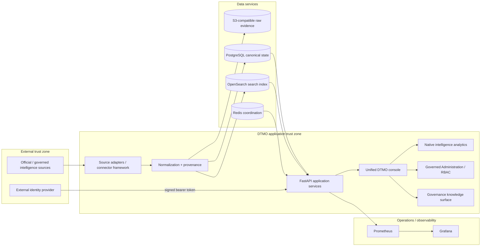

# DTMO System Architecture

Last updated: **2026-08-12**  
Release baseline: **16.0.0rc12**  
Functional product state: **RC13 PASS / OWNER_ACCEPTED**

## 1. Purpose and architectural goals

DTMO is an education-focused Cyber Threat Intelligence platform for collecting governed external intelligence, retaining raw evidence, normalizing records with provenance, supporting investigation and review, presenting native analytics and exposing controlled Administration/Governance capabilities.

The architecture is designed around the following non-negotiable goals:

- canonical, durable intelligence state;
- explicit source provenance and evidence retention;
- fail-closed normalization and source execution;
- least privilege and separation of duties;
- explicit human review and separate external-share approval;
- privacy and data minimization;
- auditable privileged state transitions;
- explicit evidence boundaries between repository CI, functional owner acceptance, external staging and production approval;
- truthful framework mapping without semantic inference.

## 2. Logical architecture

## 3. Architecture layers

### 3.1 Source ingress

Provider-specific adapters and unified source-execution profiles operate through a governed connector framework. Source execution is bounded by:

- explicit source identity;
- supported execution profile/type;
- endpoint validation;
- timeout and retry behavior;
- fail-closed parser/normalization behavior;
- source freshness/runtime state;
- provenance and raw evidence retention;
- logical secret references for credentialed integrations.

Raw credential values are not stored in the source catalog, API payload evidence or repository documentation.

### 3.2 Normalization and provenance

Provider payloads are converted into canonical intelligence candidates. The normalization boundary preserves or derives only explicitly supported fields and never invents missing enrichment.

Key properties include:

- canonical source identity;
- canonical intelligence type;
- canonical HTTP(S) reference/provenance URL where required;
- original source references retained in raw evidence;
- timestamps and publication context;
- confidence/context metadata where supplied;
- fail-closed handling of unknown canonical types.

The NVD adapter, for example, uses the stable NVD HTTPS CVE detail page as canonical/provenance URL while preserving upstream references—including non-HTTP references—in raw evidence.

### 3.3 Canonical persistence

DTMO separates durable application truth from supporting search and evidence services.

| Component | Responsibility | Authority |
|---|---|---|
| PostgreSQL 17 | Canonical intelligence records, managed principal/role assignments, application state, reporting views | **Canonical application truth** |
| OpenSearch 2.19 | Search/index representation for intelligence investigation | Supporting index; does not replace PostgreSQL truth |
| S3-compatible AIStor/MinIO | Raw source/evidence objects | Evidence retention |
| Redis 8 | Cache, coordination and queue/runtime state | Ephemeral/supporting state |

Connector ingestion does not report successful canonical persistence until the database session has completed its commit boundary. Search indexing or raw-object success alone is not treated as durable canonical application success.

### 3.4 Application services

The Python 3.12+/FastAPI application exposes authenticated APIs for:

- source/catalog administration and execution;
- canonical intelligence reads/investigation;
- dashboard and analytical summaries;
- Administration/RBAC state;
- Governance knowledge;
- operational health and metrics;
- review/share-governance workflows.

The unified DTMO console is the canonical browser product and is served through the application authorization boundary.

### 3.5 Canonical browser product

The canonical navigation comprises:

1. **Overview** — KPIs, source state, trends and recent intelligence;
2. **Intelligence** — normalized intelligence and investigation context;
3. **Sources & Catalog** — governed source operations;
4. **Visual Analytics** — native analytical views;
5. **Administration** — governed human principal/role assignment management;
6. **Governance** — evidence-backed framework/governance knowledge.

Normal product analytics are native DTMO views. Grafana remains a separately authenticated advanced/operations surface and is not a second login requirement for normal application analytics.

### 3.6 Identity and authentication

Production bearer tokens are externally issued and cryptographically validated for the configured issuer/audience/signature and DTMO claim constraints. DTMO does not silently mint or mutate production bearer-token claims from local managed assignment state.

Managed principal/role state and active token claims are deliberately separate. Production role changes require reconciliation with the external identity provider or token reissue/revocation according to the deployment identity design.

### 3.7 Authorization and Administration

Built-in DTMO roles and permissions remain code-controlled. Privileged Administration enforces:

- server-side RBAC;
- human administrator authority for managed assignment changes;
- strict human/service-account role separation;
- administrator self-management protection;
- final-active-admin protection;
- auditable before/after state;
- actor identity and request correlation.

The planned post-RC13 Administration enhancement may add richer role/permission management, but must preserve these boundaries and cannot implicitly grant review/share approval.

### 3.8 Review and external-share authority

Technical ingestion produces candidate intelligence. Investigation/review and external sharing are separate authorities.

Connectors, dashboards, CI, Administration, Governance, staging access or source execution **cannot authorize publication or external sharing**. External-share approval remains an explicit human-governed action.

### 3.9 Observability

Prometheus receives bounded application/operational metrics. Grafana provides separately authenticated operational/advanced dashboards.

Observability includes, where applicable:

- API/request health;
- connector state and freshness;
- queue/backlog behavior;
- search/storage health;
- correlation IDs and distributed trace context;
- alerting and operational dashboard state;
- runbook-linked operational responses.

Operational telemetry is not a substitute for canonical intelligence state or functional acceptance.

### 3.10 Governance knowledge and framework mapping

The repository-backed Governance model currently distinguishes context from explicit mappings:

- **Normenkader IBP:** first-class control crosswalk `UNMAPPED`;
- **MITRE ATT&CK:** first-class technique crosswalk `UNMAPPED`;
- **CVSS:** `CONTEXT_ONLY` until explicit first-class score/vector fields and mappings exist;
- **DTMO internal security/release governance:** repository-backed internal mappings.

`docs/governance/GOVERNANCE_MAPPING_REGISTRY.md` is authoritative until the planned first-class mapping data/API model is implemented.

No mapping may be inferred from tags, free text or semantic similarity. Future mapping records must include framework/version, control/technique identifier, provenance/source, confidence/status and review state.

## 4. Trust boundaries

Important trust boundaries are:

1. external provider network → source adapter/connector framework;
2. external identity provider → bearer-token validation boundary;
3. unauthenticated client → authenticated FastAPI boundary;
4. authenticated principal → privileged Administration/review/share actions;
5. managed role assignment → external identity reconciliation/token lifecycle;
6. application service → PostgreSQL/OpenSearch/Redis/object storage;
7. normalization result → canonical database commit boundary;
8. canonical browser product → separately authenticated Grafana operations surface;
9. mapping registry/data → visible governance claims;
10. repository CI/emulator → accountable owner-observed functional product;
11. accepted local product → production-equivalent staging deployment;
12. staging acceptance → independent external assurance;
13. technical access/execution → human publication/share authority.

## 5. Deployment architecture

### 5.1 Local/reference environment

Docker Compose provides a reproducible local/reference topology. It is engineering support, not production architecture evidence.

A development-only object-storage compatibility mapping can reuse local AIStor bootstrap/admin credentials for the application. This exception exists only for local development convenience and must not cross the staging boundary.

### 5.2 Phase 8 staging

Phase 8 requires one real approved production-equivalent staging environment bound to an immutable deployment identity containing:

- environment identifier and accountable owner;
- approved access path/endpoint;
- deployed release and exact commit;
- immutable application/supporting image digests;
- infrastructure/runtime inventory;
- configuration parity evidence;
- separate least-privilege application identities and secret references;
- TLS and network controls;
- data-class/sanitization evidence and no-production-credential confirmation;
- change/deployment and rollback records;
- deployment-time security/CVE/vendor-advisory review.

Staging application identities must remain distinct from infrastructure root/admin identities.

## 6. Release and evidence architecture

DTMO uses exact-head CI discipline:

- the final pull-request head is the unit of automated release evidence;
- a new commit invalidates earlier green CI for that PR;
- queued, cancelled, skipped, failed, stale or inaccessible workflows are not `PASS`;
- merge uses expected-head protection;
- repository CI cannot manufacture accountable owner acceptance or external staging evidence.

Current acceptance state:

- Phases 1–7: `PASS`;
- RC13 functional console: `PASS / OWNER_ACCEPTED`;
- Phase 8 staging: `READY / PENDING_EXTERNAL_DEPLOYMENT_IDENTITY`;
- Phase 9 independent assurance: `NOT COMPLETE`;
- Phase 10 production go/no-go: `NOT STARTED`.

## 7. Principal technology stack

- Python 3.12+
- FastAPI / Uvicorn
- SQLAlchemy / Alembic
- PostgreSQL 17
- Redis 8
- OpenSearch 2.19
- S3-compatible object evidence storage
- Prometheus 3
- Grafana 13
- Nginx
- Docker Compose reference topology

## 8. Security invariants

- RBAC and least privilege;
- known code-controlled roles and permissions;
- strict human/service-account separation;
- administrator self-management and final-admin protection;
- external identity-provider/token-lifecycle reconciliation;
- no inferred framework/control/technique mappings;
- separation of duties;
- human share approval separate from review and technical access;
- provenance/confidence preservation;
- privacy and data minimization;
- auditable privileged state transitions and request correlation;
- no raw secret values in repository evidence;
- no automatic publication from CI, connectors, analytics, Administration, Governance or staging access;
- no anonymous Grafana access or authentication bypass for convenience.

## 9. Planned architectural extensions

Post-RC13 enhancements are expected to evolve the architecture in bounded steps:

1. shared severity taxonomy/filter contract across Overview and Intelligence;
2. governed manual source onboarding;
3. richer time-window trend analytics;
4. first-class provenance-backed framework mapping model/API;
5. deeper role/permission Administration;
6. deeper Governance framework/evidence drill-down.

These extensions must build on the existing canonical persistence, provenance and authority boundaries rather than introduce parallel truth models.
