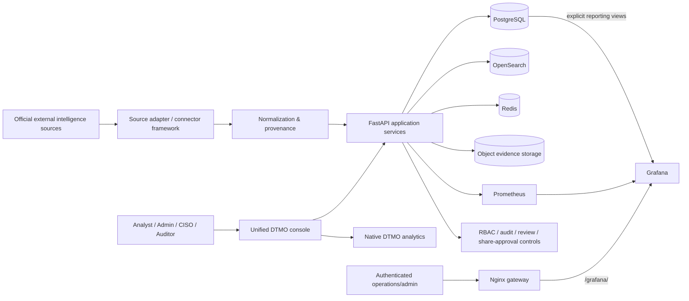

# DTMO System Architecture

Last updated: **2026-08-11**  
Current baseline: **16.0.0rc12**

## Purpose

DTMO is an education-focused Cyber Threat Intelligence platform that collects official threat/vulnerability intelligence, normalizes it with provenance, supports governed investigation and administration, and presents operational and intelligence analytics without collapsing human approval boundaries.

## Logical architecture

## Architecture layers

### 1. Source ingress

Provider-specific adapters operate through the governed source framework. Execution is bounded by explicit source identity, supported execution profiles, timeout/retry behavior, fail-closed parsing and provenance retention.

Credentialed sources use logical secret references; credential values are resolved at runtime and are not stored in the source catalog.

### 2. Normalization and provenance

Provider payloads are converted into canonical intelligence records while preserving source identity, raw evidence references, confidence and relevant publication metadata. Missing enrichment is not invented.

### 3. Application and API

The Python 3.12+/FastAPI application provides authenticated APIs, source operations, search/investigation, administration, metrics and governance workflows.

The canonical browser product is the **unified DTMO console**. Legacy role/workspace routes may remain for compatibility but are not separate intended product shells.

### 4. Persistence and search

| Component | Responsibility |
|---|---|
| PostgreSQL 17 | relational application state, governance state and explicit Grafana reporting views |
| OpenSearch 2.19 | intelligence search/index state |
| Redis 8 | cache/queue and runtime coordination state |
| S3-compatible AIStor/MinIO interface | object/evidence storage |

### 5. Observability and analytics

Prometheus collects bounded application/operational metrics. Grafana provides authenticated DTMO Operations and DTMO Intelligence dashboards for operational/advanced deployment use.

Grafana intelligence access uses a **dedicated least-privilege database reader** restricted to explicit reporting views. It does not reuse the DTMO application database identity. Anonymous Grafana access and Grafana self-signup are disabled.

Normal product analytics are **native DTMO chart/table views** backed by the DTMO application APIs. RC13.2 makes those native views the canonical Visual analytics surface and removes the separately authenticated Grafana embed from normal console use. This prevents a broken second-login journey without weakening Grafana authentication.

The Nginx gateway may continue to expose `/grafana/` for explicitly authenticated operations/admin use. That gateway path is not publication authority and is not a prerequisite for normal console analytics.

### 6. Browser and gateway boundary

The canonical product browser boundary is the FastAPI/unified-console session and its server-side authorization model. Native Visual analytics remain on that same application boundary.

Nginx remains available as a managed deployment gateway and can expose the authenticated Grafana operational surface. The gateway and presentation layer do not grant application authority, publication authority or a role upgrade.

### 7. Governance and approval

Security-sensitive authorities are deliberately separated:

- source administration and execution;
- intelligence analysis;
- human review;
- external share approval;
- audit/read-only access;
- CISO/security administration.

Technical execution, CI success, connector access, dashboard access or staging access cannot authorize publication or external sharing.

## Principal technology stack

- Python 3.12+
- FastAPI / Uvicorn
- SQLAlchemy / Alembic
- PostgreSQL 17
- Redis 8
- OpenSearch 2.19
- S3-compatible object evidence storage
- Prometheus 3
- Grafana 13
- Nginx
- Docker Compose reference topology

## Trust boundaries

Important trust boundaries are:

1. external provider networks → connector/source ingress;
2. unauthenticated client → authenticated application boundary;
3. authenticated role → privileged administrative/review/share actions;
4. application → database/search/cache/object services;
5. Grafana → explicit least-privilege reporting boundary;
6. canonical browser → FastAPI/unified-console native analytics boundary;
7. authenticated operations/admin browser → Nginx/Grafana operational boundary;
8. repository CI/emulator → real staging/production environment;
9. technical execution → human publication/share authority.

## Reliability and resilience

Connector behavior has explicit state, retry, timeout, replay, freshness and failure-isolation controls. Repository-controlled recovery gates cover multi-store migration/recovery behavior and integrity checks.

This engineering evidence does not replace the external requirement for a production-equivalent backup/restoration exercise or a real staging acceptance decision.

## CI and release architecture

The release process is exact-head gated. Pull requests pass registered quality, security, connector, recovery, performance, browser/accessibility, observability and functional-console workflows before expected-head protected merge.

RC13 adds browser-tested product journeys because component/presence tests alone were insufficient to establish functional usability. Synthetic browser fixtures prove console behavior only; they do not replace owner-observed local/live acceptance or later external staging validation.

## Current acceptance boundary

Phases 1–7 are accepted. Phase 6's final external/manual blocker was closed by accountable project-owner acceptance on 2026-08-11.

RC13 is `BLOCKED_INTERNAL`. RC13.1 is accepted via PR #151. RC13.2 single-session Visual analytics is the current priority. Phase 8 is `PAUSED_PENDING_RC13` and may only resume after RC13.5 completes the full canonical-console browser acceptance.

## Security invariants

- RBAC and least privilege;
- separation of duties;
- human share approval separate from review and technical access;
- provenance and confidence preservation;
- privacy and data minimization;
- auditable state transitions and request correlation;
- no secret values in repository evidence;
- no automatic publication from CI, connectors, recovery, analytics or runtime success;
- no anonymous Grafana access or authentication bypass for convenience.
