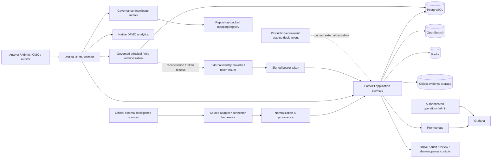

# DTMO System Architecture

Last updated: **2026-08-12**  
Current baseline: **16.0.0rc12**

## Purpose

DTMO is an education-focused Cyber Threat Intelligence platform that collects official threat/vulnerability intelligence, normalizes it with provenance, supports governed investigation and administration, and presents operational and intelligence analytics without collapsing human approval boundaries.

## Logical architecture

## Architecture layers

### Source ingress and canonical intelligence

Provider-specific adapters operate through the governed source framework with explicit source identity, supported execution profiles, timeout/retry behavior, fail-closed parsing and provenance retention. Credentialed sources use logical secret references only.

Provider payloads are normalized into canonical intelligence records while preserving source identity, evidence references, confidence and publication metadata. Missing enrichment is not invented.

### Application and persistence

The Python 3.12+/FastAPI application provides authenticated APIs, source operations, search/investigation, administration, metrics and governance workflows. The canonical browser product is the **unified DTMO console**.

PostgreSQL stores application and governed assignment state; OpenSearch provides intelligence search/index state; Redis provides cache/queue coordination; S3-compatible object storage retains evidence objects.

### Identity and RBAC administration

Production bearer tokens are externally issued and cryptographically validated. Managed principal/role state does not rewrite an already issued token; production role changes require identity-provider reconciliation or token reissue.

Built-in roles remain code-controlled. Service accounts cannot combine machine and human/admin roles. RBAC administration requires human administrator authority, blocks self-management, protects the final active managed admin and appends allowed mutations to the tamper-evident audit chain with request correlation.

The current canonical Administration layout visually prioritizes governed **Gebruikers & rollen**. Source operations remain in `Bronnen & catalogus`; local development identity context is secondary and collapsed by default.

### Observability and analytics

Prometheus collects bounded application/operational metrics. Grafana remains separately authenticated for advanced/operations use.

Normal product analytics are native DTMO chart/table views backed by application APIs. Zero-only intelligence datasets are represented as explicit empty states rather than pseudo-graphs. Connector operational state may still render when measurable connector data exists.

### Governance knowledge

The repository-backed Governance surface distinguishes framework context from actual mappings:

- Normenkader IBP — `UNMAPPED`;
- MITRE ATT&CK — `UNMAPPED`;
- CVSS — `CONTEXT_ONLY`;
- DTMO internal security/release governance — `MAPPED_INTERNAL`.

No semantic similarity creates a mapping.

## Canonical browser boundary — reopened RC13

RC13.5 historically proved one Chromium browser context through the accepted product areas, and the project owner later recorded an explicit acceptance. A subsequent owner retest on 2026-08-12 found additional usability defects, so current RC13 acceptance is reopened.

The current browser repair treats the browser execution layer as an explicit release trust boundary:

- Overview refresh must execute source/dashboard/recent-intelligence reads and expose truthful lifecycle state;
- empty canonical intelligence cannot be reported as successful data update;
- all product navigation/non-submit actions use explicit button semantics;
- Google Chrome-channel regression evidence covers canonical navigation and refresh controls;
- browser page errors and browser console errors must both be zero;
- browser CI remains synthetic API evidence and cannot replace project-owner functional acceptance.

**Current RC13 = `REOPENED / BLOCKED_INTERNAL`.**

## Phase 8 external deployment boundary

The real production-equivalent staging boundary remains defined, but is currently paused. PR #157 and the fail-closed deployment identity record remain preparatory evidence; issue #158 may not advance until RC13 is repaired and accepted again by the project owner.

When Phase 8 resumes, all external evidence must bind to one immutable deployment identity containing environment/owner, endpoint, deployed release and image digests, infrastructure/configuration parity, identity/secrets references, TLS/network, data handling, deployment/change, rollback and deployment-time security-review evidence.

## Trust boundaries

Important trust boundaries are:

1. external provider networks → connector/source ingress;
2. external identity provider/token issuer → bearer-token trust validation;
3. unauthenticated client → authenticated application boundary;
4. authenticated role → privileged administration/review/share actions;
5. managed assignment state → external identity-provider reconciliation/token reissue;
6. application → database/search/cache/object services;
7. Grafana → separately authenticated reporting/operations boundary;
8. canonical Chrome/browser execution → FastAPI/unified-console product boundary;
9. repository mapping registry → visible framework/mapping claims;
10. repository CI/browser fixtures → accountable owner-observed local product;
11. accepted local product → real production-equivalent staging deployment identity;
12. technical execution → human publication/share authority.

## CI and release architecture

The release process is exact-head gated. Pull requests pass registered quality, security, connector, recovery, performance, browser/accessibility, observability and functional-console workflows before expected-head protected merge.

The reopened repair adds a dedicated Google Chrome-channel usability workflow. Passing it establishes repository-controlled regression evidence only; the owner gate remains separate after merge.

## Current acceptance boundary

- Phases 1–7: `PASS`.
- RC13 historical component/integration evidence: `PASS`.
- RC13 current decision: `REOPENED / BLOCKED_INTERNAL`.
- Phase 8: `PAUSED_PENDING_RC13_REPAIR_AND_OWNER_RETEST`.
- Phase 9: `NOT COMPLETE`.
- Phase 10: `NOT STARTED`.

## Security invariants

RBAC and least privilege, code-controlled roles, strict human/service-account separation, administrator safety protections, identity-provider reconciliation, no inferred external framework mapping, separation of duties, separate human share approval, provenance/confidence preservation, privacy/data minimization, auditable state transitions, no secret values in repository evidence, no automatic publication from technical execution and no anonymous Grafana access remain authoritative.
