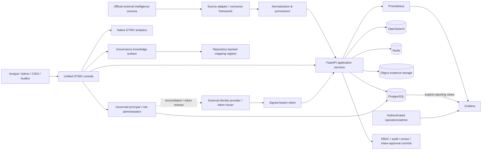

# DTMO System Architecture

Last updated: **2026-08-11**  
Current baseline: **16.0.0rc12**

## Purpose

DTMO is an education-focused Cyber Threat Intelligence platform that collects official threat/vulnerability intelligence, normalizes it with provenance, supports governed investigation and administration, and presents operational and intelligence analytics without collapsing human approval boundaries.

## Logical architecture

## Architecture layers

### 1. Source ingress

Provider-specific adapters operate through the governed source framework. Execution is bounded by explicit source identity, supported execution profiles, timeout/retry behavior, fail-closed parsing and provenance retention. Credentialed sources use logical secret references; credential values are resolved at runtime and are not stored in the source catalog.

### 2. Normalization and provenance

Provider payloads are converted into canonical intelligence records while preserving source identity, raw evidence references, confidence and relevant publication metadata. Missing enrichment is not invented.

### 3. Application and API

The Python 3.12+/FastAPI application provides authenticated APIs, source operations, search/investigation, administration, metrics and governance workflows. The canonical browser product is the **unified DTMO console**.

RC13.4 added authenticated read-only `GET /api/v1/governance/knowledge`. It exposes repository-backed governance state and adds no governance write path.

### 4. Persistence and search

| Component | Responsibility |
|---|---|
| PostgreSQL 17 | relational application state, managed principal/role assignments, governance state and explicit Grafana reporting views |
| OpenSearch 2.19 | intelligence search/index state |
| Redis 8 | cache/queue and runtime coordination state |
| S3-compatible AIStor/MinIO interface | object/evidence storage |

RC13.3 added `managed_principals` and `managed_role_assignments` through migration `0009_managed_rbac_assignments`. RC13.4 governance knowledge remains repository-backed rather than mutable database state; `docs/governance/GOVERNANCE_MAPPING_REGISTRY.md` is authoritative for visible mapping/coverage claims.

### 5. Identity and RBAC administration

Production bearer tokens are externally issued and cryptographically validated for issuer, audience, signature, known role values, principal type and token state. DTMO does not operate an internal production token issuer in the current baseline.

Managed principal/role state and active bearer-token claims are separate. Changing managed assignment state does not rewrite an already issued token; production role changes require identity-provider reconciliation or token reissue.

Built-in roles remain code-controlled. Service accounts cannot combine machine and human/admin roles. RBAC administration requires `manage:users` plus a human `admin` role, blocks administrator self-management, protects the final active managed admin and appends allowed mutations to the tamper-evident audit chain with request correlation.

### 6. Observability and analytics

Prometheus collects bounded application/operational metrics. Grafana provides authenticated Operations/advanced dashboards and remains separately secured.

Normal product analytics are **native DTMO chart/table views** backed by application APIs. RC13.2 made native severity/source/connector-health/review-status views canonical; normal product navigation does not require or request a Grafana second-login path.

### 7. Canonical browser boundary

The canonical product browser boundary is the FastAPI/unified-console session and its server-side authorization model. Source operations, recent Intelligence, native Visual analytics, governed Administration and read-only Governance knowledge all use this application boundary.

RC13.5 does not introduce new product authority or data paths. It adds an integration acceptance layer that proves the previously accepted RC13 slices operate together in **one Chromium browser context and one canonical session**.

The RC13.5 journey is:

**Overview → Intelligence → Sources & Catalog → source register/enable/run → Intelligence update → Visual analytics → Administration → Governance → Overview state confirmation.**

### 8. Governance knowledge and approval

RC13.4 distinguishes framework context from actual repository mappings:

- Normenkader IBP — `UNMAPPED`;
- MITRE ATT&CK — `UNMAPPED`;
- CVSS — `CONTEXT_ONLY`;
- DTMO internal security/release governance — `MAPPED_INTERNAL` to explicit repository evidence.

No semantic similarity creates a mapping. Future external framework crosswalks require explicit versioned datasets with provenance and review.

Security-sensitive authorities remain separated across source administration, managed identity/role administration, intelligence analysis, human review, external share approval, audit/read-only access and CISO/security administration.

Technical execution, Administration access, Governance visibility, CI success, connector access, dashboard access or staging access cannot authorize publication or external sharing.

## Principal technology stack

- Python 3.12+
- FastAPI / Uvicorn
- SQLAlchemy / Alembic
- PostgreSQL 17
- Redis 8
- OpenSearch 2.19
- S3-compatible object evidence storage
- Prometheus 3
- Grafana 13
- Nginx
- Docker Compose reference topology

## Trust boundaries

Important trust boundaries are:

1. external provider networks → connector/source ingress;
2. external identity provider/token issuer → bearer-token trust validation;
3. unauthenticated client → authenticated application boundary;
4. authenticated role → privileged administration/review/share actions;
5. managed assignment state → external identity-provider reconciliation/token reissue;
6. application → database/search/cache/object services;
7. Grafana → explicit separately authenticated reporting/operations boundary;
8. canonical browser → FastAPI/unified-console native product boundary;
9. repository mapping registry → visible framework/mapping claims;
10. repository CI/emulator → owner-observed local product and later real staging/production environment;
11. technical execution → human publication/share authority.

## CI and release architecture

The release process is exact-head gated. Pull requests pass registered quality, security, connector, recovery, performance, browser/accessibility, observability and functional-console workflows before expected-head protected merge.

RC13.4 is accepted via PR #154 / merge `21672aaf1cf097228699810660eaac167da842d6` after full exact-head success on `0a227cb9f3972504287a6f7f064d6df18b76fbed`.

RC13.5 adds `RC13 Full Functional Console Acceptance Gate`. Its machine-readable evidence records the exact PR head, one Chromium browser context, the full canonical journey, synthetic-fixture status and the requirement for a separate accountable project-owner functional retest.

The RC13.5 workflow cannot promote Phase 8 or claim owner acceptance by itself.

## Current acceptance boundary

Phases 1–7 are accepted. RC13 remains `BLOCKED_INTERNAL`.

- RC13.1: accepted via PR #151.
- RC13.2: accepted via PR #152.
- RC13.3: accepted via PR #153.
- RC13.4: accepted via PR #154, merge `21672aaf1cf097228699810660eaac167da842d6`.
- RC13.5: `PENDING_CI` / current priority.
- accountable project-owner retest of the complete repaired product: not yet recorded.
- Phase 8: `PAUSED_PENDING_RC13`.

## Security invariants

- RBAC and least privilege;
- known code-controlled roles and permissions;
- strict human/service-account role separation;
- administrator self-management and final-admin protections;
- identity-provider reconciliation for production bearer-token claim changes;
- no inferred external framework/control/technique mapping;
- separation of duties;
- human share approval separate from review and technical access;
- provenance and confidence preservation;
- privacy and data minimization;
- auditable state transitions and request correlation;
- no secret values in repository evidence;
- no automatic publication from CI, connectors, recovery, analytics, Administration, Governance or runtime success;
- no anonymous Grafana access or authentication bypass for convenience.
