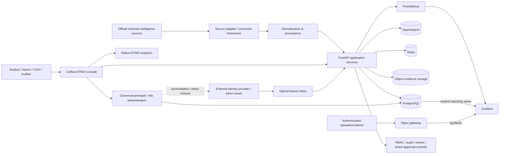

# DTMO System Architecture

Last updated: **2026-08-11**  
Current baseline: **16.0.0rc12**

## Purpose

DTMO is an education-focused Cyber Threat Intelligence platform that collects official threat/vulnerability intelligence, normalizes it with provenance, supports governed investigation and administration, and presents operational and intelligence analytics without collapsing human approval boundaries.

## Logical architecture

## Architecture layers

### 1. Source ingress

Provider-specific adapters operate through the governed source framework. Execution is bounded by explicit source identity, supported execution profiles, timeout/retry behavior, fail-closed parsing and provenance retention.

Credentialed sources use logical secret references; credential values are resolved at runtime and are not stored in the source catalog.

### 2. Normalization and provenance

Provider payloads are converted into canonical intelligence records while preserving source identity, raw evidence references, confidence and relevant publication metadata. Missing enrichment is not invented.

### 3. Application and API

The Python 3.12+/FastAPI application provides authenticated APIs, source operations, search/investigation, administration, metrics and governance workflows.

The canonical browser product is the **unified DTMO console**. Legacy role/workspace routes may remain for compatibility but are not separate intended product shells.

### 4. Persistence and search

| Component | Responsibility |
|---|---|
| PostgreSQL 17 | relational application state, managed principal/role assignments, governance state and explicit Grafana reporting views |
| OpenSearch 2.19 | intelligence search/index state |
| Redis 8 | cache/queue and runtime coordination state |
| S3-compatible AIStor/MinIO interface | object/evidence storage |

RC13.3 adds `managed_principals` and `managed_role_assignments` to PostgreSQL through migration `0009_managed_rbac_assignments` after the accepted RC12 reporting-view migration.

### 5. Identity and RBAC administration

Production bearer tokens are externally issued and cryptographically validated for issuer, audience, signature, known role values, principal type and token state. DTMO does not operate an internal production token issuer in the current baseline.

RC13.3 therefore separates two concepts:

1. **managed principal/role state** — auditable provisioning/assignment records maintained in DTMO by an authorized human administrator;
2. **active bearer-token claims** — trusted claims issued by the configured external identity provider.

Changing managed assignment state does not silently rewrite an already issued token. A production role change requires identity-provider reconciliation or token reissue before the external bearer claim changes.

Built-in roles and permissions remain defined by `Role` and `ROLE_PERMISSIONS`. The browser cannot invent arbitrary custom token roles. Machine/service principals remain restricted to `service_account`, while human principals cannot use that role.

RBAC administration requires both `manage:users` and a human `admin` role. The current administrator cannot mutate their own managed assignment, and the last active managed administrator cannot be deactivated or stripped of the admin role. Allowed mutations are written to the persistent tamper-evident audit chain with request correlation.

### 6. Observability and analytics

Prometheus collects bounded application/operational metrics. Grafana provides authenticated DTMO Operations and DTMO Intelligence dashboards for operational/advanced deployment use.

Grafana intelligence access uses a dedicated least-privilege database reader restricted to explicit reporting views. Anonymous Grafana access and Grafana self-signup are disabled.

Normal product analytics are **native DTMO chart/table views** backed by application APIs. RC13.2 makes those native views the canonical Visual analytics surface and removes the separately authenticated Grafana embed from normal console use.

### 7. Browser and gateway boundary

The canonical product browser boundary is the FastAPI/unified-console session and its server-side authorization model. Native Visual analytics and governed Administration use that application boundary.

The Administration UI is not an authorization authority by itself. Server-side permission/role checks, persistence constraints and audit rules are authoritative even when client-side controls are disabled for usability.

Nginx remains available as a managed deployment gateway and can expose the authenticated Grafana operational surface. The gateway and presentation layer do not grant application authority, publication authority or a role upgrade.

### 8. Governance and approval

Security-sensitive authorities are deliberately separated:

- source administration and execution;
- managed identity/role administration;
- intelligence analysis;
- human review;
- external share approval;
- audit/read-only access;
- CISO/security administration.

Technical execution, Administration access, CI success, connector access, dashboard access or staging access cannot authorize publication or external sharing.

## Principal technology stack

- Python 3.12+
- FastAPI / Uvicorn
- SQLAlchemy / Alembic
- PostgreSQL 17
- Redis 8
- OpenSearch 2.19
- S3-compatible object evidence storage
- Prometheus 3
- Grafana 13
- Nginx
- Docker Compose reference topology

## Trust boundaries

Important trust boundaries are:

1. external provider networks → connector/source ingress;
2. external identity provider/token issuer → bearer-token trust validation;
3. unauthenticated client → authenticated application boundary;
4. authenticated role → privileged administration/review/share actions;
5. managed assignment state → external identity-provider reconciliation/token reissue;
6. application → database/search/cache/object services;
7. Grafana → explicit least-privilege reporting boundary;
8. canonical browser → FastAPI/unified-console native analytics and Administration boundary;
9. repository CI/emulator → real staging/production environment;
10. technical execution → human publication/share authority.

## CI and release architecture

The release process is exact-head gated. Pull requests pass registered quality, security, connector, recovery, performance, browser/accessibility, observability and functional-console workflows before expected-head protected merge.

RC13.3 adds a dedicated governed Administration/RBAC gate with persistent/security contracts plus a Chromium create/update/deactivate journey. Synthetic browser fixtures prove interface behavior only; they do not replace owner-observed local/live acceptance or later external staging validation.

## Current acceptance boundary

Phases 1–7 are accepted. RC13 is `BLOCKED_INTERNAL`.

- RC13.1: accepted via PR #151.
- RC13.2: accepted via PR #152, merge `b8c254c5d099cde5dca624aa85b17c320594847e`.
- RC13.3: current `PENDING_CI` priority.
- RC13.4/13.5: pending.
- Phase 8: `PAUSED_PENDING_RC13`.

## Security invariants

- RBAC and least privilege;
- known code-controlled roles and permissions;
- strict human/service-account role separation;
- human-admin + `manage:users` required for managed assignment mutations;
- administrator self-management and final-admin lockout protections;
- identity-provider reconciliation for production bearer-token claim changes;
- separation of duties;
- human share approval separate from review and technical access;
- provenance and confidence preservation;
- privacy and data minimization;
- auditable state transitions and request correlation;
- no secret values in repository evidence;
- no automatic publication from CI, connectors, recovery, analytics, Administration or runtime success;
- no anonymous Grafana access or authentication bypass for convenience.
