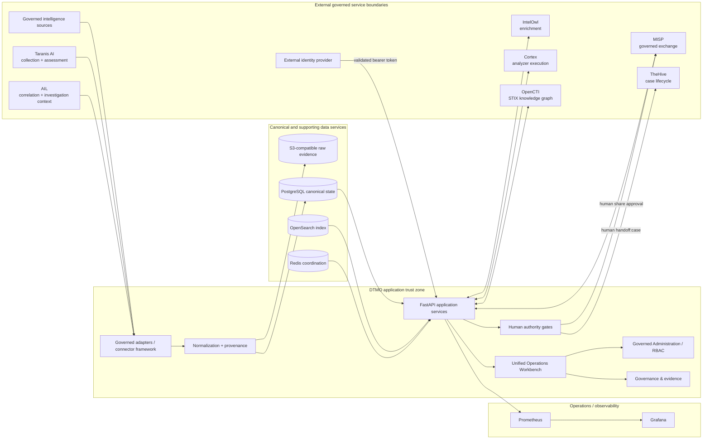

# DTMO System Architecture

Last updated: **2026-08-27**  
Software baseline: **16.0.0rc12 plus accepted post-RC13, E8 and Phase 11 repository enhancements**  
Programme state: **Phase 11 — FUNCTIONAL RECOVERY ACTIVE**

## 1. Purpose and architectural goals

DTMO is an education-focused Cyber Threat Intelligence platform for governed collection, provenance-preserving canonical intelligence, vulnerability and CTI enrichment/correlation, investigation, sharing, automation, operational analytics, Administration and Governance.

The architecture preserves durable canonical intelligence, explicit provenance, fail-closed integration boundaries, server-side RBAC, server-side credentials, least privilege, separation of human and service identities, independent human review/share/case authority, privacy/data minimization and explicit evidence boundaries.

DTMO is **not production authorized**. The current integrated candidate remains under functional recovery after external-owner rejection. Repository CI is engineering evidence for repository-controlled contracts only; it is not owner acceptance, production-equivalent evidence or independent external assurance.

## 2. Logical architecture

Service arrows describe technical integration paths only. They never transfer DTMO human review/share, publication, case-handoff or production authority to an upstream service.

## 3. Architecture layers

### 3.1 Source ingress and external framework boundaries

Provider-specific adapters and governed source profiles operate through explicit source identity, endpoint/profile validation, timeout/retry/replay/freshness behavior and provenance. Taranis AI, AIL, IntelOwl, Cortex, OpenCTI, MISP and TheHive remain separate governed service boundaries rather than browser-side dependencies.

The browser never stores upstream credentials or becomes a privileged upstream client. External integration credentials remain server-side. Missing endpoint identity, credentials, analyzer/entity allowlists or required scope fails closed instead of silently enabling an integration.

### 3.2 Normalization and provenance

Provider payloads become canonical intelligence candidates through fail-closed normalization. DTMO preserves source identity, references, timestamps, confidence/context and raw-evidence relationships. Missing evidence is not invented.

Vulnerability processing may preserve or derive governed CVE, vendor/product, CWE, CVSS, EPSS, KEV and sighting context where supported. These fields do not imply local exposure, exploitability, compromise or remediation.

### 3.3 Canonical persistence

| Component | Responsibility | Authority |
|---|---|---|
| PostgreSQL | Canonical intelligence, RBAC, governance mappings and durable integration state | **Canonical DTMO application truth** |
| OpenSearch | Search/index projection | Supporting index |
| S3-compatible object storage | Raw source/evidence objects | Evidence retention |
| Redis | Cache, coordination and runtime support | Ephemeral/supporting state |
| External framework services | Their own service-domain state | Never DTMO canonical application truth |

Successful durable ingestion is not reported before canonical PostgreSQL commit. Integration execution/history is persisted where the corresponding contract requires durable operator-visible state.

### 3.4 Application services

FastAPI services expose authenticated APIs for collection/source lifecycle, intelligence discovery and IOC pivoting, vulnerability analytics, IntelOwl/Cortex analysis, OpenCTI graph projection, governed MISP exchange, TheHive handoff/history, automation, operational analytics, Administration/RBAC and Governance/evidence.

Mutating external operations remain explicitly governed. Technical service success does not grant human authority and does not prove upstream truth or local compromise.

### 3.5 Canonical browser product

The canonical product is the **Unified Operations Workbench**. Its operator surfaces cover Overview/Command Center, Threat Intelligence, IOC Explorer, Knowledge Graph, Vulnerability & Exposure, Investigations, Analysis & Enrichment, Sharing & Exchange, Automation & Playbooks, Sources & Collection, Operations, Administration and Governance & Evidence.

`/ui/*` compatibility views are migration paths, not a second product architecture. Browser visibility never grants server-side mutation authority.

### 3.6 Identity, authorization and human authority

Bearer tokens are cryptographically validated according to configured identity constraints. Server-side RBAC remains authoritative. Human and service identities remain separate, and privileged Administration safeguards remain enforced.

Human review/share, case handoff and publication decisions are distinct authorities. Service accounts, connectors, CI, analytics, Administration, Governance and external services cannot manufacture those decisions.

### 3.7 Observability and operations

Prometheus and Grafana provide operational observability. The supported default topology must make bundled core-service readiness actionable to operators, while external framework services may legitimately remain in configure/connect states until their prerequisites exist.

An external service outage must be isolated from unrelated DTMO functions where the integration contract permits. Runtime tokens, raw secrets and unnecessarily sensitive payloads are not observability data.

### 3.8 Governance knowledge

DTMO exposes explicit, versioned and provenance-backed governance relationships for Normenkader IBP, MITRE ATT&CK and NIST CSF, with CVSS retained as vulnerability-scoring context rather than a compliance framework. Mappings never imply blanket compliance, certification, maturity, local exploitability or remediation completion.

## 4. Trust boundaries

Important boundaries are:

1. governed source or external framework service → DTMO adapter;
2. external identity provider → bearer-token validation;
3. browser → same-origin DTMO API;
4. authenticated principal → server-side RBAC and human authority gate;
5. adapter output → normalization/provenance → canonical persistence;
6. canonical state → OpenSearch and UI projections;
7. human `handoff:case` decision → durable DTMO state → TheHive;
8. human share approval → governed MISP exchange;
9. service identity → bounded technical operation, never human authority;
10. repository CI → repository evidence only, never automatic environment or assurance evidence.

### 4.1 TheHive mutation trust boundary

The supported mutation path is:

`Authorized human → DTMO API/RBAC → provenance and restriction validation → durable reservation → TheHive API → durable delivered/ambiguous outcome`.

Invalid or unrepresentable restrictions fail closed before mutation. A timeout, network failure or malformed success identity becomes `ambiguous`; DTMO does not blindly replay a potentially delivered case. Known MISP sharing restrictions that cannot be safely projected into TheHive access membership remain blocked rather than inferred.

## 5. Deployment architecture

### 5.1 Local/reference environment

Docker Compose is the supported local/reference startup topology for DTMO core services. It provides DTMO, PostgreSQL, Redis, OpenSearch, S3-compatible object storage, Prometheus and Grafana according to the installation contract. External framework services may require separately supplied endpoints, identities, licenses or organization-specific configuration.

A professional default installation must expose an actionable ready/configure/connect state and a supported first-data path. Blank or inert workspaces are not treated as functional completion.

### 5.2 Industrialized target

The Phase 11.8 repository-complete target uses Kubernetes/Helm/GitOps, workload identity/external secrets, TLS/network segmentation, HA/disruption controls, observability, recovery, supply-chain controls, capacity planning and exercised upgrade/rollback contracts. Phase 11.9 migration/compatibility is also repository-complete.

These repository states do not override the current functional rejection and do not establish production-equivalent behavior.

## 6. Release and evidence architecture

DTMO uses exact-head CI discipline: the final PR head is the repository evidence unit; a new commit invalidates earlier exact-head evidence; failed, queued, cancelled, skipped, stale or inaccessible checks are not a pass; protected merge uses expected-head protection.

Current lifecycle truth:

| Stage | Status |
|---|---|
| Phase 11.1–11.9 repository integration/industrialisation | `PASS / REPOSITORY_COMPLETE` |
| Phase 11.10a–11.10o workspace and acceptance contracts | `PASS / REPOSITORY_COMPLETE` |
| Historical Phase 11.10q recovery acceptance | `SUPERSEDED BY LATER OWNER FUNCTIONAL REJECTION` |
| Current external-owner functional acceptance | `NO-GO / REJECTED` |
| Functional recovery | `ACTIVE` |
| Fresh candidate freeze | `BLOCKED` |
| Phase 11.10p fresh production-equivalent execution | `BLOCKED BY FUNCTIONAL REJECTION` |
| Phase 11.11 independent external assurance | `NOT STARTED` |
| Phase 12 production GO/NO-GO | `NOT STARTED` |

Historical Phase 8/9 evidence remains immutable candidate-bound audit history and cannot be reused for the current materially changed candidate. When functional recovery is explicitly owner-accepted, one immutable candidate must be frozen before fresh production-equivalent validation. Any later independent assurance must evaluate that same candidate.

## 7. Principal technology stack

Python 3.12+, FastAPI/Uvicorn, SQLAlchemy/Alembic, PostgreSQL, Redis, OpenSearch, S3-compatible object storage, Prometheus, Grafana, Nginx, Docker Compose, Kubernetes/Helm/GitOps and the governed Taranis AI, AIL, IntelOwl, Cortex, OpenCTI, MISP and TheHive integration boundaries.

## 8. Security invariants

- server-side RBAC and least privilege;
- server-side credentials and strict human/service-account separation;
- protected privileged Administration;
- explicit provenance and raw-evidence binding;
- fail-closed missing or ambiguous state;
- human review/share, publication and case authority separate from technical execution;
- no blind replay after ambiguous external mutation delivery;
- no TLP or access broadening by inference;
- privacy/data minimization and auditable privileged transitions;
- no production claim from repository CI, browser fixtures, local Compose or emulators.

## 9. Successor boundary

Functional recovery and whole-product owner acceptance are the active prerequisites. Only after explicit owner acceptance may DTMO freeze a fresh immutable candidate, execute Phase 11.10p production-equivalent validation, proceed to Phase 11.11 independent external assurance for that same candidate, and then reach Phase 12 formal production GO/NO-GO.

No recovery or later lifecycle step may weaken canonical persistence, provenance, server-side credentials, RBAC, licensing boundaries, human authority or fail-closed evidence rules.
