# DTMO System Workflows

**Status:** Authoritative visual workflow reference  
**Baseline:** post-E8 / Phase 8–9  
**Purpose:** explain the principal DTMO runtime, security, governance and acceptance flows without replacing detailed contracts or evidence.

> These diagrams describe intended/implemented system behavior. They are not, by themselves, staging evidence, penetration-test evidence, independent assurance or production authorization.

## WF-01 — Source-to-intelligence

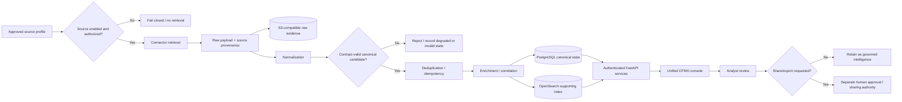

### Key controls

- retrieval is allowed only for governed source profiles;
- raw source evidence and provenance are preserved separately from derived intelligence;
- missing source facts are not invented during normalization;
- PostgreSQL is canonical application truth; OpenSearch is a supporting index;
- technical ingestion never grants publication or sharing authority;
- failures and degraded upstream states remain visible rather than being silently converted into successful intelligence.

## WF-02 — Vulnerability prioritization

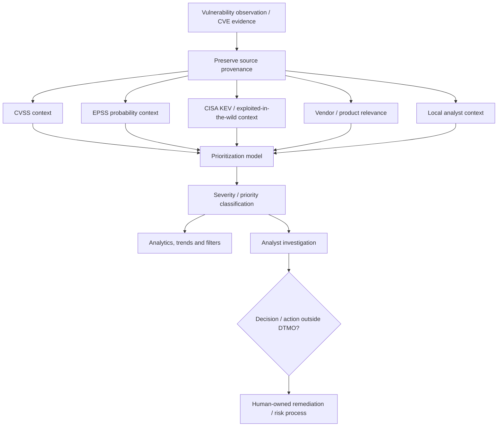

### Semantic boundaries

CVSS, EPSS and KEV are different signals and must not be collapsed into a single unsupported claim. DTMO may combine them for prioritization while preserving provenance and meaning. A CVE record, high CVSS value, EPSS probability or KEV membership does not by itself prove local exposure, exploitability, compromise or remediation status.

## WF-03 — Identity, bearer trust and RBAC

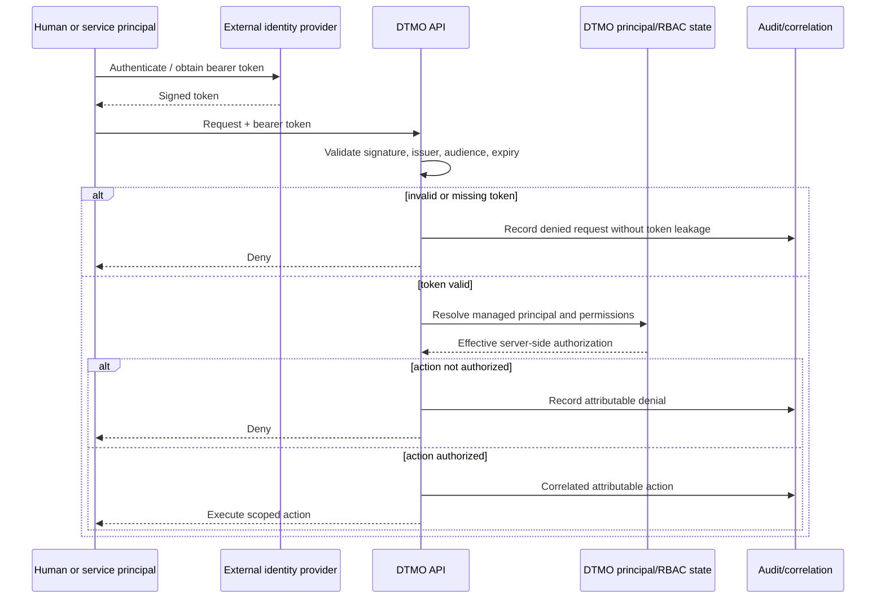

### Trust rules

- externally issued tokens are cryptographically validated;
- client-supplied role/identity headers do not establish privilege;
- server-side RBAC is authoritative;
- human and service identities remain distinct;
- privileged Administration requires explicit permission and remains auditable;
- stale or revoked privilege must not silently remain effective.

## WF-04 — Privileged Administration

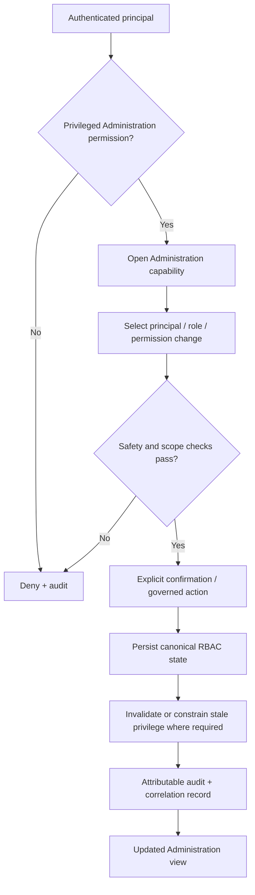

## WF-05 — MISP governed read and export

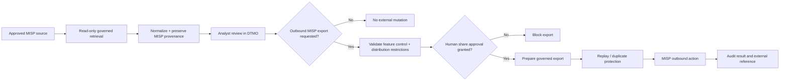

## WF-06 — AIL enrichment and correlation

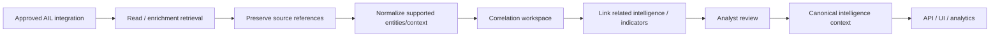

AIL access does not grant autonomous crawler control, mutation authority or publication authority.

## WF-07 — Audit and correlation trace

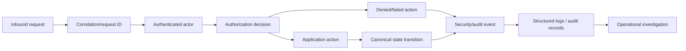

Audit records distinguish human and service actors and must not expose bearer tokens or raw secrets.

## WF-08 — Governance mapping and evidence

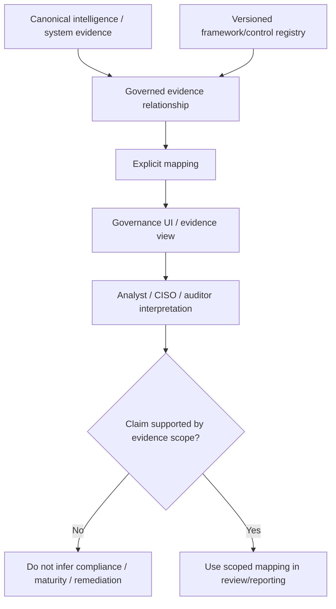

Framework mappings are relationships, not blanket compliance statements. MITRE ATT&CK, Normenkader IBP, NIST CSF, CVSS, EPSS, KEV, MISP and AIL retain their own semantic boundaries.

## WF-09 — Observability

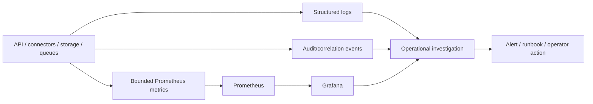

Grafana remains separately authenticated and is an operational/advanced dashboard surface rather than an alternate authentication path into DTMO.

## WF-10 — Backup, recovery and rollback

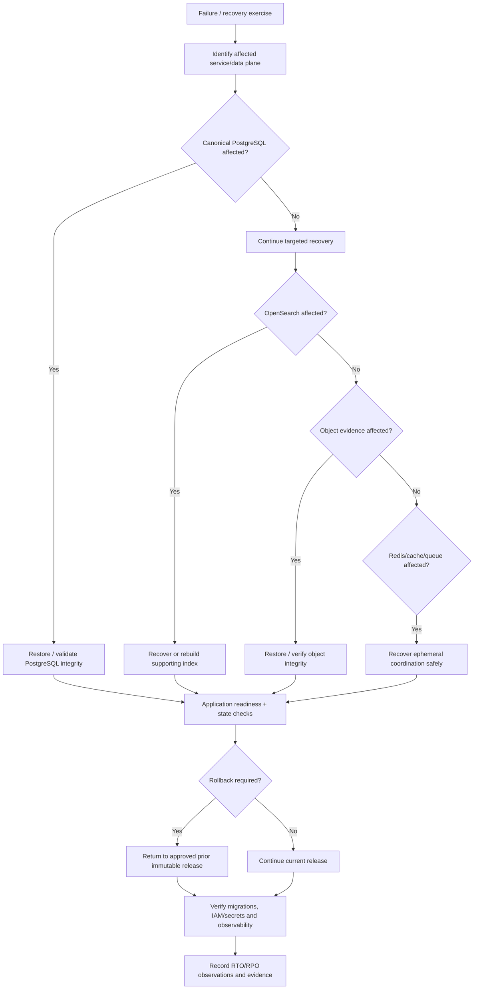

## WF-11 — Deployment and immutable staging identity

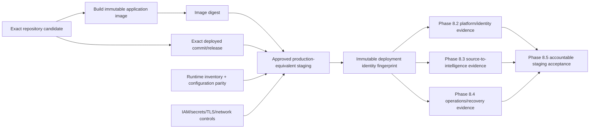

Evidence from different deployment identities must not be combined to manufacture acceptance.

## WF-12 — Production-readiness acceptance lifecycle

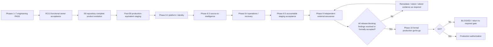

## Related authoritative documents

- `docs/architecture/SYSTEM_ARCHITECTURE.md`
- `docs/security/SECURITY_OVERVIEW.md`
- `docs/governance/GOVERNANCE_MAPPING_REGISTRY.md`
- `docs/evidence/EVIDENCE_INDEX.md`
- `docs/project/CURRENT_STATE.md`
- `docs/roadmap/PRODUCTION_ROADMAP.md`
- `docs/qa/QA_AND_RELEASE_GATES.md`
- `docs/visual/DOCUMENTATION_VISUAL_STANDARD.md`
