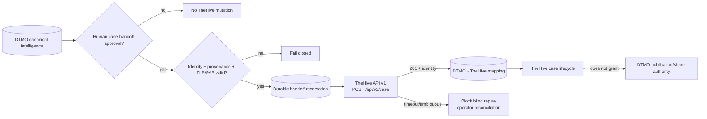

# TheHive → DTMO Incident/Case Handoff Contract

Status: **`PHASE 11.6 CONTRACT BASELINE / EXACT-HEAD VALIDATION REQUIRED`**  
Upstream baseline reviewed: **TheHive 5.5.16 (2026-06-30)**  
Public API baseline: **TheHive API v1 (`/api/v1`)**

## 1. Purpose

Phase 11.6 introduces a controlled service-to-service boundary between DTMO intelligence and TheHive incident/case workflow. DTMO remains authoritative for canonical CTI, education-sector relevance, provenance, governance and human publication/share authority. TheHive becomes authoritative only for the lifecycle of a case after an explicitly authorized handoff.

This contract does not create a runtime adapter. It defines the identity, data, authorization, licensing, failure and evidence rules that a later bounded implementation must satisfy.

## 2. Upstream and licensing boundary

TheHive remains a separate StrangeBee service. DTMO does not vendor TheHive source or assume redistribution rights. The reviewed upstream baseline is TheHive 5.5.16. Public API v0 is deprecated; DTMO integrations must target API v1.

TheHive 5.3+ requires an activated license for continued write functionality after the initial trial. Community is free but requires license acquisition/activation; Gold and Platinum are paid tiers. License entitlements and quotas are deployment prerequisites, not repository assumptions.

Primary upstream references reviewed on 2026-08-17:

- StrangeBee TheHive 5.5 release notes;
- StrangeBee TheHive API documentation;
- StrangeBee About Licenses documentation;
- StrangeBee case and observable documentation.

## 3. Bounded API surface

The initial integration may use only an explicit allowlist of TheHive API v1 operations needed for controlled case handoff. The first mutation candidate is `POST /api/v1/case` after DTMO authorization. Any observable/task creation is a later implementation decision and must be separately bounded.

Administration, license management, organization ownership transfer, arbitrary case-access changes, responder execution, Cortex execution, MISP connector administration, case deletion and bulk mutation are outside the initial boundary.

## 4. Authority model

A DTMO intelligence item, MISP event, OpenCTI object, IntelOwl result or Taranis assessment **never creates a TheHive case by itself**.

Case handoff requires an explicit human-authorized DTMO action under a server-side RBAC permission dedicated to incident/case handoff. Publication/share approval and case-handoff approval are distinct authorities.

TheHive case creation does not grant DTMO publication/share authority, does not prove local compromise and does not change canonical CTI truth.

## 5. Identity and idempotency

DTMO must preserve a durable mapping between:

- DTMO canonical intelligence UUID;
- DTMO handoff request UUID/idempotency key;
- TheHive case `_id` or stable case identity returned by API v1;
- TheHive organization context;
- source provenance and source restriction envelope.

Mutable case titles, descriptions, tags or assignees must never be used as identity.

Before retrying an uncertain case-creation delivery, DTMO must reconcile the durable handoff state. Blind replay of a potentially successful `POST /api/v1/case` is forbidden because duplicate cases would create conflicting operational truth.

## 6. Data mapping

A handoff payload may contain only reviewed, minimized fields. Candidate mappings are:

| DTMO | TheHive | Rule |
|---|---|---|
| canonical title | `title` | required, bounded length |
| analyst-approved summary | `description` / `summary` | sanitized/minimized |
| DTMO severity | `severity` | explicit deterministic mapping |
| effective TLP | `tlp` | never broaden source restrictions |
| effective PAP | `pap` | explicit mapping; unknown fails closed |
| canonical tags/framework references | `tags` | allowlisted and non-secret |
| DTMO UUID / provenance reference | custom field or link | implementation must preserve traceability |

Attachments, raw source bodies, credentials, private enrichment results and unrelated personal data are excluded by default.

## 7. TLP/PAP and access control

TheHive supports case `tlp`, `pap` and access controls. DTMO must calculate the effective restriction before handoff and must not create a case if the mapping is unknown, ambiguous or broader than authoritative source restrictions.

The initial case must use the least-broad access supported by the approved deployment profile. Automatic external sharing is excluded. Any later change to TheHive case access is a separate governed action.

## 8. Authentication and least privilege

The runtime integration requires a dedicated non-human TheHive identity scoped to the target organization with only the permissions required for the accepted case-handoff API surface. Platform administration, organization administration and unrestricted cross-organization access are prohibited for routine handoff.

Secrets are runtime secrets and never repository evidence. `401`, `403`, license/read-only state, unknown organization context and permission mismatch fail closed.

## 9. Failure model

The integration fails closed on:

- missing human handoff approval;
- missing or malformed DTMO identity/provenance;
- unknown TLP/PAP/access mapping;
- source restrictions that cannot be represented safely;
- authentication/authorization failure;
- TheHive license state that prevents write operations;
- timeout or ambiguous response after case creation;
- conflicting DTMO↔TheHive identity mapping;
- malformed API response.

A TheHive outage must not make unrelated DTMO read paths unavailable.

## 10. Trust boundary

## 11. Evidence boundary

Repository contract tests may prove documentation consistency and bounded policy assertions only. They cannot prove live TheHive connectivity, effective permissions, license entitlement, organization configuration, privacy approval, TLP/PAP correctness on real data, HA/recovery, operational acceptance, independent assurance or production authorization.

Historical Phase 8/9 evidence remains candidate-bound and is not reused for this materially changed integrated platform.

## 12. Explicit exclusions

This contract does not authorize automatic case creation, automatic incident escalation, responder execution, Cortex adoption, MISP→TheHive automation, external portal sharing, organization/access administration, report publication or production use.
