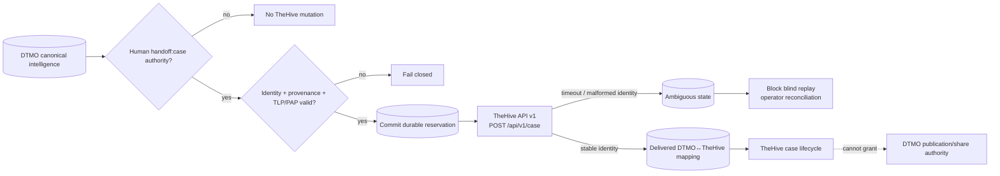

# TheHive → DTMO Incident/Case Handoff Contract

Status: **`PHASE 11.6 CONTRACT ACCEPTED / BOUNDED HANDOFF IMPLEMENTATION IN EXACT-HEAD VALIDATION`**  
Upstream baseline reviewed: **TheHive 5.5.16 (2026-06-30)**  
Public API baseline: **TheHive API v1 (`/api/v1`)**

## 1. Purpose

Phase 11.6 introduces a controlled service-to-service boundary between DTMO intelligence and TheHive incident/case workflow. DTMO remains authoritative for canonical CTI, education-sector relevance, provenance, governance and human publication/share authority. TheHive becomes authoritative only for the lifecycle of a case after an explicitly authorized handoff.

The contract baseline was accepted before runtime mutation code. The active bounded implementation realizes only the contract-approved human-authorized `POST /api/v1/case` path plus durable reservation/reconciliation state and read-only handoff history.

## 2. Upstream and licensing boundary

TheHive remains a separate StrangeBee service. DTMO does not vendor TheHive source or assume redistribution rights. The reviewed upstream baseline is TheHive 5.5.16. Public API v0 is deprecated; DTMO integrations target API v1.

TheHive 5.3+ requires an activated license for continued write functionality after the initial trial. Community is free but requires license acquisition/activation; Gold and Platinum are paid tiers. License entitlements and quotas are deployment prerequisites, not repository assumptions.

Primary upstream references reviewed on 2026-08-17:

- StrangeBee TheHive 5.5 release notes;
- StrangeBee TheHive API documentation;
- StrangeBee About Licenses documentation;
- StrangeBee case and observable documentation.

## 3. Bounded API surface

The accepted runtime allowlist contains only explicit case creation through `POST /api/v1/case` after DTMO authorization. The DTMO-side read-only history route exposes its own durable handoff state and does not mutate TheHive.

Observable/task creation, administration, license management, organization ownership transfer, arbitrary case-access changes, responder execution, Cortex execution, MISP connector administration, case deletion and bulk mutation remain outside this boundary.

## 4. Authority model

A DTMO intelligence item, MISP event, OpenCTI object, IntelOwl result or Taranis assessment **never creates a TheHive case by itself**.

Case handoff requires an explicit human-authorized DTMO action under the dedicated server-side `handoff:case` permission. In the bounded role model this permission is held by CISO, CERT, Senior Analyst and Administrator roles. Service accounts do not receive it. Publication/share approval and case-handoff approval remain distinct authorities.

TheHive case creation does not grant DTMO publication/share authority, does not prove local compromise and does not change canonical CTI truth.

## 5. Identity and idempotency

DTMO preserves a durable mapping between:

- DTMO canonical intelligence UUID;
- DTMO handoff request UUID/idempotency key;
- TheHive case `_id` or stable case identity returned by API v1;
- TheHive organization context;
- human principal and source restriction envelope.

Mutable case titles, descriptions, tags or assignees are never identity.

Migration `0014_thehive_handoff_state` creates the durable `thehive_handoff_state` reservation table. A reservation is committed before the external mutation. A request already marked `delivered` or `ambiguous` cannot be automatically replayed. Conflicting request or TheHive case identities fail closed.

## 6. Data mapping

A handoff payload contains only reviewed, minimized fields:

| DTMO | TheHive | Rule |
|---|---|---|
| canonical title | `title` | required, whitespace-normalized and bounded |
| human-approved summary | `description` | bounded; canonical UUID appended for traceability |
| DTMO severity | `severity` | deterministic explicit mapping |
| effective TLP | `tlp` | explicit map; unknown fails closed |
| effective PAP | `pap` | explicit map; unknown fails closed |
| canonical tags | `tags` | bounded, deduplicated, non-empty values only |
| DTMO UUID | description reference | immutable traceability reference |

Attachments, raw source bodies, credentials, private enrichment results and unrelated personal data remain excluded.

## 7. TLP/PAP and access control

The bounded implementation maps explicitly supplied effective TLP/PAP values and refuses unknown values before external mutation. It does not implement case-access administration or automatic external sharing.

This repository mapping is engineering evidence only. Deployment-bound validation must still prove that the approved real-data handling profile correctly represents the authoritative source restrictions in the actual TheHive organization.

## 8. Authentication and least privilege

Runtime integration uses a dedicated non-human TheHive identity scoped to one explicitly configured organization. The runtime token is obtained from `DTMO_THEHIVE_API_TOKEN`; the organization from `DTMO_THEHIVE_ORGANIZATION`. Platform administration, organization administration and unrestricted cross-organization access are prohibited for routine handoff.

`DTMO_FEATURE_THEHIVE_HANDOFF` is false by default. Production configuration validation requires an HTTPS API base, a non-empty runtime token and explicit organization whenever the feature is enabled. These settings do not establish live entitlement or deployed permission evidence.

## 9. Failure model

The integration fails closed on:

- missing human `handoff:case` authority;
- service-account attempts to authorize handoff;
- disabled feature flag;
- missing canonical item or provenance;
- unknown TLP/PAP/severity mapping;
- missing runtime service identity configuration;
- authentication/authorization/write-boundary rejection;
- timeout or network ambiguity after case creation may have been delivered;
- a success response without stable case identity;
- conflicting DTMO↔TheHive request/case identity.

Definitive pre-delivery/upstream failures may be recorded as `failed`. Potentially delivered requests become `ambiguous` and automated replay is blocked. A TheHive outage does not make unrelated DTMO read paths unavailable.

## 10. Trust boundary

## 11. Repository implementation boundary

The implementation consists of:

- `backend/dtmo/integrations/thehive.py` — minimized payload mapping and API-v1 case-create adapter;
- `backend/dtmo/thehive_handoff.py` — human-authorized DTMO handoff/history API;
- `backend/dtmo/persistence/thehive.py` — durable reservation, delivered/ambiguous/failed state;
- `database/migrations/versions/0014_thehive_handoff_state.py` — database-enforced identity and no-authority invariants;
- dedicated Phase 11.6 adapter/state contract tests and exact-head gate.

The database enforces unique request identity, unique confirmed TheHive case identity, bounded lifecycle states, `external_share_authorized=false` and `local_compromise_proven=false`.

## 12. Evidence boundary

Repository CI may prove synthetic route, RBAC, persistence, state-machine, configuration and documentation contracts only. It cannot prove live TheHive connectivity, effective permissions, license entitlement, organization configuration, privacy approval, TLP/PAP correctness on real data, HA/recovery, operational acceptance, independent assurance or production authorization.

Historical Phase 8/9 evidence remains candidate-bound and is not reused for this materially changed integrated platform. Fresh Phase 11.10 and 11.11 evidence remains required before Phase 12.

## 13. Explicit exclusions

This implementation does not authorize automatic case creation, automatic incident escalation, observable/task mutation, responder execution, Cortex adoption, MISP→TheHive automation, external portal sharing, organization/access administration, case deletion, report publication or production use.
