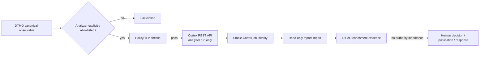

# Cortex Analyzer Connector

State: **`IN PROGRESS / EXACT-HEAD VALIDATION REQUIRED`**

## Purpose

This bounded connector was added after an explicit operator requirement to include Cortex in the DTMO platform. The previously accepted Phase 11.7 decision remains historically valid for the requirement set it assessed; this new requirement is the re-entry trigger defined by that decision.

The connector is intentionally limited to **Cortex analyzers**. It does not authorize or implement Cortex responders, automated response, case mutation, publication or sharing.

## Service and licensing boundary

Cortex remains a separate service accessed through its REST API. Cortex and its analyzer ecosystem are distributed under AGPL-3.0 upstream; DTMO does not vendor Cortex or analyzer source in this slice. Service/API separation is preserved.

## Runtime contract

DTMO submits one explicitly allowlisted analyzer using the Cortex analyzer job API and imports the returned report as enrichment evidence. The connector requires:

- an HTTPS-capable Cortex API endpoint at deployment time;
- a runtime API token supplied outside source control;
- an explicit analyzer allowlist;
- an approved observable type;
- a known TLP value;
- stable returned job identity;
- bounded report size.

Unknown analyzer IDs, observable types, TLP values, missing credentials, unstable job identity or oversized result payloads fail closed.

## Authority boundary

Imported Cortex results carry explicit DTMO metadata stating:

- `read_only_result_import = true`;
- `responder_execution_authorized = false`;
- `external_share_authorized = false`;
- `local_compromise_proven = false`.

A Cortex result may inform an analyst but never establishes local compromise, grants publication/share authority or authorizes a responder.

## Data flow

## Explicit exclusions

- Cortex responders;
- automatic containment/remediation;
- automatic TheHive responder invocation;
- Cortex-to-MISP/OpenCTI publication;
- source vendoring;
- live deployment evidence;
- production authorization.

Phase 11.8 integrated runtime industrialisation remains the next roadmap priority after this bounded connector is fully green and protected-merged.
