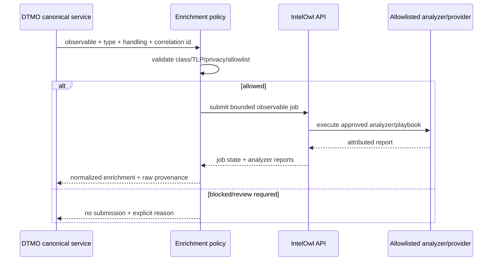
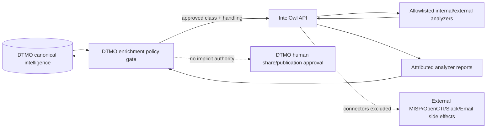

# IntelOwl Integration — Phase 11.3

State: **`CONTRACT-ONLY / ADAPTER NOT YET IMPLEMENTED`**  
Last reviewed: **2026-08-16**

## Purpose

This guide translates the Phase 11.3 architecture contract into an implementation and operations boundary. The authoritative contract is `docs/architecture/INTELOWL_DTMO_INTEGRATION_CONTRACT.md`.

No live IntelOwl integration is claimed by this document. Configuration keys, endpoint wrappers and operator controls are not considered available until a subsequent bounded implementation PR adds and tests them.

## Target data flow

## Trust boundaries

Boundary rules:

- IntelOwl is a separate service, not a DTMO code dependency to be vendored.
- DTMO submits only observable classes and analyzers/playbooks explicitly approved by policy.
- IntelOwl external Connectors are excluded from the initial enrichment path.
- Analyzer/provider secrets remain managed at the IntelOwl/provider boundary; DTMO retains only its dedicated IntelOwl API token.
- Results return as attributed enrichment context and never as implicit local-compromise proof.

## Planned operator contract

A later implementation must expose enough governed state for an authorized administrator/operator to determine:

- whether IntelOwl enrichment is enabled;
- target instance identity without exposing credentials;
- configured/approved observable classes;
- approved analyzer/playbook policy;
- last request/success/failure timestamps;
- degraded/rate-limited state;
- correlation/job identifiers for troubleshooting;
- whether a result was complete, partial or rejected;
- why an observable was blocked by TLP/privacy/allowlist policy.

It must not expose raw API tokens, provider credentials or unnecessary observable data in logs/metrics.

## Planned configuration classes

The implementation is expected to need configuration equivalent to:

- feature enablement;
- IntelOwl base URL;
- secret-backed API token;
- allowed observable classes;
- approved analyzer/playbook names;
- request timeout;
- maximum concurrent jobs;
- polling interval and maximum polling duration;
- maximum accepted result size;
- rate-limit/backoff parameters.

Exact DTMO environment-variable names are intentionally not declared yet. They become authoritative only when implementation code and configuration validation are merged together.

## TLP and privacy operations

Operators must treat analyzer execution as a possible disclosure of the submitted observable to an external provider.

- Unknown/missing handling state: do not submit; route to review.
- `TLP:RED` or equivalent restricted data: never submit to external analyzers.
- Email/personal generic observables: disabled until explicit privacy/data-processing approval.
- Analyzer `maximum_tlp` is an upstream guardrail, not a replacement for DTMO policy.
- A newly installed IntelOwl analyzer is not automatically approved in DTMO.

## Failure and recovery expectations

IntelOwl is fail-isolated. A dependency outage or provider failure must not make unrelated DTMO read paths unavailable.

Operational states to preserve include:

- authentication/authorization failure;
- TLS/connectivity failure;
- rate-limited/deferred;
- job accepted/pending/running;
- job complete;
- partial analyzer success;
- analyzer failure;
- malformed/oversized report rejected;
- unknown analyzer rejected;
- review-required due to handling/privacy policy.

Retries are bounded. A `403` never triggers privilege escalation. A `429` never triggers uncontrolled retry or fallback to an unapproved analyzer.

## Provenance minimum

Every imported enrichment result must remain traceable to:

- DTMO canonical observable/intelligence identity;
- IntelOwl instance;
- upstream job ID;
- analyzer/playbook identity;
- provider/report identity where available;
- submission/completion/retrieval timestamps;
- correlation/request ID;
- handling/TLP state;
- raw-result evidence reference;
- complete/partial/failure outcome.

## Security and licensing

The service identity is non-human, non-admin and least-privilege. TLS verification is mandatory outside explicit local development. Tokens are runtime secrets and are excluded from logs/evidence.

IntelOwl and pyIntelOwl are AGPL-3.0 projects. The accepted Phase 11.3 design is service-to-service. No IntelOwl/pyIntelOwl source is vendored into DTMO by this step. Embedding, modification, redistribution or operation of modified network-facing components requires explicit licensing review before acceptance.

## Acceptance/evidence boundary

This document plus the architecture contract can be accepted by repository CI. Such acceptance proves only that the implementation boundary is documented and synchronized.

It does not prove:

- live IntelOwl connectivity;
- deployed service-account permissions;
- configured analyzer/provider credentials;
- provider availability or data quality;
- production-equivalent runtime behavior;
- privacy approval for personal data;
- independent assurance;
- production authorization.

Those evidence classes remain future bounded work under the Phase 11 roadmap.
