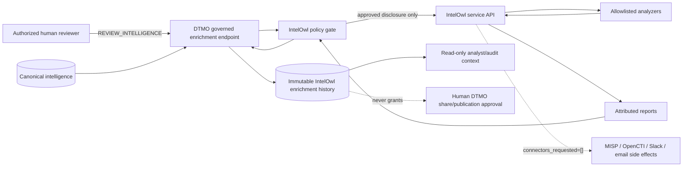

# IntelOwl Integration — Phase 11.3

State: **`GOVERNED EXECUTION + DURABLE HISTORY IMPLEMENTED / EXACT-HEAD VALIDATION REQUIRED`**  
Last reviewed: **2026-08-16**

## Purpose

This guide documents the bounded IntelOwl service/API integration under the accepted Phase 11.3 contract in `docs/architecture/INTELOWL_DTMO_INTEGRATION_CONTRACT.md`. The current slice extends the accepted adapter with human-authorized execution, immutable durable enrichment history and an operational read boundary. It does not claim live IntelOwl deployment, provider quality, production-equivalent behavior, external assurance or production authorization.

## Governed execution flow

```mermaid
sequenceDiagram
    actor Analyst as Authorized reviewer
    participant API as DTMO /api/v1/intelowl
    participant DB as DTMO canonical DB
    participant Policy as IntelOwlAdapter policy gate
    participant Owl as IntelOwl API
    participant Analyzer as Allowlisted analyzer/provider

    Analyst->>API: POST item/{id}/enrich + observable + handling + analyzers
    API->>API: require REVIEW_INTELLIGENCE + feature flag
    API->>Policy: canonical id + observable + handling + analyzers
    Policy->>Policy: validate class / size / handling / analyzer allowlist
    alt permitted
        Policy->>Owl: POST /api/analyze_observable
        Note over Policy,Owl: connectors_requested=[]
        Owl-->>Policy: immutable job id
        loop bounded polling
            Policy->>Owl: GET /api/jobs/{job_id}
            Owl-->>Policy: status + attributed analyzer reports
        end
        Policy->>Policy: verify job identity, size and returned analyzers
        Policy-->>API: complete/partial attributed result
        API->>DB: insert immutable enrichment record
        DB-->>API: record id + no-share/no-compromise markers
        API-->>Analyst: governed execution receipt
    else blocked
        Policy-->>API: fail closed before disclosure
        API-->>Analyst: policy error; no enrichment record invented
    end
```

## Trust and authority boundaries



IntelOwl is a separate service boundary. For this slice every requested analyzer is conservatively treated as an external disclosure target. Restricted handling such as `red`, `tlp:red` and `review-required` therefore fails closed before network disclosure. A future narrower analyzer classification requires a separately reviewed contract and evidence; it is not inferred from provider names.

The initial enrichment request always sends `connectors_requested=[]`. IntelOwl external Connectors remain outside this path. Every persisted result is constrained to `external_share_authorized=false` and `local_compromise_proven=false`; analyzer/provider verdicts remain contextual evidence only.

## Durable enrichment history

Migration `0011_intelowl_enrichment_history` adds `intelowl_enrichment_records`, linked by foreign key to the canonical `intelligence_items` record. Each record preserves:

- canonical intelligence item identity and immutable IntelOwl job identity;
- observable type/value and handling label used for the disclosure decision;
- explicitly requested analyzers;
- terminal status, partial-success marker and attributed analyzer reports;
- bounded raw normalized result with DTMO provenance markers;
- requesting human principal subject and creation timestamp;
- database-enforced no-share-authority and no-local-compromise-proof invariants.

`(item_id, job_id)` is unique, making replay of the same upstream job idempotent at the persistence boundary rather than duplicating evidence.

## API and RBAC

The governed operational surface is:

- `POST /api/v1/intelowl/items/{item_id}/enrich` — requires `REVIEW_INTELLIGENCE`; service accounts do not possess that permission in the current RBAC model, preventing autonomous external enrichment through this endpoint;
- `GET /api/v1/intelowl/items/{item_id}/history` — requires `READ_INTELLIGENCE` and returns persisted enrichment receipts/context without granting share authority.

Execution is disabled unless `DTMO_FEATURE_INTELOWL_ENRICHMENT=true`. A missing canonical item returns a bounded not-found result; policy rejection returns a bounded validation failure; upstream HTTP failure returns a dependency failure without fabricating enrichment evidence.

## Runtime configuration

All keys use the standard `DTMO_` environment prefix:

- `DTMO_FEATURE_INTELOWL_ENRICHMENT` — feature enablement, disabled by default;
- `DTMO_INTELOWL_API_BASE` — IntelOwl service base URL;
- `DTMO_INTELOWL_API_TOKEN` — runtime-secret API token;
- `DTMO_INTELOWL_ALLOWED_OBSERVABLE_TYPES` — defaults to `cve,ip,domain,url,hash`;
- `DTMO_INTELOWL_ALLOWED_ANALYZERS` — explicit analyzer allowlist; required in production when enabled;
- `DTMO_INTELOWL_MAX_POLL_ATTEMPTS` — hard bound on job polling;
- `DTMO_INTELOWL_POLL_INTERVAL_SECONDS` — interval between bounded polls;
- `DTMO_INTELOWL_MAX_RESULT_BYTES` — maximum accepted serialized job-result size;
- `DTMO_CONNECTOR_TIMEOUT_SECONDS` — bounded HTTP client timeout reused for the service call.

Production validation requires HTTPS, a non-empty runtime API token and a non-empty explicit analyzer allowlist. Tokens are never copied into normalized or persisted results.

## Fail-closed policy

The adapter rejects before network disclosure when the observable type is outside the configured approved set, the value is empty/oversized, the requested analyzers are not a non-empty subset of the allowlist, or the handling policy forbids external disclosure. Email/personal-data observable classes remain outside the approved default set pending explicit privacy/data-processing approval.

Returned job data is also validated. A missing or changed job ID, oversized payload, malformed report list, or report from an analyzer outside the allowlist is rejected rather than silently normalized. Persistence independently verifies that the result canonical id equals the target intelligence item id.

## Partial success and provenance

Analyzer failures are preserved separately from successful peer analyzers. A terminal job is marked partial when any analyzer fails or when a requested analyzer is absent from the returned reports. Partial success is not rewritten as complete success.

Normalized and persisted metadata preserves the DTMO canonical identifier, IntelOwl job ID, analyzer identity, raw upstream result and explicit authority markers. Enrichment does not mutate canonical review/share state and cannot itself set `share_approved`.

## Rate limits and outages

HTTP status failures, including `429`, remain bounded dependency failures. The integration does not fall back to an unapproved provider and does not retry beyond the configured polling/request framework. A job that never reaches a terminal state within `DTMO_INTELOWL_MAX_POLL_ATTEMPTS` fails closed with an explicit bounded-polling error.

## Security and licensing

The IntelOwl runtime API identity remains non-human and non-admin by contract; the DTMO caller that authorizes a governed disclosure is a human principal with `REVIEW_INTELLIGENCE`. Provider credentials belong at the IntelOwl/provider boundary; DTMO holds only its IntelOwl API token. No IntelOwl or pyIntelOwl source is vendored into DTMO. IntelOwl/pyIntelOwl remain AGPL-3.0 components across a service/API boundary; embedding, modification or redistribution requires separate licensing review.

## Repository acceptance and remaining Phase 11.3 work

Repository acceptance for this slice requires migration upgrade/downgrade, lint/type/test gates, RBAC and policy-contract coverage, durable-history invariants, documentation synchronization and exact-head CI.

Repository CI proves only code/configuration and synthetic persistence behavior. It does **not** prove live IntelOwl connectivity, deployed service-account permissions, provider credentials, analyzer quality, privacy approval, production-equivalent behavior, independent assurance or production authorization.

Phase 11.4 OpenCTI must not begin until this governed execution/persistence slice is green and merged and Phase 11.3 is formally reconciled as repository-complete in the authoritative roadmap/current-state documentation.
