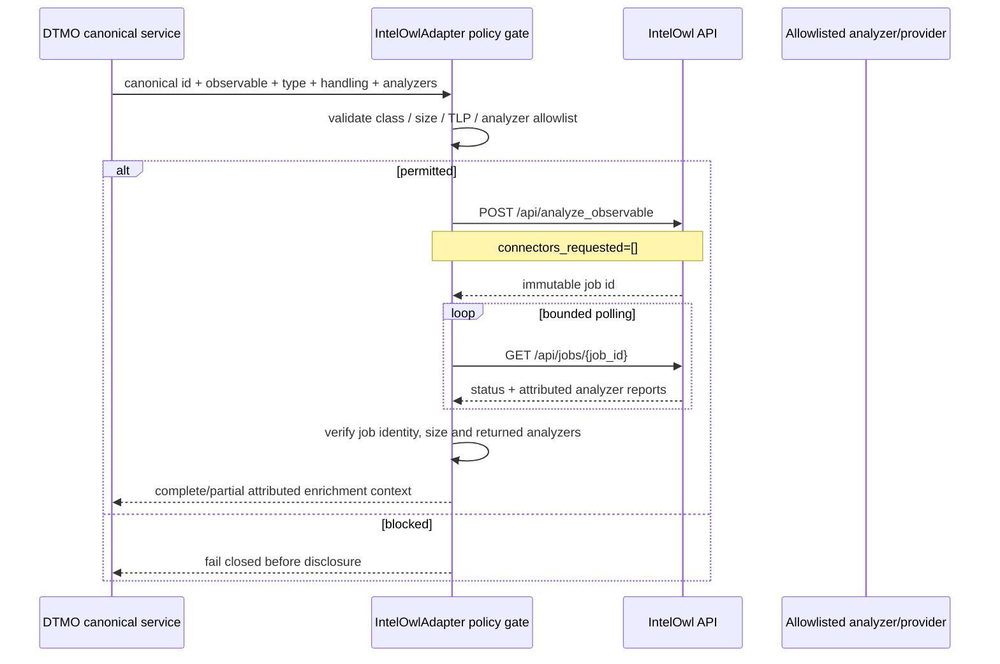
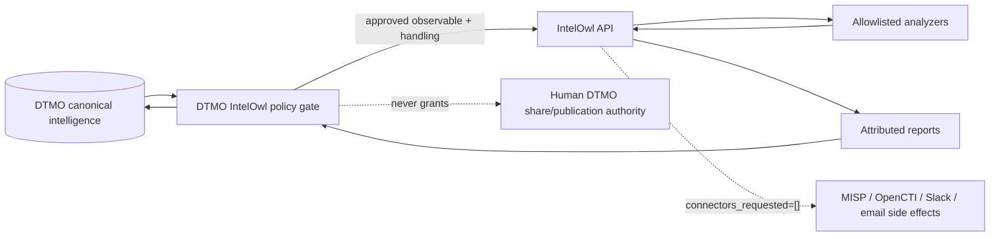

# IntelOwl Integration — Phase 11.3

State: **`ADAPTER IMPLEMENTED / EXACT-HEAD VALIDATION REQUIRED`**  
Last reviewed: **2026-08-16**

## Purpose

This guide documents the bounded IntelOwl adapter implemented under the accepted Phase 11.3 contract in `docs/architecture/INTELOWL_DTMO_INTEGRATION_CONTRACT.md`. It is a service-to-service enrichment boundary only. It does not claim live IntelOwl deployment, production-equivalent behavior, external assurance or production authorization.

## Implemented data flow

## Trust and authority boundaries

The implementation sends `connectors_requested=[]` on the initial enrichment request. IntelOwl external Connectors therefore remain outside this path. An IntelOwl result records `external_share_authorized=false` and `local_compromise_proven=false`; provider verdicts remain contextual evidence only.

## Runtime configuration

All keys use the standard `DTMO_` environment prefix:

- `DTMO_FEATURE_INTELOWL_ENRICHMENT` — feature enablement, disabled by default;
- `DTMO_INTELOWL_API_BASE` — IntelOwl service base URL;
- `DTMO_INTELOWL_API_TOKEN` — runtime-secret API token;
- `DTMO_INTELOWL_ALLOWED_OBSERVABLE_TYPES` — defaults to `cve,ip,domain,url,hash`;
- `DTMO_INTELOWL_ALLOWED_ANALYZERS` — explicit analyzer allowlist; required in production when enabled;
- `DTMO_INTELOWL_MAX_POLL_ATTEMPTS` — hard bound on job polling;
- `DTMO_INTELOWL_POLL_INTERVAL_SECONDS` — interval between bounded polls;
- `DTMO_INTELOWL_MAX_RESULT_BYTES` — maximum accepted serialized job-result size.

Production validation requires HTTPS, a non-empty runtime API token and a non-empty explicit analyzer allowlist. Tokens are never copied into normalized results.

## Fail-closed policy

The adapter rejects before network disclosure when the observable type is outside the configured approved set, the value is empty/oversized, the requested analyzers are not a non-empty subset of the allowlist, or the handling policy forbids sending restricted material to an analyzer identified as external. Email/personal-data observable classes remain outside the approved default set pending explicit privacy/data-processing approval.

Returned job data is also validated. A missing or changed job ID, oversized payload, malformed report list, or report from an analyzer outside the allowlist is rejected rather than silently normalized.

## Partial success and provenance

Analyzer failures are preserved separately from successful peer analyzers. A terminal job is marked partial when any analyzer fails or when a requested analyzer is absent from the returned reports. Partial success is not rewritten as complete success.

Normalized metadata preserves the DTMO canonical identifier, IntelOwl job ID, analyzer identity, raw upstream result and the explicit authority markers. Subsequent persistence/history wiring must preserve this attribution rather than flattening analyzer results into local-compromise truth.

## Rate limits and outages

HTTP status failures, including `429`, propagate as bounded dependency failures from this adapter. The implementation does not fall back to an unapproved provider and does not retry beyond the configured polling/request framework. A job that never reaches a terminal state within `DTMO_INTELOWL_MAX_POLL_ATTEMPTS` fails closed with an explicit bounded-polling error.

## Security and licensing

The service identity remains non-human and non-admin by contract. Provider credentials belong at the IntelOwl/provider boundary; DTMO holds only its IntelOwl API token. No IntelOwl or pyIntelOwl implementation source is vendored into DTMO. IntelOwl/pyIntelOwl remain AGPL-3.0 components across a service/API boundary; embedding, modification or redistribution requires separate licensing review.

## Repository acceptance and next bounded work

Synthetic tests cover bearer/token use, connector-side-effect exclusion, observable/analyzer allowlisting, TLP restriction, unknown analyzer rejection, job identity mismatch, partial-success semantics, bounded polling, `429` propagation and production configuration validation.

Repository CI for this PR proves only code/configuration behavior against synthetic fixtures. It does **not** prove live IntelOwl connectivity, deployed service-account permissions, provider credentials, provider quality, persistent enrichment history, production-equivalent behavior, privacy approval, independent assurance or production authorization.

After this bounded adapter PR is accepted, the next Phase 11.3 slice is governed execution/persistence and operational integration of IntelOwl results. Phase 11.4 OpenCTI does not begin before Phase 11.3 repository completion.
