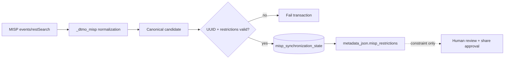

# MISP read integration and Phase 11.5 synchronization authority

## Purpose

The accepted MISP read path is an optional, disabled-by-default service integration. MISP remains an upstream CTI source; DTMO remains the canonical governed product surface for review, correlation and any later sharing decision.

Phase 11.5 does not replace this adapter. It reconciles the established read path with the existing human-approved MISP export path through one durable synchronization/authority model.

MISP remains a separate AGPL-3.0 service/API boundary. DTMO does not vendor MISP core source.

## Configuration

- `DTMO_FEATURE_MISP_CONNECTOR=false` by default.
- `DTMO_MISP_API_BASE` identifies the approved MISP instance.
- `DTMO_MISP_API_KEY` is the runtime API key.
- `DTMO_MISP_EVENT_LIMIT` bounds one read cycle (default 50, maximum 500).
- scheduled execution additionally requires the existing `DTMO_FEATURE_LIVE_CONNECTORS=true` switch.

When enabled in production, the MISP base URL must use HTTPS and a runtime API key must be present. Credentials remain runtime secrets and are never persisted as evidence.

## Read contract

The adapter POSTs only to `events/restSearch` with JSON output, a bounded limit, page 1 and descending timestamp order. Returned event wrappers and direct event objects are accepted.

Each event is retained as raw evidence and receives a `_dtmo_misp` projection containing:

- event UUID, source event ID, event information, date/timestamps and creator organisation;
- event distribution and sharing-group identifier;
- event tags and TLP tags;
- galaxies and galaxy clusters;
- attributes/IOCs with UUID, type, category, value, `to_ids`, first/last seen, distribution, sharing group, tags and galaxies;
- MISP objects, object attributes and object references/relationship types;
- explicit `restriction_authoritative=true`, `read_only_import=true` and `external_share_authorized=false` boundaries.

The canonical DTMO item type `cti_event` represents a structured CTI event/package without pretending that every MISP event is a campaign, incident or single indicator.

## Phase 11.5 synchronization-state persistence

After canonical candidate creation, MISP-origin records are reconciled inside the same database transaction through `misp_synchronization_state`.

The state binds exactly one DTMO canonical item to one stable MISP event UUID. It persists:

- MISP event UUID and upstream timestamp;
- source distribution;
- sharing-group identifier where distribution `4` applies;
- normalized TLP tags;
- the authoritative source restriction envelope;
- a deterministic snapshot hash and last-seen timestamp;
- `external_share_authorized=false` as a database-enforced invariant.

Accepted restrictions are also projected into canonical `metadata_json.misp_restrictions`. This is the shared authority boundary consumed by the governed export implementation. The read path therefore cannot silently diverge from the outbound restriction checks.

The reconciliation fails closed when:

- event UUID is missing or changes identity for an existing canonical item;
- one MISP event UUID maps to a different DTMO canonical item;
- distribution is unknown;
- distribution `4` lacks an explicit sharing group;
- TLP context is not an explicit list;
- the normalized projection is not marked authoritative/read-only;
- inbound data attempts to set external share authority.

## Distribution and sharing boundary

Incoming MISP distribution/TLP/sharing-group data is evidence and an authoritative constraint. Import success does not mean redistribution is allowed. Inbound processing never grants `share_approved`, never publishes back to MISP and never creates a server synchronization relationship.

The separate governed outbound path requires human DTMO review/share approval in addition to source restrictions. The more restrictive effective rule wins.

## Transaction and replay semantics

Canonical candidate persistence and MISP synchronization-state reconciliation occur before the database session commits. A malformed or conflicting authority envelope therefore aborts the canonical MISP ingestion transaction instead of leaving a canonical item that lacks its restriction state.

Reprocessing the same stable event identity/restriction snapshot is idempotent. Changed upstream restriction state updates the current attributable authority envelope without changing DTMO share authority.

## Explicit exclusions

Phase 11.5 does not authorize automatic MISP server push/pull federation, OpenCTI↔MISP synchronization, automatic MISP publication, service-account share approval or TheHive case creation.

## Evidence boundary

Repository unit/contract tests prove parser, request-shape, state-reconciliation, migration and restriction-preservation behavior against synthetic MISP payloads only. They do not prove connectivity to a real MISP instance, correctness of a specific organisation's MISP permissions, completeness of live CTI, production deployment, owner acceptance, external-sharing approval, independent assurance or production authorization.

Historical Phase 8/9 evidence remains scoped to the candidate it originally covered and is not evidence for the materially changed Phase 11 platform.

## Upstream basis

The implementation is aligned with the accepted Phase 11.5 contract for MISP v2.5.44 and the established MISP event search, JSON format, taxonomies/galaxies and granular sharing/distribution semantics. A materially changed upstream API/security/licensing baseline requires compatibility review before acceptance.
