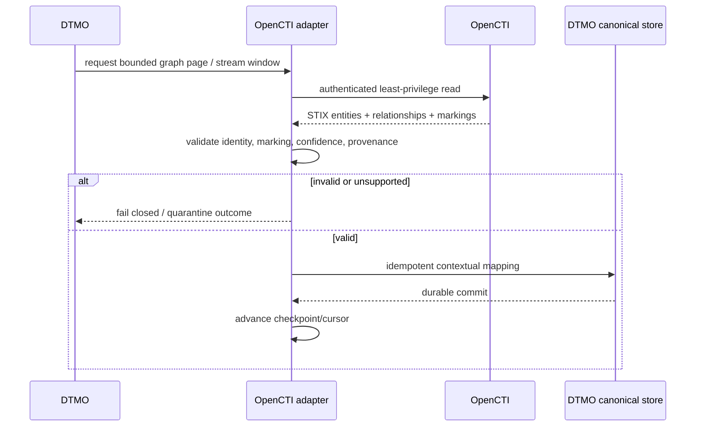

# OpenCTI Integration

Status: **Phase 11.4 contract slice / exact-head validation required**  
Last updated: **2026-08-16**

## Objective

OpenCTI supplies the STIX relationship/knowledge-graph capability for the Phase 11 composed platform. DTMO remains the education-sector CTI, vulnerability-context, governance, review and publication/share-authority layer.

The initial Phase 11.4 slice is documentation/contract only. It does not enable live OpenCTI connectivity or mutations.

## Reviewed upstream baseline

- OpenCTI **7.260811.0**;
- STIX 2.1 data representation;
- GraphQL API for application access;
- TAXII 2.1 feeds for specifically governed collection access;
- access-controlled event streams for later synchronization/replay;
- OpenCTI Community Edition under Apache-2.0, with Enterprise Edition governed separately.

## Planned adapter sequence

1. Read-only GraphQL/STIX identity adapter.
2. Bounded pagination and durable reconciliation/checkpointing.
3. Marking/TLP/confidence/provenance preservation.
4. Relationship mapping into DTMO contextual views without introducing a second graph authority.
5. Only after separate approval: narrowly scoped governed writes where required.

## Authority model

OpenCTI graph facts are attributed CTI context. They do not automatically:

- prove DTMO-local exposure or compromise;
- set DTMO severity;
- change canonical share approval;
- authorize publication;
- authorize MISP exchange;
- create cases or incidents.

Those decisions remain in DTMO or later bounded Phase 11 integrations.

## Identity model

DTMO canonical UUIDs and OpenCTI/STIX identities stay distinct. The adapter will preserve explicit mappings containing stable upstream identifiers, STIX type/ID, relationship endpoints, markings, confidence, source references and synchronization metadata.

Display labels and mutable names are never sufficient deduplication keys.

## Security boundary

A dedicated non-human OpenCTI account/token is required. It must have least privilege and only the markings required for the configured integration scope. Administrator/bypass capabilities are not part of the routine boundary.

Credentials are runtime secrets. `401`, `403`, unknown markings, malformed STIX and unsupported entity/relationship semantics fail closed.

## Synchronization model

The future adapter must be restart-safe and idempotent. It will not advance a durable cursor/checkpoint beyond successfully persisted DTMO state. Stream delete/merge events must preserve DTMO evidence history rather than destructively erasing provenance.

## Side effects excluded in the first implementation

- OpenCTI connector registration/invocation;
- MISP synchronization;
- TheHive case creation;
- automatic report publication;
- external enrichment triggers;
- security/marking configuration changes;
- arbitrary GraphQL mutations.

## Evidence boundary

Repository tests may prove contract synchronization and synthetic adapter behavior only. They do not prove production OpenCTI identity, marking configuration, live interoperability, performance, recovery, independent assurance or production authorization.

See `docs/architecture/OPENCTI_DTMO_INTEGRATION_CONTRACT.md` for the authoritative contract.