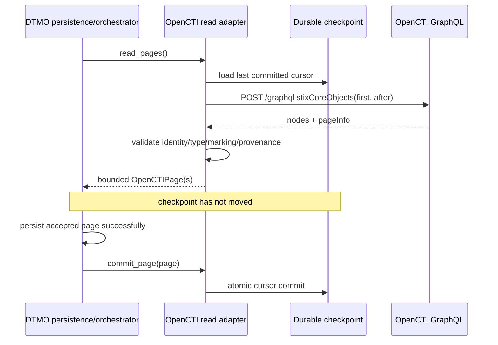

# OpenCTI Integration

Status: **Phase 11.4 read-only adapter / exact-head validation required**  
Last updated: **2026-08-16**

## Objective

OpenCTI supplies the STIX relationship/knowledge-graph capability for the Phase 11 composed platform. DTMO remains the education-sector CTI, vulnerability-context, governance, review and publication/share-authority layer.

The accepted Phase 11.4 contract is implemented here as a bounded **read-only GraphQL/STIX identity adapter**. This slice does not enable OpenCTI mutations or any external side effect.

## Implemented adapter boundary

The adapter in `backend/dtmo/integrations/opencti.py`:

- authenticates to a separately deployed OpenCTI service with a runtime bearer token;
- performs only GraphQL `stixCoreObjects` reads;
- uses explicit page-size and maximum-page bounds;
- preserves OpenCTI internal ID, STIX standard ID, entity type, parent types, markings, confidence, timestamps and external references;
- attaches DTMO provenance markers that keep the import read-only and explicitly set `external_share_authorized=false` and `local_compromise_proven=false`;
- rejects entity types outside the configured allowlist;
- fails closed on GraphQL errors, malformed page structures, unstable/missing identity, malformed markings, malformed confidence and invalid cursors;
- writes no OpenCTI data and invokes no OpenCTI connectors.

## Durable pagination and restart semantics

Checkpoint state is intentionally **not** advanced by `read_pages()`. The caller receives bounded `OpenCTIPage` objects and must first persist the page successfully. Only then may it invoke `commit_page(page)`. This separates network retrieval from durable acceptance and prevents partial/failed persistence from skipping upstream data.

The checkpoint is written atomically through a temporary file plus `os.replace()`. On restart the adapter resumes from the last explicitly committed cursor. Malformed checkpoint files fail closed.

## Configuration

The adapter is disabled by default. Relevant settings are:

- `DTMO_FEATURE_OPENCTI_READ=false`;
- `DTMO_OPENCTI_API_BASE`;
- `DTMO_OPENCTI_API_TOKEN`;
- `DTMO_OPENCTI_PAGE_SIZE`;
- `DTMO_OPENCTI_MAX_PAGES`;
- `DTMO_OPENCTI_ALLOWED_ENTITY_TYPES`;
- `DTMO_OPENCTI_CHECKPOINT_PATH`.

Production validation requires HTTPS, a non-empty runtime token, an explicit entity-type allowlist and an absolute durable checkpoint path. The token is never repository evidence.

## Identity and authority model

DTMO canonical UUIDs and OpenCTI/STIX identities remain distinct. Mutable labels/names are never treated as stable identity. The current adapter preserves upstream identities and provenance but does not yet create the durable DTMO canonical mapping/presentation layer; that remains a later bounded Phase 11.4 slice after this adapter is accepted.

OpenCTI graph facts are attributed CTI context. They do not automatically:

- prove DTMO-local exposure or compromise;
- set DTMO severity;
- change canonical share approval;
- authorize publication;
- authorize MISP exchange;
- create cases or incidents.

## Side effects excluded

This read adapter does **not** authorize or implement:

- OpenCTI connector registration/invocation;
- MISP synchronization;
- TheHive case creation;
- automatic report publication;
- external enrichment triggers;
- security/marking configuration changes;
- arbitrary GraphQL mutations.

## Evidence boundary

Repository tests may establish bounded synthetic adapter behavior, configuration validation and documentation synchronization only. They do not prove live OpenCTI connectivity, deployed credentials/RBAC/markings, real STIX graph correctness/performance, privacy approval, HA/recovery, independent assurance or production authorization.

Historical Phase 8/9 evidence remains candidate-bound and is not reused for the materially changed integrated platform.

See `docs/architecture/OPENCTI_DTMO_INTEGRATION_CONTRACT.md` for the authoritative contract and `docs/operations/OPENCTI_INTEGRATION_RUNBOOK.md` for operational handling.
