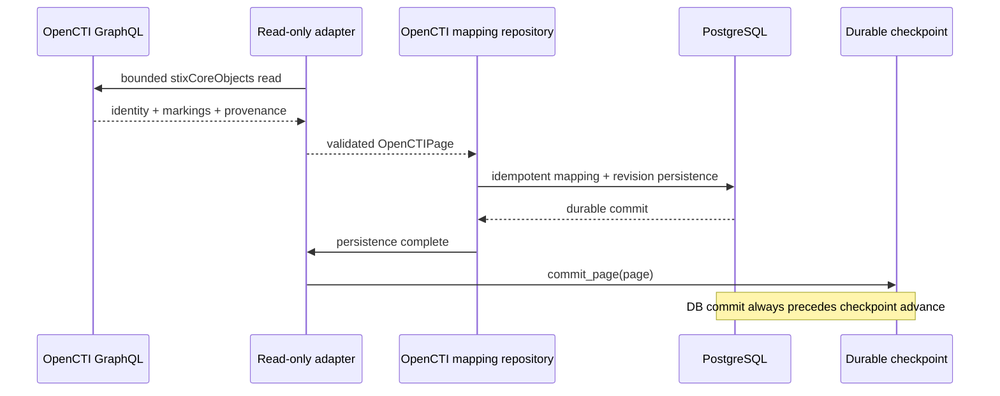

# OpenCTI Integration

Status: **Phase 11.4 canonical mapping/persistence + operational integration / exact-head validation required**  
Last updated: **2026-08-16**

## Objective

OpenCTI supplies the STIX relationship/knowledge-graph capability for the Phase 11 composed platform. DTMO remains authoritative for education-sector context, governance, review and publication/share decisions.

The Phase 11.4 contract and bounded read-only GraphQL/STIX adapter are accepted repository baselines. The active final Phase 11.4 slice adds durable canonical OpenCTI identity mapping, immutable reconciliation history and the persistence-before-checkpoint operational boundary. It does not authorize OpenCTI mutations or external side effects.

## Read-only adapter boundary

`backend/dtmo/integrations/opencti.py` performs bounded GraphQL `stixCoreObjects` reads and preserves OpenCTI internal identity, STIX standard ID, entity type, parent types, markings, confidence, timestamps, external references and explicit read-only provenance. Entity types remain allowlisted and malformed GraphQL/STIX/marking/identity/cursor state fails closed.

## Canonical mapping persistence

`backend/dtmo/persistence/opencti.py` adds two persistence classes:

- `opencti_object_mappings` stores the current attributed mapping between one DTMO canonical item and stable OpenCTI/STIX identity;
- `opencti_mapping_revisions` stores immutable snapshots keyed by mapping plus SHA-256 snapshot hash so upstream changes remain attributable and prior evidence is not destroyed.

Identity is fail-closed. A known OpenCTI internal ID may not silently change STIX ID, and a known STIX ID may not silently change OpenCTI internal ID. Mutable labels are not identity keys.

Every stored mapping preserves markings, confidence, timestamps, external references and provenance and is database-constrained to `external_share_authorized=false` and `local_compromise_proven=false`.

## Idempotent reconciliation

The repository hashes a canonical JSON snapshot of the OpenCTI-derived state. Replaying an unchanged object updates `last_seen_at` without creating duplicate revision history. A changed attributable snapshot updates current mapping context and adds one immutable revision. Ambiguous identity changes fail closed instead of being merged heuristically.

If the database commit fails, the checkpoint does not advance. If checkpoint replacement fails after database commit, replay is safe because mapping identity and revision snapshot hashes are idempotent.

## Migration

Migration `0012_opencti_mapping_persistence` follows `0011_intelowl_enrichment_history` and creates both mapping tables, identity uniqueness constraints, confidence validation, no-share/no-compromise constraints and reconciliation indexes.

## Configuration and service boundary

The adapter remains disabled by default and requires production HTTPS, a runtime bearer token, explicit entity-type allowlist and absolute durable checkpoint path. The OpenCTI token remains runtime-only evidence and is never committed.

OpenCTI remains a separate service. Community Edition is Apache-2.0 and Enterprise Edition remains separately licensed; no OpenCTI source is vendored into DTMO.

## Side effects excluded

Phase 11.4 still does not authorize:

- OpenCTI connector registration or invocation;
- MISP synchronization;
- TheHive case creation;
- external enrichment triggers;
- automatic report publication;
- security/marking administration;
- arbitrary GraphQL mutation.

No successful mapping, graph relationship or confidence value changes DTMO share approval, publication authority, severity or local-compromise state.

## Evidence boundary

Repository tests and exact-head CI can establish schema, idempotence, ordering and documentation contracts only. They do not prove live OpenCTI connectivity, deployed credentials/RBAC/markings, production graph correctness/performance, privacy approval, HA/recovery, independent assurance or production authorization. Historical Phase 8/9 evidence remains candidate-bound.

See `docs/architecture/OPENCTI_DTMO_INTEGRATION_CONTRACT.md` and `docs/operations/OPENCTI_INTEGRATION_RUNBOOK.md`.
