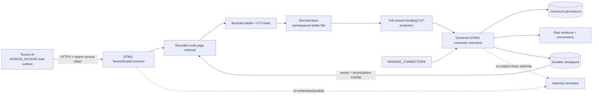

# Taranis AI → DTMO Read-only Adapter

Phase: **11.2**  
State: **`REPOSITORY IMPLEMENTATION COMPLETE / EXACT-HEAD VALIDATION REQUIRED`**

## Scope

The Phase 11.2 adapter establishes the executable service boundary between Taranis AI and DTMO. It is intentionally read-only and does not grant Taranis, its publishers, or the DTMO service identity any DTMO external-sharing authority.

## Runtime configuration

The connector is disabled by default. Runtime settings use the standard `DTMO_` prefix:

- `DTMO_FEATURE_TARANIS_CONNECTOR=true` enables the integration;
- `DTMO_TARANIS_API_BASE` is the Taranis service base URL;
- `DTMO_TARANIS_API_TOKEN` is a secret-backed read-only bearer token;
- `DTMO_TARANIS_PAGE_SIZE` bounds each collection request and defaults to 100;
- `DTMO_TARANIS_MAX_PAGES` bounds work per collection/run and defaults to 10;
- `DTMO_TARANIS_RECONCILE_PAGES` controls the intentional replay overlap and defaults to 1 page;
- `DTMO_TARANIS_DETAIL_CTI_LIMIT` bounds detail/CTI expansion per run and defaults to 200 upstream objects;
- `DTMO_TARANIS_CHECKPOINT_PATH` identifies the durable checkpoint file and defaults to `/var/lib/dtmo/checkpoints/taranis.json`.

Production validation requires an HTTPS API base, a non-empty runtime token and an absolute checkpoint path. The deployment must back the checkpoint path with durable storage. Tokens must not be committed, logged, placed in screenshots or copied into documentation.

## Read surface

The adapter uses the accepted Phase 11.1 read-only assessment surface:

- `GET /api/assess/news-items`;
- `GET /api/assess/news-items/{item_id}`;
- `GET /api/assess/news-items/{item_id}/cti`;
- `GET /api/assess/stories`;
- `GET /api/assess/stories/{story_id}`;
- `GET /api/assess/stories/{story_id}/cti`.

Collection pagination uses explicit `limit` and `offset` values and is capped by `DTMO_TARANIS_MAX_PAGES`. Detail/CTI expansion has its own bounded per-run budget so a large upstream page cannot create unbounded N+1 traffic. Records beyond that budget remain valid canonical candidates but carry `detail_cti_status=budget-exhausted`, making the evidence boundary explicit rather than silently pretending enrichment occurred.

A detail `404` after a successful list response is treated as a reconciliation race, not as invented deletion semantics. A CTI `404` retains the detail object with `detail-only` status. Malformed detail or CTI payloads fail the run before checkpoint commit.

## Canonical identity, checkpointing and replay

Upstream identity is preserved using explicit namespaces:

- `taranis:news-item:{id}`;
- `taranis:story:{id}`.

Unchanged replay therefore produces the same external ID and content fingerprint. The adapter does not use a content hash as a replacement for upstream identity.

Checkpoint state is maintained independently for news items and stories. Each run resumes from the prior high-water offset, deliberately backtracks by the configured reconciliation window, and replays that bounded overlap. This permits recently changed upstream objects to be re-normalized while canonical identity keeps replay deterministic.

A fetched checkpoint is only a candidate. The checkpoint file is atomically replaced **after** the complete fetched payload has parsed successfully. A malformed page, detail/CTI failure, missing stable ID, HTTP failure or checkpoint write failure therefore cannot advance the durable position. On restart, DTMO resumes from the last committed state and replays the configured overlap.

## Governed execution and RBAC

Taranis now uses the same governed execution path as the existing live connectors:

- scheduler registration occurs only when both `feature_live_connectors` and `feature_taranis_connector` are enabled;
- the manual endpoint is `POST /connectors/taranis/run`;
- manual execution requires existing `Permission.MANAGE_CONNECTORS` authorization;
- connector results flow through the canonical `ingest_connector_record` persistence/indexing path;
- connector health/alerting is recorded through the existing connector alerting service;
- `/connectors` advertises the Taranis mode as `read-only-assessment` and explicitly reports `external_share_authority=false`.

No new permission is introduced and no upstream Taranis publisher/share permission becomes DTMO publication or external-sharing authority. Existing human approval and governed MISP/export controls remain authoritative.

## Handling and provenance

Recognized TLP values are retained as handling input. Missing or unknown values map to `review-required`; they are never silently made shareable. Every normalized payload records `read_only_import=true` and `external_share_authorized=false`.

Detail and CTI responses are retained inside the raw Taranis context so downstream normalization remains attributable to the original upstream object. CTI output is context/evidence and is not represented as proof of compromise in the DTMO environment.

## Failure behavior

The adapter uses the DTMO connector timeout and bounded attempts. Missing credentials, malformed collection/detail/CTI shapes, unreadable checkpoint state and missing stable IDs fail closed. An upstream outage produces a failed/degraded connector result rather than fabricated intelligence or failure of unrelated DTMO read paths.

Partial failure is checkpoint-safe: if either collection or a required bounded detail/CTI read cannot be fetched and parsed successfully, neither collection checkpoint is committed for that run. This favors bounded replay over silent data loss.

## Evidence boundary

Repository tests prove normalization, bounded pagination, reconciliation backtracking, stable replay, detail/CTI request behavior, `404` reconciliation semantics, fail-closed payload validation, governed scheduler/manual registration and checkpoint commit semantics against synthetic fixtures and temporary files. They do **not** prove live Taranis connectivity, real service-account permissions, persistent-volume deployment, operational throughput, production-equivalent behavior or production authorization.

Those environment-dependent claims remain for the later integrated production-equivalent validation and independent assurance phases. Historical Phase 8/9 evidence is not reused for this materially changed integrated candidate.

## Phase 11.2 exit

Phase 11.2 repository implementation is complete when this bounded slice passes exact-head CI and professional documentation gates. After merge, the roadmap advances to **Phase 11.3 IntelOwl enrichment integration**. Live composed-platform acceptance remains intentionally deferred to Phase 11.10 rather than being inferred from CI.
