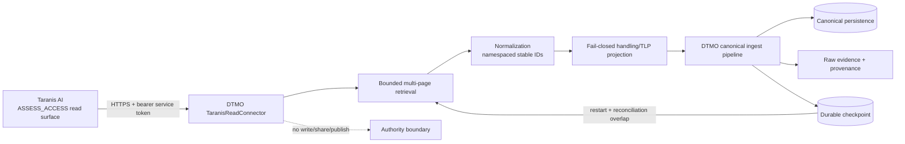

# Taranis AI → DTMO Read-only Adapter

Phase: **11.2**  
State: **`CHECKPOINTING SLICE IMPLEMENTED / EXACT-HEAD VALIDATION REQUIRED`**

## Scope

The Phase 11.2 adapter establishes the executable service boundary between Taranis AI and DTMO. It is intentionally read-only and does not grant Taranis, its publishers, or the DTMO service identity any DTMO external-sharing authority.

## Runtime configuration

The connector is disabled by default. Runtime settings use the standard `DTMO_` prefix:

- `DTMO_FEATURE_TARANIS_CONNECTOR=true` enables the integration;
- `DTMO_TARANIS_API_BASE` is the Taranis service base URL;
- `DTMO_TARANIS_API_TOKEN` is a secret-backed read-only bearer token;
- `DTMO_TARANIS_PAGE_SIZE` bounds each request and defaults to 100;
- `DTMO_TARANIS_MAX_PAGES` bounds work per collection/run and defaults to 10;
- `DTMO_TARANIS_RECONCILE_PAGES` controls the intentional replay overlap and defaults to 1 page;
- `DTMO_TARANIS_CHECKPOINT_PATH` identifies the durable checkpoint file and defaults to `/var/lib/dtmo/checkpoints/taranis.json`.

Production validation requires an HTTPS API base, a non-empty runtime token and an absolute checkpoint path. The deployment must back the checkpoint path with durable storage. Tokens must not be committed, logged, placed in screenshots or copied into documentation.

## Current read path

The bounded adapter reads only:

- `GET /api/assess/news-items`;
- `GET /api/assess/stories`.

Pagination uses explicit `limit` and `offset` values and is capped by `DTMO_TARANIS_MAX_PAGES`. The service token is expected to have only the upstream assessment read permission required by the Phase 11.1 contract. The implementation contains no Taranis create, update, delete, share or publish call.

## Canonical identity, checkpointing and replay

Upstream identity is preserved using explicit namespaces:

- `taranis:news-item:{id}`;
- `taranis:story:{id}`.

Unchanged replay therefore produces the same external ID and content fingerprint. The adapter does not use a content hash as a replacement for upstream identity.

Checkpoint state is maintained independently for news items and stories. Each run resumes from the prior high-water offset, deliberately backtracks by the configured reconciliation window, and replays that bounded overlap. This permits recently changed upstream objects to be re-normalized while canonical identity keeps replay deterministic.

A fetched checkpoint is only a candidate. The checkpoint file is atomically replaced **after** the complete fetched payload has parsed successfully. A malformed page, missing stable ID, HTTP failure or checkpoint write failure therefore cannot advance the durable position. On restart, DTMO resumes from the last committed state and replays the configured overlap.

## Handling and authority boundary

Recognized TLP values are retained as handling input. Missing or unknown values map to `review-required`; they are never silently made shareable. Every normalized payload records `read_only_import=true` and `external_share_authorized=false`.

Upstream publication/report metadata is context only. DTMO human approval and governed MISP/export controls remain separate authority boundaries.

## Failure behavior

The adapter uses the DTMO connector timeout and bounded attempts. Missing credentials, malformed object shapes, unreadable checkpoint state and missing stable IDs fail closed. An upstream outage produces a failed/degraded connector result rather than fabricated intelligence or failure of unrelated DTMO read paths.

Partial failure is checkpoint-safe: if either collection cannot be fetched and parsed successfully, neither collection checkpoint is committed for that run. This favors bounded replay over silent data loss.

## Evidence boundary

Repository tests prove normalization, bounded pagination, reconciliation backtracking, stable replay, fail-closed parsing and checkpoint commit semantics against synthetic HTTP fixtures and temporary durable files. They do **not** prove live Taranis connectivity, production-equivalent persistent-volume configuration, upstream permission configuration, operational throughput or production authorization.

## Remaining Phase 11.2 work

Before Phase 11.2 is considered complete, the programme still needs any required detail/CTI retrieval from the accepted mapping, registration in the governed source execution path, and production-equivalent integration evidence. These remain separate bounded slices and are not inferred from repository CI.
