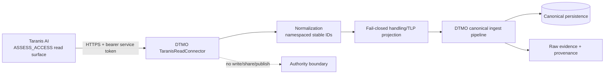

# Taranis AI → DTMO Read-only Adapter

Phase: **11.2**  
State: **`IMPLEMENTED / EXACT-HEAD VALIDATION REQUIRED`**

## Scope

The Phase 11.2 adapter establishes the first executable service boundary between Taranis AI and DTMO. It is intentionally read-only and does not grant Taranis, its publishers, or the DTMO service identity any DTMO external-sharing authority.

## Runtime configuration

The connector is disabled by default. Runtime settings use the standard `DTMO_` prefix:

- `DTMO_FEATURE_TARANIS_CONNECTOR=true` enables the integration;
- `DTMO_TARANIS_API_BASE` is the Taranis service base URL;
- `DTMO_TARANIS_API_TOKEN` is a secret-backed read-only bearer token;
- `DTMO_TARANIS_PAGE_SIZE` bounds a polling request and defaults to 100.

Production validation requires an HTTPS API base and a non-empty runtime token. Tokens must not be committed, logged, placed in screenshots or copied into documentation.

## Current read path

The bounded first slice reads:

- `GET /api/assess/news-items`;
- `GET /api/assess/stories`.

The service token is expected to have only the upstream assessment read permission required by the Phase 11.1 contract. The implementation contains no Taranis create, update, delete, share or publish call.

## Canonical identity and replay

Upstream identity is preserved using explicit namespaces:

- `taranis:news-item:{id}`;
- `taranis:story:{id}`.

Unchanged replay therefore produces the same external ID and content fingerprint. The adapter does not use a content hash as a replacement for upstream identity.

## Handling and authority boundary

Recognized TLP values are retained as handling input. Missing or unknown values map to `review-required`; they are never silently made shareable. Every normalized payload records `read_only_import=true` and `external_share_authorized=false`.

Upstream publication/report metadata is context only. DTMO human approval and governed MISP/export controls remain separate authority boundaries.

## Failure behavior

The adapter uses the existing DTMO connector timeout, bounded retry/backoff and failure-isolation framework. Missing credentials, malformed object shapes and missing stable IDs fail closed. An upstream outage produces a failed/degraded connector result rather than fabricated intelligence or failure of unrelated DTMO read paths.

## Evidence boundary

Repository tests prove normalization and connector behavior against synthetic HTTP fixtures. They do **not** prove live Taranis connectivity, production-equivalent deployment, upstream permission configuration, operational throughput or production authorization.

## Next slices

Before Phase 11.2 can be considered fully operational, subsequent bounded work must add durable multi-page checkpoints/reconciliation, detail/CTI retrieval where required by the accepted mapping, registration in the governed source execution path and production-equivalent integration evidence. These remain repository/deployment work and are not inferred from this first adapter slice.
