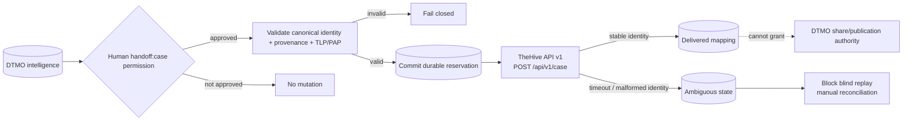

# TheHive Incident/Case Handoff Integration

Status: **`BOUNDED HUMAN-AUTHORIZED HANDOFF / EXACT-HEAD VALIDATION REQUIRED`**

## Scope

Phase 11.6 integrates TheHive as a separate incident/case-management service after explicit DTMO human authorization. The reviewed baseline remains TheHive 5.5.16 and public API v1 (`/api/v1`).

The bounded implementation adds only `POST /api/v1/case` handoff and handoff-history retrieval. No automatic case creation, responder execution, Cortex execution, MISP→TheHive automation, observable/task creation, external sharing or administration is accepted in this slice.

## Authority boundary

DTMO remains authoritative for canonical CTI, provenance, governance and publication/share approval. TheHive becomes authoritative only for the lifecycle of a case after a successful, human-approved handoff. `handoff:case` is a dedicated server-side RBAC permission and is distinct from `approve:share`. Service accounts cannot hold human handoff authority.

The bounded role assignment is CISO, CERT, Senior Analyst and Administrator. Publisher/share-approval authority alone does not authorize case handoff.

## Runtime flow

The reservation is committed to PostgreSQL before external mutation. A reused request UUID that is already delivered or ambiguous is rejected. This prevents automatic duplicate case creation after an uncertain delivery.

## Data mapping and minimization

Only the human-approved summary and bounded canonical fields cross the service boundary. The adapter maps canonical title, deterministic severity, explicit effective TLP/PAP, bounded non-empty tags and a DTMO UUID reference. Attachments, raw source bodies, credentials, private enrichment output and unrelated personal data are not sent by this slice.

Unknown TLP, PAP or severity mappings fail closed before a reservation is sent to TheHive. A successful upstream response must contain a stable case `_id`/`id`; otherwise the handoff becomes ambiguous and requires reconciliation.

## Runtime configuration

The feature is disabled by default. Runtime settings are:

- `DTMO_FEATURE_THEHIVE_HANDOFF=true`;
- `DTMO_THEHIVE_API_BASE` — deployed HTTPS service base;
- `DTMO_THEHIVE_API_TOKEN` — runtime-only secret for the dedicated non-human identity;
- `DTMO_THEHIVE_ORGANIZATION` — explicit organization scope.

Production configuration validation requires HTTPS, a non-empty token and explicit organization whenever the feature is enabled. These configuration checks do not prove actual entitlement or permission scope.

## Persistence and reconciliation

Migration `0014_thehive_handoff_state` creates `thehive_handoff_state`. It binds the DTMO canonical UUID, human principal, request/idempotency UUID, organization, TLP/PAP authority snapshot, outcome status and confirmed TheHive case identity. Database constraints enforce unique request and case identities plus `external_share_authorized=false` and `local_compromise_proven=false`.

States are `reserved`, `delivered`, `ambiguous` and `failed`. Ambiguous state is intentionally terminal for automated replay in this bounded slice; operator reconciliation is required before any future governed recovery action.

## Licensing and deployment boundary

TheHive remains a separate StrangeBee service. TheHive 5.3+ requires an activated Community, Gold or Platinum license for continued write operation. Repository CI cannot establish that entitlement, live connectivity, deployed credentials, organization scope, privacy approval or operational readiness. Live enablement remains deployment-bound and later Phase 11.10/11.11 evidence remains mandatory before Phase 12.
