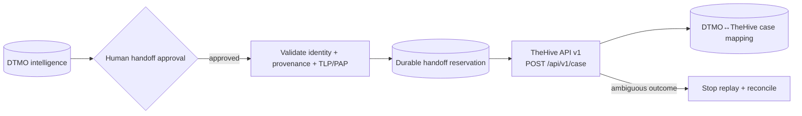

# TheHive Incident/Case Handoff Integration

Status: **`CONTRACT ONLY / NO RUNTIME MUTATION ADAPTER YET`**

## Scope

Phase 11.6 integrates TheHive as a separate incident/case-management service after DTMO human authorization. The reviewed baseline is TheHive 5.5.16 and public API v1 (`/api/v1`).

The first implementation candidate is a minimal `POST /api/v1/case` handoff. No automatic case creation, responder execution, Cortex execution, MISP→TheHive automation, external sharing or administration is accepted in this slice.

## Authority boundary

DTMO remains authoritative for canonical CTI, provenance, governance and publication/share approval. TheHive becomes authoritative only for the lifecycle of a case after a successful, human-approved handoff. Case-handoff approval is distinct from publication/share approval.

## Candidate mapping

A later adapter must minimize payload data, preserve strongest source restrictions, use a dedicated least-privilege TheHive service identity and durably reconcile mutation outcomes before retry.

## Licensing and deployment

TheHive 5.3+ requires an activated Community, Gold or Platinum license for continued write operation. CI cannot establish that entitlement. Live integration remains blocked until deployment credentials, organization scope, license state and privacy/handling requirements are validated in the later deployment-bound phases.
