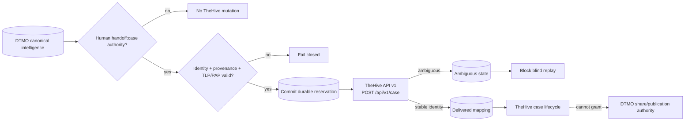

# TheHive Incident/Case Handoff Integration

Status: **`PASS / REPOSITORY_COMPLETE — ACCEPTED IMPLEMENTATION BASELINE`**

## Scope

Phase 11.6 integrates TheHive as a separate incident/case-management service after explicit DTMO human authorization. The reviewed baseline remains TheHive 5.5.16 and public API v1 (`/api/v1`).

The accepted bounded implementation adds only `POST /api/v1/case` handoff and handoff-history retrieval. No automatic case creation, responder execution, Cortex execution, MISP→TheHive automation, observable/task creation, external sharing or administration is accepted in this boundary.

## Authority boundary

DTMO remains authoritative for canonical CTI, provenance, governance and publication/share approval. TheHive becomes authoritative only for the lifecycle of a case after a successful, human-approved handoff. `handoff:case` is a dedicated server-side RBAC permission and is distinct from `approve:share`. Service accounts cannot hold human handoff authority.

The bounded role assignment is CISO, CERT, Senior Analyst and Administrator. Publisher/share-approval authority alone does not authorize case handoff.

## Runtime flow

The durable reservation is committed before the external mutation. Successful delivery requires a stable TheHive case identity. Timeout/network ambiguity or a nominal success response without stable identity transitions the request to `ambiguous`; automated replay remains blocked until explicit reconciliation.

## Data minimization

The outbound payload is limited to the bounded canonical title, human-approved summary, deterministic severity, explicit TLP/PAP, bounded tags and DTMO UUID reference. Attachments, raw source bodies, credentials, private enrichment output and unrelated personal data remain excluded.

Persisted upstream outcome is similarly minimized to stable identity and bounded delivery/reconciliation metadata. TheHive results do not mutate DTMO publication/share approval and do not prove local compromise.

## Handling restrictions

Known authoritative TLP cannot be broadened by the requested handoff. Unknown or incompatible handling values fail closed. Authoritative MISP distribution/sharing-group restrictions block handoff unless a deployment-approved TheHive organization/access mapping exists; repository CI does not infer such a mapping.

## Runtime configuration

The handoff feature is disabled by default. When enabled, configuration requires a TheHive API base, runtime-secret API token and explicit organization scope; production configuration requires HTTPS. Tokens are not persisted in handoff state, evidence or logs.

## Failure semantics

Definitive authorization, validation or bounded upstream rejection becomes `failed`. Ambiguous network delivery becomes `ambiguous`, never fabricated success. TheHive unavailability affects only the explicit handoff path and does not make unrelated DTMO read or ingestion paths unavailable.

## Licensing and deployment boundary

TheHive remains a separate StrangeBee service/API boundary. DTMO does not vendor TheHive source. Repository acceptance does not prove an activated Community/Gold/Platinum entitlement, deployed credentials, effective service-account permissions, organization membership, privacy/handling approval, live connectivity, production-equivalent behavior, independent assurance or production authorization.

Historical Phase 8/9 evidence remains candidate-bound and is not reused for this materially changed integrated platform. Fresh Phase 11.10 production-equivalent validation and Phase 11.11 independent assurance remain required before Phase 12.
