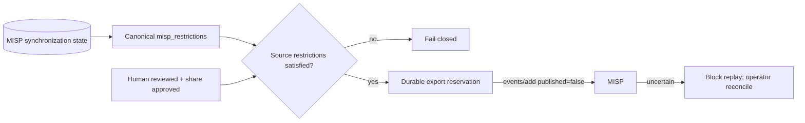

# Governed MISP export

## Scope

The governed DTMO-to-MISP export path remains the only Phase 11.5 outbound MISP path. It does not turn MISP connectivity into publication authority and it does not weaken the established two-step DTMO decision model.

An item may reach the MISP export path only after it is already `reviewed`, has separate human `share_approved` state and retains the approving principal attribution. The export endpoint itself cannot create review or share approval. Service accounts remain excluded.

Phase 11.5 consolidates this path with inbound MISP intelligence by projecting accepted inbound restrictions from `misp_synchronization_state` into canonical `metadata_json.misp_restrictions`. The outbound path reuses that canonical restriction envelope rather than introducing a parallel authority model.

## Runtime boundary

Outbound MISP delivery is disabled by default through `DTMO_FEATURE_MISP_EXPORT=false`. This flag is separate from the read connector flag, so enabling read access cannot silently enable writes. Runtime delivery additionally requires `DTMO_MISP_API_BASE` and `DTMO_MISP_API_KEY`; production requires HTTPS.

The API key is consumed as a runtime secret and is not written into canonical intelligence, audit metadata or repository evidence. MISP remains a separate AGPL-3.0 service/API boundary.

## Endpoint

`POST /api/v1/intelligence/{item_id}/misp-export`

The caller requires the established publisher/share-approval authority. The request also supplies a bounded MISP distribution value, optional sharing-group ID where distribution `4` is selected, TLP and `X-Request-ID` correlation.

## Export representation

The bounded export creates an unpublished MISP event through `events/add`. DTMO sends a deterministic event UUID, the governed intelligence title, canonical URL and bounded summary context. `published` is always `false`. MISP publication, synchronization and further community distribution are not automated by DTMO.

## Phase 11.5 authoritative restriction handling

Distribution, sharing-group and TLP are enforced fail-closed. Sharing-group distribution requires an explicit sharing-group ID.

For MISP-origin intelligence, canonical ingestion now requires an authoritative normalized MISP restriction envelope. That envelope is persisted in `misp_synchronization_state` and projected to `metadata_json.misp_restrictions` inside the canonical database transaction. The governed export path therefore refuses:

- distribution changes that contradict the authoritative source distribution;
- a changed or missing sharing group;
- a TLP less restrictive than the most restrictive authoritative source TLP;
- MISP-origin re-export when authoritative source restrictions are absent;
- any attempt by a service account or connector to substitute for human approval.

Source restrictions and DTMO human approval are cumulative; technical write access is never sufficient authority to redistribute intelligence.

## Replay protection

DTMO reserves an export record in canonical metadata before delivery and derives a stable replay key from the exact outbound event. Successful and delivery-uncertain records block automatic replay. A timeout, HTTP failure or malformed/ambiguous MISP response is recorded as `uncertain`; the request fails and an operator must inspect destination evidence before any later remediation.

Successful delivery records the returned MISP event ID, deterministic UUID and replay key and appends an auditable `intelligence.misp_export` allow decision. Replay rejection and uncertain delivery are fail-closed states.

## Explicit exclusions

Phase 11.5 does not authorize automatic event publication, automatic MISP server federation, OpenCTI↔MISP automatic synchronization, source-restriction broadening, service-account sharing decisions, TheHive case creation or MISP source vendoring.

## Claim boundary

Repository tests use synthetic intelligence and mocked MISP transport/state. They demonstrate code and migration contracts only. They do not prove live MISP connectivity, production deployment, destination permissions, successful external delivery, external publication, owner acceptance, penetration-test acceptance, independent assurance, production authorization or permission from an upstream intelligence-sharing community.

Historical Phase 8/9 evidence remains candidate-bound and is not reused as evidence for the materially changed Phase 11 integrated platform.
