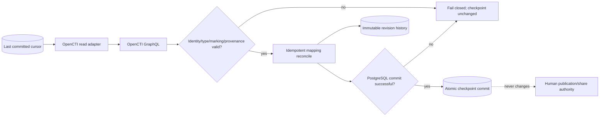

# OpenCTI Integration Operations Runbook

Status: **Phase 11.4 canonical mapping/persistence + operational integration / exact-head validation required**  
Last updated: **2026-08-16**

## Scope

This runbook governs the read-only DTMO→OpenCTI synchronization path, durable canonical identity mapping and restart-safe checkpoint sequence. Repository acceptance does not claim that OpenCTI is deployed, credentialed or live-connected.

## Preconditions before enablement

- approved OpenCTI edition and licensing/entitlement recorded;
- immutable deployed OpenCTI version identified;
- dedicated least-privilege DTMO service identity and allowed markings reviewed;
- token stored in the approved runtime secret manager;
- TLS endpoint/certificate trust and privacy/data-handling basis validated;
- migration `0012_opencti_mapping_persistence` applied and schema verified;
- durable writable checkpoint location mounted at the configured absolute path;
- database backup/recovery and checkpoint recovery responsibilities documented;
- Phase 11.4 exact-head repository gates accepted.

## Runtime sequence

1. load the last durable OpenCTI cursor;
2. request bounded GraphQL `stixCoreObjects` pages;
3. validate stable OpenCTI/STIX identity, entity allowlist, markings, confidence and provenance;
4. reconcile each object into `opencti_object_mappings`;
5. create an immutable `opencti_mapping_revisions` snapshot only when the canonical snapshot hash is new;
6. commit the PostgreSQL transaction;
7. only after successful database commit call `commit_page(page)` to atomically advance the checkpoint;
8. verify share/publication and local-compromise authority remain false/unchanged.

`read_pages()` never advances the checkpoint by itself.

## Idempotency and identity drift

Replaying an unchanged OpenCTI object is safe: the mapping snapshot hash prevents duplicate revision history. A changed snapshot produces a new immutable revision while updating the current attributed mapping. If a known OpenCTI internal ID changes STIX identity, or a known STIX identity changes OpenCTI internal ID, reconciliation fails closed. Operators must investigate rather than force-merge identities.

## Fail-closed conditions

Stop or quarantine the integration path on authentication/authorization failure, GraphQL errors, disallowed entity type, missing/unstable identity, malformed markings, invalid confidence, malformed pagination/checkpoint state, ambiguous identity mapping, failed database transaction, migration/schema mismatch, repeated timeout/`429`/`5xx`, or broader-than-approved OpenCTI privilege.

Do not broaden privileges or edit checkpoint state to make synchronization appear successful.

## Restart and recovery

After interruption:

1. verify database and checkpoint integrity independently;
2. restart from the last durable cursor;
3. replay a page when database persistence completed but checkpoint replacement did not;
4. rely on stable identity plus snapshot hash for idempotent replay;
5. preserve all prior mapping revisions;
6. advance the cursor only after the database transaction commits.

If the checkpoint moved without corresponding durable database state, stop and restore/reconcile from evidence; do not continue with a guessed cursor.

## Migration and rollback

Before enablement, apply Alembic through `0012_opencti_mapping_persistence`. Rollback drops only OpenCTI mapping/revision tables after operators have exported any required evidence and disabled synchronization. A database downgrade does not itself alter OpenCTI.

## Incident handling

For suspected leakage, authorization bypass, marking overexposure, identity ambiguity or unapproved side effects: disable `DTMO_FEATURE_OPENCTI_READ`, revoke/rotate the token, preserve non-secret correlation evidence, identify affected mappings/revisions, verify DTMO share approval was not modified, record corrective action, and require trust-boundary revalidation before resume.

## Side effects that remain prohibited

Phase 11.4 does not authorize connector registration, MISP sync, external enrichment, arbitrary GraphQL mutation, TheHive case creation, report publication or OpenCTI security/marking administration.

## Evidence rule

Repository CI proves engineering contracts only. It does not prove live endpoint health, effective production RBAC/marking segregation, deployed secret handling, production-scale graph correctness, HA/recovery, independent assurance or production authorization. Historical Phase 8/9 evidence remains bound to the earlier candidate.
