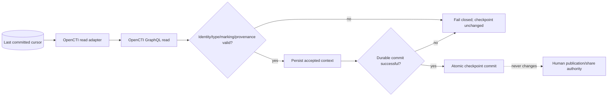

# OpenCTI Integration Operations Runbook

Status: **Phase 11.4 read-only adapter / exact-head validation required**  
Last updated: **2026-08-16**

## Scope

This runbook defines the operational boundary for the bounded DTMO→OpenCTI read adapter. Repository acceptance does not claim that OpenCTI is deployed, credentialed or live-connected.

## Preconditions before enablement

- approved OpenCTI edition and licensing/entitlement recorded;
- immutable deployed OpenCTI version identified;
- dedicated DTMO service identity created;
- minimum OpenCTI roles/capabilities and allowed markings reviewed;
- token stored in the approved runtime secret manager;
- TLS endpoint and certificate trust validated;
- GraphQL path selected and documented;
- privacy/data-handling review completed for the actual dataset;
- durable writable checkpoint location mounted at the configured absolute path;
- backup/recovery responsibilities known;
- Phase 11.4 adapter exact-head repository gate accepted.

## Runtime configuration

The path remains disabled unless `DTMO_FEATURE_OPENCTI_READ=true`. Configure `DTMO_OPENCTI_API_BASE`, `DTMO_OPENCTI_API_TOKEN`, `DTMO_OPENCTI_PAGE_SIZE`, `DTMO_OPENCTI_MAX_PAGES`, `DTMO_OPENCTI_ALLOWED_ENTITY_TYPES` and `DTMO_OPENCTI_CHECKPOINT_PATH` through deployment configuration/runtime secrets.

Production validation requires HTTPS, a runtime token, an explicit entity-type allowlist and an absolute checkpoint path. Never place the real token in repository files, screenshots or evidence.

## Normal operation

1. load the last durable cursor;
2. request a bounded GraphQL `stixCoreObjects` page window;
3. validate stable OpenCTI/STIX identity, configured entity type, markings, confidence and provenance;
4. persist the accepted page in the governed DTMO persistence layer;
5. only after successful durable persistence call `commit_page(page)`;
6. verify that the checkpoint reflects the committed cursor and that share/publication state is unchanged.

`read_pages()` never advances the checkpoint by itself.

## Fail-closed conditions

Stop or quarantine the integration path on:

- `401` / invalid authentication;
- `403` / insufficient capability or marking access;
- GraphQL `errors` responses;
- unknown/disallowed entity type;
- missing or unstable OpenCTI/STIX identity;
- malformed marking structures;
- invalid confidence values;
- malformed pagination metadata or missing next cursor;
- malformed/corrupt checkpoint state;
- oversized/unexpected payload behavior at the surrounding HTTP/runtime boundary;
- repeated timeout, `429` or `5xx` beyond the configured operational retry budget;
- evidence that the configured account has broader privilege than approved.

Do not broaden privileges automatically to make the integration succeed.

## Reconciliation and restart

The current adapter resumes from the last explicitly committed GraphQL cursor. Because OpenCTI cursors are opaque, this slice does not claim time-window overlap semantics. Operators/orchestration must therefore preserve page persistence and checkpoint commit as one governed sequence.

After interruption:

1. inspect the durable checkpoint without modifying it;
2. restart from that cursor;
3. safely replay any page that was persisted but whose checkpoint commit was interrupted using stable OpenCTI/STIX identity and version/update context;
4. preserve prior DTMO evidence history;
5. advance the cursor only after durable persistence succeeds.

A later Phase 11.4 persistence/mapping slice may add stronger database-backed idempotency/reconciliation semantics; that must be accepted separately.

## Incident handling

For suspected data leakage, authorization bypass, unexpected broader marking access or unapproved side effects:

1. disable `DTMO_FEATURE_OPENCTI_READ`;
2. revoke or rotate the integration token;
3. preserve request/correlation IDs and non-secret evidence;
4. identify affected OpenCTI identities/markings and DTMO mappings;
5. confirm no DTMO share approval was mutated;
6. record corrective action and revalidation requirements;
7. do not resume until the trust boundary is reviewed.

## Side effects that remain prohibited

The Phase 11.4 read adapter does not authorize connector registration, MISP sync, external enrichment, arbitrary GraphQL mutations, case creation, report publication or OpenCTI security/marking administration.

## Evidence rule

Repository CI is engineering evidence only. Live endpoint health, effective RBAC/marking segregation, deployed secret handling, real graph correctness, HA/recovery and production readiness require later deployment-bound evidence. Historical Phase 8/9 evidence cannot be reused as acceptance of this materially changed integrated candidate.
