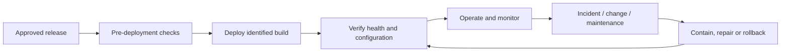

# DTMO Operating Model

## Purpose

This document defines the target operational responsibility model for running DTMO in controlled staging and production environments. It complements the detailed Operations Manual by clarifying ownership, service boundaries, operational evidence and escalation responsibilities.

## Operating principles

1. **Environment identity is explicit.** Operational evidence must identify the environment and immutable deployment to which it applies.
2. **Least privilege applies to operations.** Application identities, operators and infrastructure administrators use distinct permissions where practicable.
3. **Observability supports decisions.** Metrics, alerts and dashboards support diagnosis but do not replace canonical application state or acceptance evidence.
4. **Recovery is tested.** Backup and recovery claims require demonstrated evidence appropriate to the target environment.
5. **Change is controlled.** Deployment and rollback actions remain attributable and reviewable.
6. **Security incidents and service incidents share correlation, not authority.** Technical responders can contain and restore service, while risk/publication decisions remain with their accountable authorities.

## Operational responsibility domains

| Domain | Primary responsibility | Required evidence |
|---|---|---|
| Deployment | Operations / platform owner | change record, release identity, image digests, deployment result |
| Configuration | Operations with engineering/security consultation | approved configuration and parity evidence |
| Secrets | Operations / platform security | secret references, ownership and least-privilege identity evidence |
| Monitoring | Operations | metrics, alert routing and dashboard availability |
| Incident response | Operations + security | runbook, escalation, correlation and incident record |
| Backup | Operations | successful backup evidence and retention policy |
| Restore | Operations | tested restore evidence and recovery outcome |
| Capacity / performance | Operations + engineering | target-specific observations and performance evidence |
| Vulnerability response | Security + engineering/operations | applicability and remediation/disposition record |
| Rollback | Operations | tested/approved rollback path and execution evidence where used |

## Operational lifecycle

## Health model

Operational health should consider at least:

- API and application availability;
- PostgreSQL connectivity and canonical write/read health;
- OpenSearch search health;
- object-storage evidence availability/integrity;
- Redis coordination/queue health;
- connector freshness and failures;
- queue/backlog behavior;
- request errors and latency;
- metrics and alert delivery;
- authentication/authorization dependencies.

A single green dashboard is not sufficient evidence of complete service health.

## Incident and escalation model

Operational incidents should be triaged by impact, affected component, data/integrity risk and security relevance. Incidents involving unauthorized access, secret exposure, provenance/integrity compromise or suspected exploitation require security escalation in addition to service restoration.

External communication or intelligence publication remains separately governed and is not implied by incident-response authority.

## Staging and production boundary

The local Docker Compose environment is a reference/development topology. Phase 8 requires a real production-equivalent staging environment with accountable ownership, controlled access, immutable deployment identity, least-privilege secrets/identities, network/TLS evidence, data-handling controls, rollback evidence and deployment-time security review.

Production operation remains conditional on completed Phase 8, accepted Phase 9 independent assurance and a Phase 10 production go/no-go decision.

## Related documentation

- `OPERATIONS_MANUAL.md`
- `../architecture/SYSTEM_ARCHITECTURE.md`
- `../security/SECURITY_OVERVIEW.md`
- `../project/PROJECT_GOVERNANCE.md`
- `../project/PRODUCTION_CHECKLIST.md`
