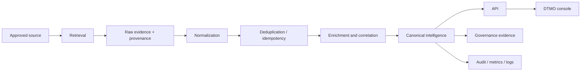
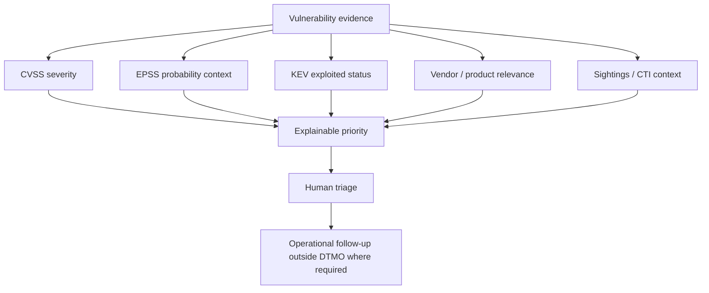

# DTMO Product Guide

**Audience:** product owners, sponsors, CISO/ISO, architects, analysts and external assessors  
**Documentation class:** professional current-product documentation  
**Production readiness:** DTMO is **not production ready**; Phase 8 external acceptance, Phase 9 independent assurance and Phase 10 production authorization remain separate gates.

## 1. Product purpose

Dutch Threat Monitoring for Education (DTMO) is a governed threat- and vulnerability-intelligence platform designed to turn approved sources into attributable, reviewable intelligence for an education-sector operating context. The product combines source governance, normalized intelligence, vulnerability prioritization, correlation, governance mappings, administration and operational observability in one application shell.

The product does not create publication authority, prove local exposure, prove compromise or establish framework compliance merely because a source, score or mapping is present.

## 2. Product workflow

The canonical product journey is maintained as **WF-01 Source-to-intelligence** in [`SYSTEM_WORKFLOWS.md`](../architecture/SYSTEM_WORKFLOWS.md):

A source item is useful only when provenance survives the path from retrieval to the analyst-facing record. Derived context must remain distinguishable from source evidence.

## 3. Main product surfaces

### Overview

The Overview surface provides an operational picture: current intelligence volume, new records, average confidence, severity distribution, connector health, recent intelligence and vulnerability posture. It is intended for orientation and prioritization rather than final assurance decisions.

**Capture class:** actual DTMO runtime UI with sanitized synthetic fixture data; documentation illustration only.

### Intelligence

The Intelligence workspace combines recent canonical records, search, severity filtering, vulnerability prioritization and vulnerability analytics. Analysts can move from a summarized record toward deeper evidence and correlation without losing source identity.

Relevant workflows: **WF-01 Source-to-intelligence**, **WF-02 Vulnerability prioritization**, **WF-04 AIL enrichment/correlation**.

### Sources & Catalogue

This surface separates curated source definitions from runtime registration and health. A source being listed does not mean that live retrieval has been proven in the current deployment.

Relevant workflow: **WF-01** and source-governance controls in the Administrator Guide.

### Vulnerability intelligence

DTMO combines vulnerability evidence and prioritization context such as CVSS, EPSS, KEV, vendor/product relevance and sightings where available. A prioritization signal does not independently prove exploitability, local deployment, compromise or remediation state; these signals support triage and must remain separate from asset-specific evidence.

Relevant workflow: **WF-02 Vulnerability prioritization**.

### MISP and AIL

MISP is treated as governed CTI input/output with separate human approval for external sharing. AIL is treated as read/enrichment/correlation context with explicit boundaries around raw-content exposure and analytical inference.

**UI-05 boundary:** the rendered export controls do not prove live MISP connectivity or sharing authority; the documented export path creates an unpublished event and remains subject to server-side approval checks.

Relevant workflows: **WF-03 MISP read/governed export** and **WF-04 AIL enrichment/correlation**.

### Visual Analytics

Visual Analytics presents trends and operational views using the same governed product data. Grafana remains separately authenticated where configured and does not become an alternative authorization authority for DTMO.

Relevant workflow: **WF-09 Observability**.

### Governance

Governance exposes controlled framework relationships and evidence semantics. Mappings to Normenkader IBP, MITRE ATT&CK, NIST CSF, CVSS and related concepts are contextual relationships, not blanket compliance or certification claims.

Relevant workflow: **WF-08 Governance mapping and evidence**.

### Administration

Administration governs users/principals, roles, connector administration and privileged actions. Server-side authorization remains authoritative; UI visibility is not authorization.

Relevant workflows: **WF-05 Authentication/bearer trust** and **WF-06 RBAC/privileged Administration**.

## 4. Vulnerability prioritization

Priority is explainable context. DTMO must preserve the distinction between an external vulnerability record and evidence that a specific local asset is affected.

## 5. Authority boundaries

DTMO intentionally separates technical capability from authority:

- connectors may retrieve but do not approve external publication;
- analytics may prioritize but do not prove local exposure;
- governance mappings may contextualize but do not certify compliance;
- Administration may manage permitted configuration but does not bypass server-side RBAC;
- screenshots and CI artifacts document behavior but do not create staging or production acceptance;
- production authorization occurs only through the formal release lifecycle.

## 6. Product evidence and observability

Key evidence classes include provenance/raw evidence, canonical records, search/index representation, audit/correlation identifiers, metrics, operational logs, governance mappings and accountable acceptance records. See [`EVIDENCE_INDEX.md`](../evidence/EVIDENCE_INDEX.md) for the hierarchy.

## 7. Visual reference

The governed screenshot catalogue is maintained in [`docs/visual/screenshots/README.md`](../visual/screenshots/README.md). Screenshot labels must identify whether the image is fixture-backed local/runtime documentation, production-equivalent staging or historical. An image alone never proves external connectivity or release acceptance.

## 8. Related guides

- [`USER_GUIDE.md`](../user/USER_GUIDE.md) — analyst-facing operation.
- [`ADMINISTRATOR_GUIDE.md`](../administration/ADMINISTRATOR_GUIDE.md) — RBAC, identities, source administration and privileged behavior.
- [`SYSTEM_WORKFLOWS.md`](../architecture/SYSTEM_WORKFLOWS.md) — maintained workflow catalogue.
- [`SECURITY_OVERVIEW.md`](../security/SECURITY_OVERVIEW.md) — security boundaries.
- [`GOVERNANCE_MAPPING_REGISTRY.md`](../governance/GOVERNANCE_MAPPING_REGISTRY.md) — governed framework relationships.
