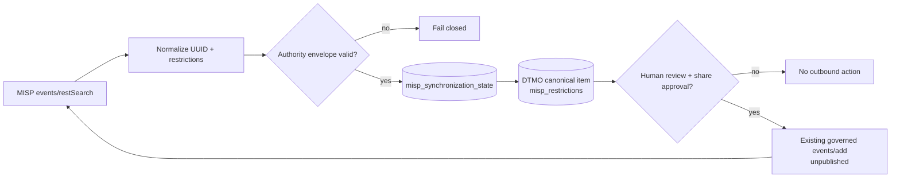

# DTMO Current Project State

Last reconciled: **2026-08-17**  
Software baseline: **16.0.0rc12 plus accepted post-RC13, E8 and Phase 11 repository enhancements**

## Executive summary

DTMO has completed Phases 1–7, RC13 functional acceptance and E8.1–E8.10 product evolution. RC13 is `PASS / OWNER_ACCEPTED`; E8.1–E8.10 are `PASS / REPOSITORY_COMPLETE`. Phase 8 is `PASS / OWNER_ACCEPTED` and Phase 9 is `PASS / EXTERNAL_ASSURANCE_ACCEPTED` for the earlier candidate. Phase 10 concluded **`NO-GO / BLOCKED — PLATFORM INDUSTRIALISATION REQUIRED`**. DTMO is **not production authorized**.

The active programme is **Phase 11 — Platform Industrialisation**. Phase 11.1–11.2 Taranis, Phase 11.3 IntelOwl and Phase 11.4 OpenCTI are `PASS / REPOSITORY_COMPLETE`. The Phase 11.5 MISP consolidation contract is `PASS / REPOSITORY_COMPLETE`. The active bounded objective is **Phase 11.5 MISP synchronization-state/persistence and authority enforcement**, currently `IN PROGRESS / EXACT-HEAD VALIDATION REQUIRED`.

## Lifecycle position

| Stage | Status |
|---|---|
| Phases 1–7 | `PASS` |
| RC13 + owner retest | `PASS / OWNER_ACCEPTED` |
| E8.1–E8.10 | `PASS / REPOSITORY_COMPLETE` |
| Phase 8 | `PASS / OWNER_ACCEPTED` |
| Phase 9 | `PASS / EXTERNAL_ASSURANCE_ACCEPTED` |
| Phase 10 | `NO-GO / BLOCKED — PLATFORM INDUSTRIALISATION REQUIRED` |
| Phase 11 | `IN PROGRESS / ACTIVE` |
| Phase 11.1 Taranis architecture/contract | `PASS / REPOSITORY_COMPLETE` |
| Phase 11.2 Taranis adapter | `PASS / REPOSITORY_COMPLETE` |
| Phase 11.3 IntelOwl integration | `PASS / REPOSITORY_COMPLETE` |
| Phase 11.4 OpenCTI contract | `PASS / REPOSITORY_COMPLETE` |
| Phase 11.4 OpenCTI read-only adapter | `PASS / REPOSITORY_COMPLETE` |
| Phase 11.4 OpenCTI canonical mapping/persistence | `PASS / REPOSITORY_COMPLETE` |
| Phase 11.4 OpenCTI integration | `PASS / REPOSITORY_COMPLETE` |
| Phase 11.5 MISP consolidation contract | `PASS / REPOSITORY_COMPLETE` |
| Phase 11.5 MISP synchronization state/persistence | `IN PROGRESS / EXACT-HEAD VALIDATION REQUIRED` |
| Phase 12 | `NOT STARTED` |

## Accepted Phase 11 capabilities

Phase 11.2 provides the repository-complete Taranis read-only canonical integration with durable checkpointing/reconciliation, detail/CTI retrieval, governed execution, canonical persistence/indexing and observability.

Phase 11.3 provides the repository-complete IntelOwl service boundary, bounded enrichment adapter, human-authorized `REVIEW_INTELLIGENCE` execution and durable enrichment history. IntelOwl results never grant external-share authority or prove local compromise.

Phase 11.4 provides the repository-complete OpenCTI service/API/STIX/licensing contract, bounded GraphQL/STIX read adapter, explicit OpenCTI/STIX↔DTMO identity mapping, immutable reconciliation history, database-enforced no-share/no-local-compromise invariants and PostgreSQL-before-checkpoint ordering. Repository completion is engineering evidence only and does not establish live OpenCTI or production evidence.

The accepted Phase 11.5 MISP contract establishes one authority model for the existing read-only `events/restSearch` path and human-approved unpublished `events/add` path. MISP remains a separate AGPL-3.0 service/API; automatic federation and OpenCTI↔MISP synchronization are outside this boundary.

## Active Phase 11.5 MISP synchronization-state implementation

The active implementation adds durable PostgreSQL synchronization state without introducing another MISP client. `misp_synchronization_state` binds one DTMO canonical item to one stable MISP event UUID and persists the authoritative source distribution, sharing-group and TLP envelope.

Reconciliation fails closed when a MISP event UUID is already bound to another DTMO item, a DTMO item changes MISP event identity, distribution is unknown, sharing-group distribution lacks a group, source restrictions are not marked authoritative, or an inbound projection attempts to grant external-share authority.

Accepted inbound restrictions are projected to `metadata_json.misp_restrictions`, which is the existing governed-export enforcement boundary. This directly connects the read and export paths to one restriction model without creating automatic publication or federation.

Migration `0013_misp_synchronization_state` follows `0012_opencti_mapping_persistence`. Database constraints preserve known distribution semantics, sharing-group requirements and `external_share_authorized=false`.

## Data and authority model

PostgreSQL remains canonical DTMO application/intelligence/RBAC state. MISP, IntelOwl and OpenCTI remain separate services that provide attributable CTI/enrichment/graph/exchange context. None can grant DTMO publication/share authority or establish local compromise by itself.

MISP-origin restrictions and DTMO human approval are cumulative; the more restrictive effective rule wins. Ambiguous identity, malformed restrictions, authorization failure, uncertain delivery or conflicting provenance fails closed.

## Governance and evidence boundary

Framework relationships remain explicit, versioned and provenance-backed. Repository CI for this MISP slice can prove only schema, synthetic reconciliation behavior, authority-invariant enforcement and documentation synchronization. It cannot prove live credentials, effective production MISP permissions, remote-server trust, lawful live-data sharing, staging acceptance, independent assurance or production authorization.

Historical Phase 8/9 evidence remains valid only for the earlier candidate and is not reused for the materially changed Phase 11 platform. Fresh Phase 11.10 production-equivalent validation and Phase 11.11 independent assurance remain required before Phase 12.

## Phase 11 fixed order

1. Taranis AI — `PASS / REPOSITORY_COMPLETE` through Phase 11.2;
2. IntelOwl — `PASS / REPOSITORY_COMPLETE` for Phase 11.3;
3. OpenCTI — `PASS / REPOSITORY_COMPLETE` for Phase 11.4;
4. MISP consolidation — active Phase 11.5 synchronization-state/persistence implementation;
5. TheHive — blocked until Phase 11.5 is repository-complete;
6. Cortex only if IntelOwl cannot satisfy a validated requirement;
7. Kubernetes/Helm/GitOps and integrated runtime hardening;
8. migration/compatibility;
9. new production-equivalent validation;
10. new independent external assurance;
11. Phase 12 formal production GO/NO-GO.
