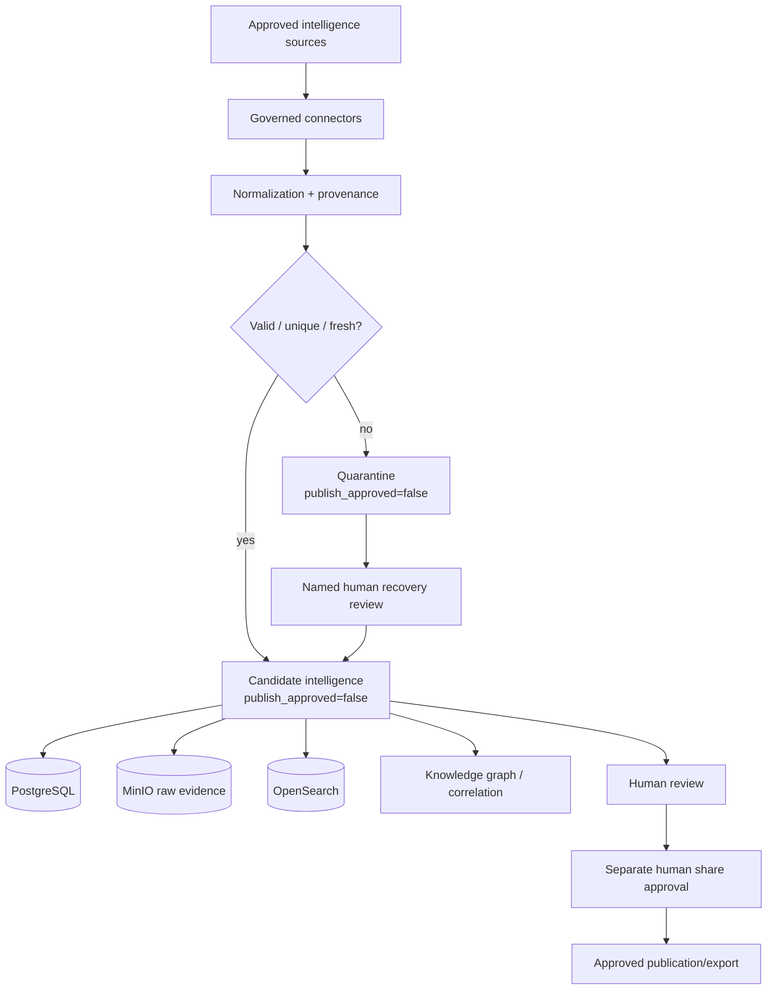
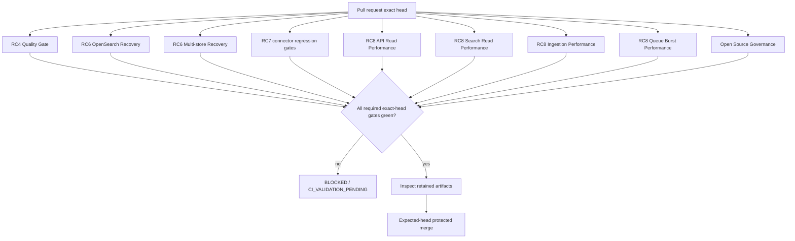

# DTMO Current Project State

Last reconciled: 2026-08-09

This document is the human-readable current-state view of DTMO. It complements the immutable run history in `docs/development/runs/`, the chronological `RUN_LOG.md`, the production roadmap, QA gate records and GitHub issues #1–#3.

## Executive status

- Phases 1–4: `PASS` with recorded evidence.
- Phase 5 — performance and scalability: `IN PROGRESS`.
- RC8.1 workload profile: `PASS`.
- RC8.2 API-read performance: `PASS`.
- RC8.3 OpenSearch search-read performance: `PASS`.
- RC8.4 ingestion-throughput performance: `PASS`.
- RC8.5 queue pressure and connector burst: `PASS` via RUN-20260809-083 / PR #42.
- Phases 6–9: not yet accepted.
- Phase 10 production go/no-go: `BLOCKED` until every remaining phase and external gate is evidenced.

## Roadmap graph

```mermaid
flowchart LR
    P1[Phase 1 CI/workflow integrity\nPASS] --> P2[Phase 2 Security & identity\nPASS]
    P2 --> P3[Phase 3 Data integrity & recovery\nPASS]
    P3 --> P4[Phase 4 Connector reliability & provenance\nPASS]
    P4 --> P5[Phase 5 Performance & scalability\nIN PROGRESS]
    P5 --> P6[Phase 6 Accessibility & operational UX\nNOT ACCEPTED]
    P6 --> P7[Phase 7 Observability & incident operations\nNOT ACCEPTED]
    P7 --> P8[Phase 8 Staging acceptance\nNOT ACCEPTED]
    P8 --> P9[Phase 9 External assurance\nNOT ACCEPTED]
    P9 --> P10[Phase 10 Production go/no-go\nBLOCKED]
```

## Runtime and governance dataflow

## CI and evidence graph

## Phase 5 workflows confirmed on `main`

- `.github/workflows/api-read-performance.yml` — RC8.2 API Read Performance Gate;
- `.github/workflows/search-read-performance.yml` — RC8.3 OpenSearch Search Read Performance Gate;
- `.github/workflows/ingestion-performance.yml` — RC8.4 Ingestion Performance Gate;
- `.github/workflows/queue-burst-performance.yml` — RC8.5 Queue Burst Performance Gate;
- `.github/workflows/open-source-governance.yml` — project licensing/governance regression gate.

Existing RC4/RC6/RC7 workflows continue to protect build quality, recovery and connector governance. A workflow being configured or present is not itself evidence of a successful execution.

## Accepted Phase 5 measurements

### RC8.2 API reads

- 500/500 successful requests;
- 100.142 requests/s;
- 0% errors;
- p95 1.878 ms;
- p99 11.059 ms.

### RC8.3 OpenSearch search reads

- 200/200 successful searches;
- 40.161 searches/s;
- 0% errors;
- p95 7.700 ms;
- p99 12.131 ms.

### RC8.4 ingestion

- 500/500 records accepted;
- zero data loss;
- zero duplicate candidate creation;
- identical second pass quarantined as replay;
- measured bounded synthetic throughput 108081.257 records/s.

### RC8.5 queue pressure / connector burst

Exact head `65c7949624c3770ce91d00c34a957b6b2cb9946a` passed all 17 required workflows. Artifact `9029584698` (`sha256:a934d6179f347e3bf9a198fcb155e7996c42fc670959c2cfd50453969969b974`) recorded:

- 250/250 submitted and accepted;
- 170 backpressure events;
- queue depth 40/40;
- zero data loss;
- zero duplicate candidates;
- recovery 0.602 s;
- provenance and publication state preserved;
- 6 focused tests, 0 failures/errors/skips.

These are bounded internal CI measurements. They do not close issue #1's independent representative load/stress gate.

## External gates still open

Issue #1 remains the source of truth for externally executed production gates. In particular, independent representative load/stress remains open. RC8.5 also explicitly did not test degraded dependencies, so Phase 5 cannot yet be closed.

## Security and governance invariants

- RBAC remains enforced;
- review and share approval remain separate human actions;
- connectors and service accounts cannot approve publication;
- ingestion, replay, retry, recovery, timeout or performance success never implies publication approval;
- provenance, confidence and raw evidence are retained;
- performance fixtures must be synthetic or specifically approved public fixtures;
- absent, queued, cancelled or unexecuted CI is never `PASS`.

## Exactly one current priority

Implement one bounded RC8.6 degraded-dependency performance/correctness gate proving zero data loss and preserved fail-closed governance when a representative internal dependency is unavailable or impaired. Do not combine this objective with the independent external load/stress gate or Phase 6 work.
