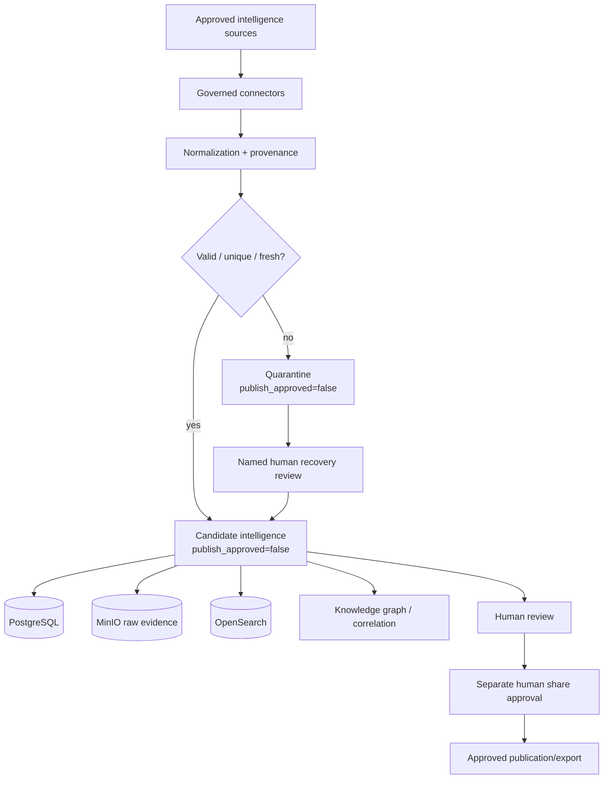
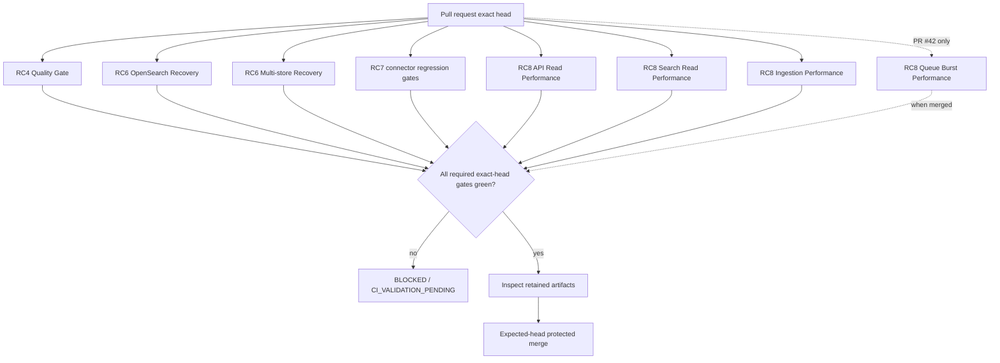

# DTMO Current Project State

Last reconciled: 2026-08-08

This document is the human-readable current-state view of DTMO. It complements the immutable run history in `docs/development/runs/`, the chronological `RUN_LOG.md`, the production roadmap, QA gate records and GitHub issues #1–#3.

## Executive status

- Phases 1–4: `PASS` with recorded evidence.
- Phase 5 — performance and scalability: `IN PROGRESS`.
- RC8.1 workload profile: `PASS`.
- RC8.2 API-read performance: `PASS`.
- RC8.3 OpenSearch search-read performance: `PASS`.
- RC8.4 ingestion-throughput performance: `PASS`.
- RC8.5 queue pressure and connector burst: `CI_VALIDATION_PENDING` in PR #42; not yet on `main`.
- Phases 6–9: not yet accepted.
- Phase 10 production go/no-go: `BLOCKED` until every remaining phase and external gate is evidenced.

## Roadmap graph

```mermaid
flowchart LR
    P1[Phase 1 CI/workflow integrity\nPASS] --> P2[Phase 2 Security & identity\nPASS]
    P2 --> P3[Phase 3 Data integrity & recovery\nPASS]
    P3 --> P4[Phase 4 Connector reliability & provenance\nPASS]
    P4 --> P5[Phase 5 Performance & scalability\nIN PROGRESS]
    P5 --> P6[Phase 6 Accessibility & operational UX\nNOT ACCEPTED]
    P6 --> P7[Phase 7 Observability & incident operations\nNOT ACCEPTED]
    P7 --> P8[Phase 8 Staging acceptance\nNOT ACCEPTED]
    P8 --> P9[Phase 9 External assurance\nNOT ACCEPTED]
    P9 --> P10[Phase 10 Production go/no-go\nBLOCKED]
```

## Runtime and governance dataflow

## CI and evidence graph

## Workflows confirmed on `main`

The current reconciliation verified that the following Phase 5 workflows are present on `main`:

- `.github/workflows/api-read-performance.yml` — RC8.2 API Read Performance Gate;
- `.github/workflows/search-read-performance.yml` — RC8.3 OpenSearch Search Read Performance Gate;
- `.github/workflows/ingestion-performance.yml` — RC8.4 Ingestion Performance Gate.

The RC8.5 queue-burst workflow belongs to open PR #42 and must not be described as present on `main` until that PR is accepted and merged.

Existing RC4/RC6/RC7 workflows continue to protect build quality, recovery and connector governance. A workflow being configured or present is not itself evidence of a successful execution.

## Accepted Phase 5 measurements

### RC8.2 API reads

- 500/500 successful requests;
- 100.142 requests/s;
- 0% errors;
- p95 1.878 ms;
- p99 11.059 ms;
- accepted limits: p95 <= 300 ms, p99 <= 750 ms, errors <= 1%.

### RC8.3 OpenSearch search reads

- 200/200 successful searches;
- 40.161 searches/s;
- 0% errors;
- p95 7.700 ms;
- p99 12.131 ms;
- accepted limits: p95 <= 800 ms, p99 <= 1500 ms, errors <= 1%.

### RC8.4 ingestion

- 500/500 records accepted;
- zero data loss;
- zero duplicate candidate creation;
- identical second pass quarantined as replay rather than creating candidates;
- measured throughput 108081.257 records/s in the bounded synthetic CI fixture;
- accepted sustained minimum: 100 records/s.

These are bounded internal CI measurements. They do not close issue #1's independent representative load/stress gate.

## Current active change

PR #42 — RC8.5 queue pressure and connector burst performance — is open and mergeable but remains `CI_VALIDATION_PENDING` until every required exact-head workflow and retained queue-burst artifact have been verified. It is intentionally not included as an accepted `main` capability yet.

## External gates still open

Issue #1 remains the source of truth for externally executed production gates. The live-connector credential/rate-limit/licence/terms gate was externally attested and closed for Phase 4. Remaining external assurance, staging/deployment, load/stress, hardening, secrets-management and operational acceptance gates require their own evidence.

## Security and governance invariants

- RBAC remains enforced;
- review and share approval remain separate human actions;
- connectors and service accounts cannot approve publication;
- ingestion, replay, retry, recovery, timeout or performance success never implies publication approval;
- provenance, confidence and raw evidence are retained;
- performance fixtures must be synthetic or specifically approved public fixtures;
- absent, queued, cancelled or unexecuted CI is never `PASS`.

## Exactly one current priority

Complete exact-head validation of PR #42 / RC8.5. If every required workflow and retained queue-burst artifact succeeds, merge with expected-head protection. Otherwise remediate only the earliest deterministic failure.