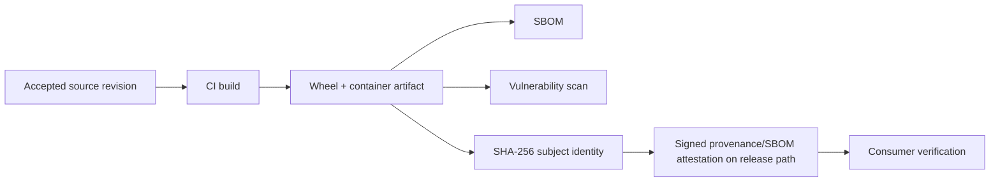

# DTMO Current Project State

Last reconciled: **2026-08-18**  
Software baseline: **16.0.0rc12 plus accepted post-RC13, E8 and Phase 11 repository enhancements**

## Executive summary

DTMO has completed Phases 1–7, RC13 functional acceptance and E8.1–E8.10 product evolution. Phase 8 and Phase 9 evidence remain historical and candidate-bound. Phase 10 concluded **`NO-GO / BLOCKED — PLATFORM INDUSTRIALISATION REQUIRED`**. DTMO is **not production authorized**.

The active programme is **Phase 11 — Platform Industrialisation**. Phase 11.1–11.8f are `PASS / REPOSITORY_COMPLETE`. The sole active bounded objective is **Phase 11.8g software supply-chain hardening**, currently `IN PROGRESS / EXACT-HEAD VALIDATION REQUIRED`.

## Lifecycle position

| Stage | Status |
|---|---|
| Phases 1–7 | `PASS` |
| RC13 + owner retest | `PASS / OWNER_ACCEPTED` |
| E8.1–E8.10 | `PASS / REPOSITORY_COMPLETE` |
| Phase 8 | `PASS / OWNER_ACCEPTED — HISTORICAL CANDIDATE` |
| Phase 9 | `PASS / EXTERNAL_ASSURANCE_ACCEPTED — HISTORICAL CANDIDATE` |
| Phase 10 | `NO-GO / BLOCKED — PLATFORM INDUSTRIALISATION REQUIRED` |
| Phase 11 | `IN PROGRESS / ACTIVE` |
| Phase 11.1–11.2 Taranis | `PASS / REPOSITORY_COMPLETE` |
| Phase 11.3 IntelOwl | `PASS / REPOSITORY_COMPLETE` |
| Phase 11.4 OpenCTI | `PASS / REPOSITORY_COMPLETE` |
| Phase 11.5 MISP | `PASS / REPOSITORY_COMPLETE` |
| Phase 11.6 TheHive | `PASS / REPOSITORY_COMPLETE` |
| Phase 11.7 Cortex decision gate | `PASS / REPOSITORY_COMPLETE — HISTORICAL DECISION BASELINE` |
| Phase 11.7b Cortex analyzer connector | `PASS / REPOSITORY_COMPLETE` |
| Phase 11.8a runtime foundation | `PASS / REPOSITORY_COMPLETE` |
| Phase 11.8b workload identity / external secrets | `PASS / REPOSITORY_COMPLETE` |
| Phase 11.8c ingress/TLS + network segmentation | `PASS / REPOSITORY_COMPLETE` |
| Phase 11.8d HA / disruption hardening | `PASS / REPOSITORY_COMPLETE` |
| Phase 11.8e observability hardening | `PASS / REPOSITORY_COMPLETE` |
| Phase 11.8f backup / restore / recovery hardening | `PASS / REPOSITORY_COMPLETE` |
| Phase 11.8g software supply-chain hardening | `IN PROGRESS / EXACT-HEAD VALIDATION REQUIRED` |
| Phase 11.9 migration/compatibility | `NOT STARTED` |
| Phase 11.10 production-equivalent validation | `NOT STARTED` |
| Phase 11.11 independent external assurance | `NOT STARTED` |
| Phase 12 | `NOT STARTED` |

## Accepted Phase 11 service boundaries

Taranis provides governed collection/canonicalization; IntelOwl provides bounded human-authorized enrichment with immutable history; Cortex provides bounded analyzer-only enrichment; OpenCTI provides bounded graph integration and durable identity reconciliation; MISP provides governed inbound/outbound exchange with authoritative restriction state; TheHive provides minimal explicit human-authorized case handoff with durable mutation reservation/reconciliation and no blind replay after ambiguity.

All remain separate service and licensing boundaries. None gains DTMO human publication/share authority or establishes local compromise by itself. TheHive case-handoff authority remains distinct from publication/share authority.

## Accepted Phase 11.8 runtime boundaries

The accepted 11.8a slice establishes the governed Helm/GitOps Kubernetes foundation. The accepted 11.8b slice adds provider-neutral workload identity and opt-in external secret delivery. The accepted 11.8c slice adds TLS-only ingress and explicit ingress-controller namespace/pod network segmentation. The accepted 11.8d slice adds application-level zone/host spreading, anti-affinity, PodDisruptionBudget and graceful termination. The accepted 11.8e slice establishes opt-in metrics discovery, structured JSON logging and opt-in tracing boundaries. The accepted 11.8f slice defines explicit recovery domains and governed backup/restore/recovery evidence boundaries. These remain repository engineering evidence and do not establish production authorization.

## Active Phase 11.8g software supply-chain boundary

The active slice establishes exact-head build evidence for Python and container SBOMs, known-vulnerability scanning, SHA-256 artifact identity and a governed release path for cryptographically signed provenance and SBOM attestations. PR CI validates the mechanism and scan results; it does not claim that a future release artifact has already been signed or deployed.

Supply-chain controls do not grant publication/share authority, case-handoff authority, responder authority or proof of local compromise. Missing required SBOM, vulnerability, subject-identity or attestation evidence fails closed for a candidate that claims this control.

## Governance and evidence boundary

Repository CI can prove supply-chain contract, SBOM-generation, vulnerability-scan and documentation requirements only. It cannot prove that a future release attestation exists, that a registry or deployment environment verified it, that all vulnerabilities are absent, or that the candidate has production-equivalent behavior, independent assurance or production authorization.

Historical Phase 8/9 evidence remains valid only for the earlier candidate and is not reused for the materially changed Phase 11 platform. Fresh Phase 11.10 production-equivalent validation and Phase 11.11 independent assurance remain required before Phase 12.

## Phase 11 fixed order

1. Taranis AI — `PASS / REPOSITORY_COMPLETE`;
2. IntelOwl — `PASS / REPOSITORY_COMPLETE`;
3. OpenCTI — `PASS / REPOSITORY_COMPLETE`;
4. MISP — `PASS / REPOSITORY_COMPLETE`;
5. TheHive — `PASS / REPOSITORY_COMPLETE`;
6. original Cortex conditional decision — historical `PASS / REPOSITORY_COMPLETE`;
7. owner-required Cortex analyzer connector — `PASS / REPOSITORY_COMPLETE`;
8. Kubernetes/Helm/GitOps and integrated runtime hardening — active Phase 11.8, with 11.8a–11.8f accepted and 11.8g active;
9. migration/compatibility;
10. new production-equivalent validation;
11. new independent external assurance;
12. Phase 12 formal production GO/NO-GO.
