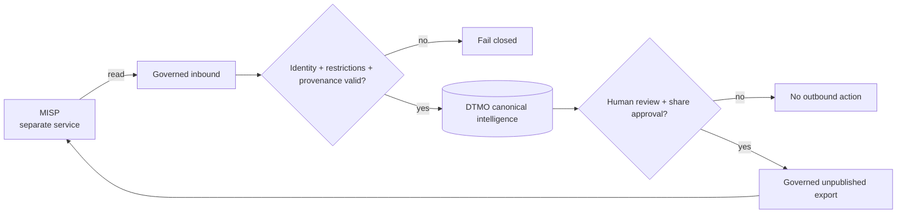

# DTMO Current Project State

Last reconciled: **2026-08-16**  
Software baseline: **16.0.0rc12 plus accepted post-RC13, E8 and Phase 11 repository enhancements**

## Executive summary

DTMO has completed Phases 1–7, RC13 functional acceptance and E8.1–E8.10 product evolution. RC13 is `PASS / OWNER_ACCEPTED`; E8.1–E8.10 are `PASS / REPOSITORY_COMPLETE`. Phase 8 is `PASS / OWNER_ACCEPTED` and Phase 9 is `PASS / EXTERNAL_ASSURANCE_ACCEPTED` for the earlier candidate. Phase 10 concluded **`NO-GO / BLOCKED — PLATFORM INDUSTRIALISATION REQUIRED`**. DTMO is **not production authorized**.

The active programme is **Phase 11 — Platform Industrialisation**. Phase 11.1–11.2 Taranis, Phase 11.3 IntelOwl and Phase 11.4 OpenCTI are `PASS / REPOSITORY_COMPLETE`. The active bounded objective is **Phase 11.5 MISP consolidation contract**, currently `IN PROGRESS / EXACT-HEAD VALIDATION REQUIRED`.

## Lifecycle position

| Stage | Status |
|---|---|
| Phases 1–7 | `PASS` |
| RC13 + owner retest | `PASS / OWNER_ACCEPTED` |
| E8.1–E8.10 | `PASS / REPOSITORY_COMPLETE` |
| Phase 8 | `PASS / OWNER_ACCEPTED` |
| Phase 9 | `PASS / EXTERNAL_ASSURANCE_ACCEPTED` |
| Phase 10 | `NO-GO / BLOCKED — PLATFORM INDUSTRIALISATION REQUIRED` |
| Phase 11 | `IN PROGRESS / ACTIVE` |
| Phase 11.1 Taranis architecture/contract | `PASS / REPOSITORY_COMPLETE` |
| Phase 11.2 Taranis adapter | `PASS / REPOSITORY_COMPLETE` |
| Phase 11.3 IntelOwl integration | `PASS / REPOSITORY_COMPLETE` |
| Phase 11.4 OpenCTI contract | `PASS / REPOSITORY_COMPLETE` |
| Phase 11.4 OpenCTI read-only adapter | `PASS / REPOSITORY_COMPLETE` |
| Phase 11.4 OpenCTI canonical mapping/persistence | `PASS / REPOSITORY_COMPLETE` |
| Phase 11.4 OpenCTI integration | `PASS / REPOSITORY_COMPLETE` |
| Phase 11.5 MISP consolidation contract | `IN PROGRESS / EXACT-HEAD VALIDATION REQUIRED` |
| Phase 12 | `NOT STARTED` |

## Accepted Phase 11 capabilities

Phase 11.2 provides the repository-complete Taranis read-only canonical integration with durable checkpointing/reconciliation, detail/CTI retrieval, governed execution, canonical persistence/indexing and observability.

Phase 11.3 provides the repository-complete IntelOwl service boundary, bounded enrichment adapter, human-authorized `REVIEW_INTELLIGENCE` execution and durable enrichment history. IntelOwl results never grant external-share authority or prove local compromise.

Phase 11.4 provides the repository-complete OpenCTI service/API/STIX/licensing contract, bounded GraphQL/STIX read adapter, explicit OpenCTI/STIX↔DTMO identity mapping, immutable reconciliation history, database-enforced no-share/no-local-compromise invariants and PostgreSQL-before-checkpoint ordering. Repository completion is engineering evidence only and does not establish live OpenCTI or production evidence.

## Active Phase 11.5 MISP consolidation contract

DTMO already contains two MISP capabilities from E8: a governed read-only `events/restSearch` connector and a separate human-approved `events/add` export path. Phase 11.5 consolidates these into one explicit authority and synchronization model instead of adding another MISP client or implicit federation path.

The reviewed upstream baseline is **MISP v2.5.44**. MISP remains a separate **AGPL-3.0** service/API component; DTMO does not vendor MISP core source.

The active contract preserves the following rules:

- MISP event/attribute/object UUID identity remains distinct from DTMO canonical UUID identity;
- inbound distribution, sharing-group and TLP/tag restrictions remain attributable and authoritative constraints;
- import never grants `share_approved`, publication authority, local-compromise proof or blanket governance claims;
- outbound sharing requires attributable human DTMO review and share approval;
- service accounts, collectors, schedulers, IntelOwl, OpenCTI and MISP cannot grant DTMO sharing authority;
- source restrictions cannot be broadened on re-export;
- `events/add` creates an unpublished destination event and does not itself authorize publication/federation;
- uncertain outbound delivery blocks automated replay pending operator reconciliation;
- MISP server push/pull synchronization and automatic OpenCTI↔MISP synchronization remain excluded from this first consolidation boundary;
- runtime credentials remain secret and production access requires HTTPS, least privilege and fail-closed authorization behavior.

## Data and authority model

PostgreSQL remains canonical DTMO application/intelligence/RBAC state. MISP, IntelOwl and OpenCTI remain separate services that provide attributable CTI/enrichment/graph/exchange context. None can grant DTMO publication/share authority or establish local compromise by itself.

MISP-origin restrictions and DTMO human approval are cumulative; the more restrictive effective rule wins. Ambiguous identity, malformed restrictions, authorization failure, uncertain delivery or conflicting provenance fails closed.

## Governance and evidence boundary

Framework relationships remain explicit, versioned and provenance-backed. Repository CI for the MISP contract can prove only repository-controlled contract wording, existing path compatibility and documentation synchronization. It cannot prove live credentials, effective production MISP permissions, remote-server trust, lawful live-data sharing, staging acceptance, independent assurance or production authorization.

Historical Phase 8/9 evidence remains valid only for the earlier candidate and is not reused for the materially changed Phase 11 platform. Fresh Phase 11.10 production-equivalent validation and Phase 11.11 independent assurance remain required before Phase 12.

## Phase 11 fixed order

1. Taranis AI — `PASS / REPOSITORY_COMPLETE` through Phase 11.2;
2. IntelOwl — `PASS / REPOSITORY_COMPLETE` for Phase 11.3;
3. OpenCTI — `PASS / REPOSITORY_COMPLETE` for Phase 11.4;
4. MISP consolidation — active Phase 11.5 contract validation;
5. TheHive;
6. Cortex only if IntelOwl cannot satisfy a validated requirement;
7. Kubernetes/Helm/GitOps and integrated runtime hardening;
8. migration/compatibility;
9. new production-equivalent validation;
10. new independent external assurance;
11. Phase 12 formal production GO/NO-GO.
