# DTMO Current Project State

Last reconciled: 2026-08-09 — RUN-20260809-130 (`CI_VALIDATION_PENDING` for this documentation head; RC10.4 product evidence is accepted and merged)

This document is the human-readable current-state view of DTMO. It complements the immutable run history in `docs/development/runs/`, the chronological `docs/development/RUN_LOG.md`, the production roadmap, QA gate records and GitHub issues #1–#3.

## Executive status

- Phase 1 — CI and workflow integrity: `PASS`.
- Phase 2 — application security and identity: `PASS` for internal roadmap gates.
- Phase 3 — data integrity and recovery: `PASS` for internal roadmap gates.
- Phase 4 — connector reliability and provenance: `PASS` for internal roadmap gates.
- Phase 5 — performance and scalability: `PASS` for internal roadmap gates. External representative production load/stress remains separate in issue #1.
- Phase 6 — frontend accessibility and operational UX: `BLOCKED_EXTERNAL` only for genuine VoiceOver/NVDA behavior on supported real host/browser/screen-reader combinations. Browser/DOM automation is not accepted as a substitute.
- Phase 7 — observability and incident operations: `IN PROGRESS`.
  - RC10.1 request observability: `PASS`.
  - RC10.2 controlled connector-failure alerting: `PASS`.
  - RC10.3 bounded queue-backlog alerting: `PASS`.
  - RC10.4 bounded storage-integrity alerting: `PASS`.
  - normal next item RC10.5 API-error alerting is deferred behind a higher-severity MinIO security-maintenance blocker.
- Phase 8 — staging acceptance: `NOT STARTED`.
- Phase 9 — external assurance: `NOT COMPLETE`.
- Phase 10 — production go/no-go: `NOT STARTED`.

DTMO is therefore **not production ready**. Issue #1 remains the source of truth for external production-acceptance gates.

## Roadmap graph

```mermaid
flowchart LR
    P1[Phase 1 CI/workflow integrity\nPASS] --> P2[Phase 2 Security & identity\nPASS internal]
    P2 --> P3[Phase 3 Data integrity & recovery\nPASS internal]
    P3 --> P4[Phase 4 Connector reliability & provenance\nPASS internal]
    P4 --> P5[Phase 5 Performance & scalability\nPASS internal]
    P5 --> P6[Phase 6 Accessibility & operational UX\nBLOCKED_EXTERNAL]
    P6 --> P7[Phase 7 Observability & incident operations\nIN PROGRESS]
    P7 --> P8[Phase 8 Staging acceptance\nNOT STARTED]
    P8 --> P9[Phase 9 External assurance\nNOT COMPLETE]
    P9 --> P10[Phase 10 Production go/no-go\nNOT STARTED]
```

Phase 7 work may proceed while Phase 6 remains externally blocked; the VoiceOver/NVDA requirement itself remains open and is not bypassed.

## Latest accepted Phase 7 evidence

### RC10.1 — request observability

PR #80 exact head `01a175e12da7c8af8566178a2d7e6b34a57d58bc` passed all 34 workflows. Retained artifact `9040196394`, digest `sha256:6792020994d94b0484cb84140d202433303eceb82565f8598ffd5937940531d6`, independently proved correlated structured request telemetry and bounded route-template metrics. JUnit: 5/5. Merge: `1675d88bb24dcd50e20545f49b26dd7cc2810d97`.

### RC10.2 — controlled connector-failure alerting

PR #82 exact head `b38aeae44588e39e35339f4c4d9667947804b243` passed all 35 workflows. Retained artifact `9040485255`, digest `sha256:96883158cfd790c3c6b21c2db819acbcbc03d431d4dd79bb32038b6ff258de25`, independently proved terminal failure signaling, Prometheus rule/metric, safe correlation, actionable guidance and recovery/clear behavior. JUnit: 4/4. Merge: `f6680423860389288d9feced34592294d774bf4a`.

### RC10.3 — bounded queue-backlog alerting

PR #84 exact head `8058b476298eee4bcd2942d9cca54384ec12aa74` passed all 36 workflows. Retained artifact `9040996591`, digest `sha256:42aaad1424d7c1ad40accd056b4746ea6fb328a561b24df5ebc293c0425b1910`, independently proved bounded queue identifiers, depth/capacity/utilization metrics, raise at `>=80%`, clear at `<=50%`, hysteresis, structured correlated evidence, actionable guidance and accepted RC8 queue-pressure contract reuse. JUnit: 5/5. Merge: `42ccbe04cbc1081f93e4a155243627b5a3038573`.

### RC10.4 — bounded storage-integrity alerting

PR #86 exact head `8aa56dacd64583de5e96c0fda188ba954437ffda` passed all 37 workflows. Retained artifact `9041327884`, digest `sha256:456b09902727552d62fa7e1c96f119c6050a692d2519e0f8cecdd160e8b1dab3`, independently proved real `IntelligenceLake.verify()` reuse, critical storage-integrity signaling, safe correlation, recovery clear behavior, repeat-raise suppression and exclusion of object keys, expected digest and payload evidence. JUnit: 5/5. Merge: `4d7494e8b8fcdcddb73349bf87157d8c16763c33`.

RC10.4 does not claim scheduled/fleet-wide production integrity scanning, external notification delivery, API/search alerting, dashboards, runbooks or Phase-7 completion.

## Higher-severity security blocker

The repository currently pins `minio/minio:RELEASE.2025-07-23T15-54-02Z`. Fresh public threat-intelligence/advisory review places that version within affected ranges for multiple later MinIO vulnerabilities, including CVE-2026-41145. This does not erase accepted bounded RC10.4 evidence, but it blocks further normal Phase-7 advancement until the object-storage runtime is moved to a supported/patched release or explicitly supported successor and the relevant security, recovery, storage-integrity and regression gates are re-executed.

Affected-version match is high confidence. Exploitability of individual OIDC/STS/cluster-JWT-dependent advisories remains configuration-dependent and is not asserted without deployment evidence.

## Phase 6 external accessibility boundary

RC9.1–RC9.15 contain accepted bounded browser/accessibility evidence. RC9.16 defines the remaining real-assistive-technology evidence contract. Phase 6 remains `BLOCKED_EXTERNAL` until genuine VoiceOver and NVDA execution is retained from supported real host/browser/screen-reader combinations.

## Phase 5 capacity boundary

Internal Phase 5 is `PASS`. All performance figures are bounded internal/synthetic evidence and do not certify production capacity. Issue #1's independent representative production load/stress gate remains separate and open.

## External gates still open

Issue #1 remains authoritative for externally executed production gates, including independent penetration testing, representative load/stress, full backup/restoration exercise, production OpenSearch hardening, secrets-manager replacement where required, staging/production deployment acceptance and operational/stakeholder approval.

## Security and governance invariants

- RBAC remains enforced.
- Review and share approval remain separate human actions.
- Connectors and service accounts cannot approve publication.
- Ingestion, connector, queue, storage, replay, retry, recovery, timeout, performance or observability success never implies publication approval.
- Provenance, confidence and raw evidence remain retained according to their controls.
- Performance and controlled-failure fixtures use synthetic or explicitly approved non-production data.
- Missing, queued, cancelled, failed or unexecuted CI is never `PASS`.

## Exactly one current priority

Remediate the vulnerable MinIO runtime pin with a supported/patched object-storage release or explicitly supported successor, then run relevant security, recovery, storage-integrity and full regression gates with retained exact-head evidence before resuming Phase 7 / RC10.5 API-error alerting.
