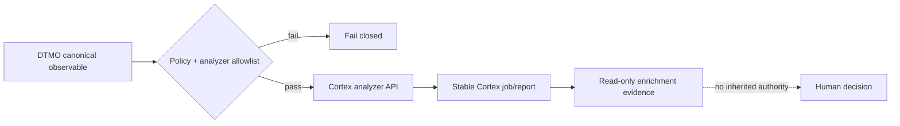

# DTMO Current Project State

Last reconciled: **2026-08-17**  
Software baseline: **16.0.0rc12 plus accepted post-RC13, E8 and Phase 11 repository enhancements**

## Executive summary

DTMO has completed Phases 1–7, RC13 functional acceptance and E8.1–E8.10 product evolution. RC13 is `PASS / OWNER_ACCEPTED`; E8.1–E8.10 are `PASS / REPOSITORY_COMPLETE`. Phase 8 is `PASS / OWNER_ACCEPTED` and Phase 9 is `PASS / EXTERNAL_ASSURANCE_ACCEPTED` for the earlier candidate. Phase 10 concluded **`NO-GO / BLOCKED — PLATFORM INDUSTRIALISATION REQUIRED`**. DTMO is **not production authorized**.

The active programme is **Phase 11 — Platform Industrialisation**. Phase 11.1–11.6 are `PASS / REPOSITORY_COMPLETE`. The original Phase 11.7 Cortex no-adoption decision is also `PASS / REPOSITORY_COMPLETE` for the requirement set it assessed. A new explicit accountable-operator requirement now activates **Phase 11.7A — bounded Cortex analyzer connector re-entry**, currently `IN PROGRESS / EXACT-HEAD VALIDATION REQUIRED`. Phase 11.8 remains next after protected acceptance of this bounded exception.

## Lifecycle position

| Stage | Status |
|---|---|
| Phases 1–7 | `PASS` |
| RC13 + owner retest | `PASS / OWNER_ACCEPTED` |
| E8.1–E8.10 | `PASS / REPOSITORY_COMPLETE` |
| Phase 8 | `PASS / OWNER_ACCEPTED` |
| Phase 9 | `PASS / EXTERNAL_ASSURANCE_ACCEPTED` |
| Phase 10 | `NO-GO / BLOCKED — PLATFORM INDUSTRIALISATION REQUIRED` |
| Phase 11 | `IN PROGRESS / ACTIVE` |
| Phase 11.1–11.2 Taranis | `PASS / REPOSITORY_COMPLETE` |
| Phase 11.3 IntelOwl | `PASS / REPOSITORY_COMPLETE` |
| Phase 11.4 OpenCTI | `PASS / REPOSITORY_COMPLETE` |
| Phase 11.5 MISP | `PASS / REPOSITORY_COMPLETE` |
| Phase 11.6 TheHive | `PASS / REPOSITORY_COMPLETE` |
| Phase 11.7 Cortex decision gate | `PASS / REPOSITORY_COMPLETE` |
| Phase 11.7A Cortex analyzer connector | `IN PROGRESS / EXACT-HEAD VALIDATION REQUIRED` |
| Phase 11.8 integrated runtime industrialisation | `NOT STARTED` |
| Phase 12 | `NOT STARTED` |

## Accepted Phase 11 capabilities

Taranis provides governed collection/canonicalization; IntelOwl provides bounded human-authorized enrichment with immutable history; OpenCTI provides bounded graph integration and durable identity reconciliation; MISP provides governed inbound/outbound exchange with authoritative restriction state; TheHive provides minimal explicit human-authorized case handoff with durable mutation reservation/reconciliation and no blind replay after ambiguity.

All remain separate service boundaries. None gains DTMO human publication/share authority or establishes local compromise by itself. TheHive case-handoff authority remains distinct from publication/share authority.

## Active Phase 11.7A Cortex analyzer connector

The original Phase 11.7 review found no validated IntelOwl capability gap and therefore did not adopt Cortex. That accepted decision remains historically valid. On 2026-08-17 the accountable operator explicitly added a new requirement: **include a Cortex connector in DTMO**. This new attributable requirement activates the decision record's re-entry mechanism.

The bounded implementation adds Cortex only as an **analyzer service/API connector**. It does not replace IntelOwl and does not implement Cortex responders. Analyzer IDs must be explicitly allowlisted; observable type and TLP are validated; missing credentials, unknown policy values, unstable job identity and oversized reports fail closed. Imported reports are marked read-only enrichment evidence with no responder authority, no external-share authority and no local-compromise proof.

Cortex remains a separate AGPL-3.0 service/API boundary. DTMO does not vendor Cortex or Cortex-Analyzer source in this slice. Live endpoint, token, permissions, analyzer availability and upstream provider entitlements remain deployment evidence and are not inferred from CI.

## Governance and evidence boundary

Repository acceptance of Phase 11.7A can prove only synthetic connector policy, request/response normalization and documentation consistency. It does not prove live analyzer quality, legal authority to disclose observables, deployed credentials/permissions, production-equivalent behavior, independent assurance or production authorization.

Historical Phase 8/9 evidence remains valid only for the earlier candidate and is not reused for the materially changed Phase 11 platform. Fresh Phase 11.10 production-equivalent validation and Phase 11.11 independent assurance remain required before Phase 12.

## Phase 11 fixed order

1. Taranis AI — `PASS / REPOSITORY_COMPLETE`;
2. IntelOwl — `PASS / REPOSITORY_COMPLETE`;
3. OpenCTI — `PASS / REPOSITORY_COMPLETE`;
4. MISP — `PASS / REPOSITORY_COMPLETE`;
5. TheHive — `PASS / REPOSITORY_COMPLETE`;
6. Cortex original decision — `PASS / REPOSITORY_COMPLETE`; no adoption for the original requirement set;
7. Cortex analyzer connector re-entry — active bounded operator requirement;
8. Kubernetes/Helm/GitOps and integrated runtime hardening — next after protected Cortex connector acceptance;
9. migration/compatibility;
10. new production-equivalent validation;
11. new independent external assurance;
12. Phase 12 formal production GO/NO-GO.
