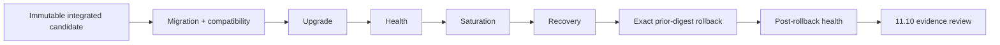

# DTMO Current Project State

Last reconciled: **2026-08-20**  
Software baseline: **16.0.0rc12 plus accepted post-RC13, E8 and Phase 11 repository enhancements**

## Executive summary

DTMO has completed Phases 1–7, RC13 functional acceptance and E8.1–E8.10 product evolution. Phase 8 and Phase 9 evidence remain historical and candidate-bound. Phase 10 concluded **`NO-GO / BLOCKED — PLATFORM INDUSTRIALISATION REQUIRED`**. DTMO is **not production authorized**.

The active programme is **Phase 11 — Platform Industrialisation**. Phase 11.1–11.9 are `PASS / REPOSITORY_COMPLETE`. The sole active bounded objective is **Phase 11.10 integrated production-equivalent validation**, currently `IN PROGRESS / FRESH CANDIDATE-BOUND EVIDENCE REQUIRED`.

## Lifecycle position

| Stage | Status |
|---|---|
| Phases 1–7 | `PASS` |
| RC13 + owner retest | `PASS / OWNER_ACCEPTED` |
| E8.1–E8.10 | `PASS / REPOSITORY_COMPLETE` |
| Phase 8 | `PASS / OWNER_ACCEPTED — HISTORICAL CANDIDATE` |
| Phase 9 | `PASS / EXTERNAL_ASSURANCE_ACCEPTED — HISTORICAL CANDIDATE` |
| Phase 10 | `NO-GO / BLOCKED — PLATFORM INDUSTRIALISATION REQUIRED` |
| Phase 11 | `IN PROGRESS / ACTIVE` |
| Phase 11.1–11.2 Taranis | `PASS / REPOSITORY_COMPLETE` |
| Phase 11.3 IntelOwl | `PASS / REPOSITORY_COMPLETE` |
| Phase 11.4 OpenCTI | `PASS / REPOSITORY_COMPLETE` |
| Phase 11.5 MISP | `PASS / REPOSITORY_COMPLETE` |
| Phase 11.6 TheHive | `PASS / REPOSITORY_COMPLETE` |
| Phase 11.7 Cortex decision gate | `PASS / REPOSITORY_COMPLETE — HISTORICAL DECISION BASELINE` |
| Phase 11.7b Cortex analyzer connector | `PASS / REPOSITORY_COMPLETE` |
| Phase 11.8 integrated runtime industrialisation | `PASS / REPOSITORY_COMPLETE` |
| Phase 11.8a runtime foundation | `PASS / REPOSITORY_COMPLETE` |
| Phase 11.8b workload identity / external secrets | `PASS / REPOSITORY_COMPLETE` |
| Phase 11.8c ingress/TLS + network segmentation | `PASS / REPOSITORY_COMPLETE` |
| Phase 11.8d HA / disruption hardening | `PASS / REPOSITORY_COMPLETE` |
| Phase 11.8e observability hardening | `PASS / REPOSITORY_COMPLETE` |
| Phase 11.8f backup / restore / recovery hardening | `PASS / REPOSITORY_COMPLETE` |
| Phase 11.8g software supply-chain hardening | `PASS / REPOSITORY_COMPLETE` |
| Phase 11.8h capacity / resource planning | `PASS / REPOSITORY_COMPLETE` |
| Phase 11.8i exercised upgrade / rollback | `PASS / REPOSITORY_COMPLETE` |
| Phase 11.9 migration/compatibility | `PASS / REPOSITORY_COMPLETE` |
| Phase 11.10 production-equivalent validation | `IN PROGRESS / FRESH CANDIDATE-BOUND EVIDENCE REQUIRED` |
| Phase 11.11 independent external assurance | `NOT STARTED` |
| Phase 12 | `NOT STARTED` |

## Accepted service and runtime boundaries

Taranis, IntelOwl, Cortex, OpenCTI, MISP and TheHive remain separate governed service/licensing boundaries. None gains DTMO human publication/share authority or establishes local compromise by itself. TheHive case-handoff authority remains distinct from publication/share authority.

Phase 11.8 is repository-complete. Accepted controls cover the Helm/GitOps Kubernetes runtime foundation, workload identity/external-secret delivery, TLS ingress/network segmentation, application HA/disruption controls, observability boundaries, backup/restore/recovery controls, software supply-chain hardening, capacity/resource planning and exercised upgrade/rollback. Phase 11.9 adds the accepted forward-first migration/application compatibility contract. These remain engineering controls and do not themselves establish production-equivalent behavior or production authorization.

## Active Phase 11.10 validation boundary

Phase 11.10 requires fresh production-equivalent evidence for one immutable integrated deployment identity. The mandatory evidence classes are candidate identity, migration/compatibility, upgrade, rollback, health, saturation and recovery.

Every artifact must identify the same candidate and environment. Historical Phase 8 staging evidence remains audit history only and is not reusable for Phase 11.10 acceptance. Missing, ambiguous, mixed-candidate or historical-only evidence must **fail closed**.

Repository CI may validate the Phase 11.10 evidence contract and exact-head metadata, but it cannot prove that the production-equivalent environment was deployed or exercised. Repository-green status alone therefore does not complete Phase 11.10 and does not authorize production.

Phase 11.11 independent external assurance must run only after Phase 11.10 acceptance and against the same immutable integrated candidate.

## Phase 11 fixed order

1. Taranis AI — `PASS / REPOSITORY_COMPLETE`;
2. IntelOwl — `PASS / REPOSITORY_COMPLETE`;
3. OpenCTI — `PASS / REPOSITORY_COMPLETE`;
4. MISP — `PASS / REPOSITORY_COMPLETE`;
5. TheHive — `PASS / REPOSITORY_COMPLETE`;
6. original Cortex conditional decision — historical `PASS / REPOSITORY_COMPLETE`;
7. owner-required Cortex analyzer connector — `PASS / REPOSITORY_COMPLETE`;
8. integrated runtime industrialisation — Phase 11.8 `PASS / REPOSITORY_COMPLETE`;
9. migration/compatibility — Phase 11.9 `PASS / REPOSITORY_COMPLETE`;
10. production-equivalent validation — active Phase 11.10;
11. new independent external assurance;
12. Phase 12 formal production GO/NO-GO.
