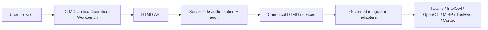

# DTMO Current Project State

Last reconciled: **2026-08-20**  
Software baseline: **16.0.0rc12 plus accepted post-RC13, E8 and Phase 11 repository enhancements**

## Executive summary

DTMO has completed Phases 1–7, RC13 functional acceptance and E8.1–E8.10 product evolution. Phase 8 and Phase 9 evidence remain historical and candidate-bound. Phase 10 concluded **`NO-GO / BLOCKED — PLATFORM INDUSTRIALISATION REQUIRED`**. DTMO is **not production authorized**.

The active programme is **Phase 11 — Platform Industrialisation**. Phase 11.1–11.9 are `PASS / REPOSITORY_COMPLETE`. Phase 11.10 remains `IN PROGRESS / FRESH CANDIDATE-BOUND EVIDENCE REQUIRED`.

The sole active bounded objective is now **Phase 11.10a Frontend architecture and design contract**, status `IN PROGRESS / REPOSITORY ARCHITECTURE CONTRACT`. The owner-required next-generation Unified Operations Workbench materially changes the integrated candidate, so fresh production-equivalent execution is intentionally deferred until the candidate-completion sequence 11.10a–11.10o is complete and one immutable integrated candidate is frozen for 11.10p.

## Lifecycle position

| Stage | Status |
|---|---|
| Phases 1–7 | `PASS` |
| RC13 + owner retest | `PASS / OWNER_ACCEPTED` |
| E8.1–E8.10 | `PASS / REPOSITORY_COMPLETE` |
| Phase 8 | `PASS / OWNER_ACCEPTED — HISTORICAL CANDIDATE` |
| Phase 9 | `PASS / EXTERNAL_ASSURANCE_ACCEPTED — HISTORICAL CANDIDATE` |
| Phase 10 | `NO-GO / BLOCKED — PLATFORM INDUSTRIALISATION REQUIRED` |
| Phase 11 | `IN PROGRESS / ACTIVE` |
| Phase 11.1–11.2 Taranis | `PASS / REPOSITORY_COMPLETE` |
| Phase 11.3 IntelOwl | `PASS / REPOSITORY_COMPLETE` |
| Phase 11.4 OpenCTI | `PASS / REPOSITORY_COMPLETE` |
| Phase 11.5 MISP | `PASS / REPOSITORY_COMPLETE` |
| Phase 11.6 TheHive | `PASS / REPOSITORY_COMPLETE` |
| Phase 11.7 Cortex decision gate | `PASS / REPOSITORY_COMPLETE — HISTORICAL DECISION BASELINE` |
| Phase 11.7b Cortex analyzer connector | `PASS / REPOSITORY_COMPLETE` |
| Phase 11.8 integrated runtime industrialisation | `PASS / REPOSITORY_COMPLETE` |
| Phase 11.8a runtime foundation | `PASS / REPOSITORY_COMPLETE` |
| Phase 11.8b workload identity / external secrets | `PASS / REPOSITORY_COMPLETE` |
| Phase 11.8c ingress/TLS + network segmentation | `PASS / REPOSITORY_COMPLETE` |
| Phase 11.8d HA / disruption hardening | `PASS / REPOSITORY_COMPLETE` |
| Phase 11.8e observability hardening | `PASS / REPOSITORY_COMPLETE` |
| Phase 11.8f backup / restore / recovery hardening | `PASS / REPOSITORY_COMPLETE` |
| Phase 11.8g software supply-chain hardening | `PASS / REPOSITORY_COMPLETE` |
| Phase 11.8h capacity / resource planning | `PASS / REPOSITORY_COMPLETE` |
| Phase 11.8i exercised upgrade / rollback | `PASS / REPOSITORY_COMPLETE` |
| Phase 11.9 migration/compatibility | `PASS / REPOSITORY_COMPLETE` |
| Phase 11.10 production-equivalent validation | `IN PROGRESS / FRESH CANDIDATE-BOUND EVIDENCE REQUIRED` |
| Phase 11.10a frontend architecture/design contract | `IN PROGRESS / REPOSITORY ARCHITECTURE CONTRACT` |
| Phase 11.10b canonical application shell | `NOT STARTED` |
| Phase 11.10c Command Center | `NOT STARTED` |
| Phase 11.10d Unified Intelligence Workspace | `NOT STARTED` |
| Phase 11.10e IntelOwl/Cortex integrated analysis | `NOT STARTED` |
| Phase 11.10f OpenCTI graph/entity workspace | `NOT STARTED` |
| Phase 11.10g MISP Sharing & Exchange | `NOT STARTED` |
| Phase 11.10h TheHive Investigations & Cases | `NOT STARTED` |
| Phase 11.10i Vulnerability & Exposure Center | `NOT STARTED` |
| Phase 11.10j Sources & Collection Control Center | `NOT STARTED` |
| Phase 11.10k Automation & Playbooks | `NOT STARTED` |
| Phase 11.10l Governance & Evidence Center | `NOT STARTED` |
| Phase 11.10m Operations & Administration | `NOT STARTED` |
| Phase 11.10n role-aware UX/accessibility | `NOT STARTED` |
| Phase 11.10o consolidation/full functional acceptance | `NOT STARTED` |
| Phase 11.10p fresh production-equivalent validation | `NOT STARTED / CANDIDATE FREEZE REQUIRED` |
| Phase 11.11 independent external assurance | `NOT STARTED` |
| Phase 12 | `NOT STARTED` |

## Accepted service and runtime boundaries

Taranis, IntelOwl, Cortex, OpenCTI, MISP and TheHive remain separate governed service/licensing boundaries. None gains DTMO human publication/share authority or establishes local compromise by itself. TheHive case-handoff authority remains distinct from publication/share authority.

Phase 11.8 is repository-complete. Accepted controls cover the Helm/GitOps Kubernetes runtime foundation, workload identity/external-secret delivery, TLS ingress/network segmentation, application HA/disruption controls, observability boundaries, backup/restore/recovery controls, software supply-chain hardening, capacity/resource planning and exercised upgrade/rollback. Phase 11.9 adds the accepted forward-first migration/application compatibility contract. These remain engineering controls and do not themselves establish production-equivalent behavior or production authorization.

## Active Phase 11.10a frontend architecture boundary

11.10a establishes the maintainable architecture required to build the approved next-generation interface without weakening existing controls.

The target canonical trust path is:

Normal product workflows must use **browser → DTMO API → governed integration adapter → upstream service**. The browser is not a privileged integration broker. Role-aware rendering is a usability function only; server-side RBAC remains authoritative.

The 11.10a repository contract consists of:

- `docs/architecture/FRONTEND_ARCHITECTURE.md`;
- `docs/architecture/UI_API_CONTRACT.md`;
- `docs/ux/UNIFIED_OPERATIONS_WORKBENCH.md`;
- `docs/ux/INFORMATION_ARCHITECTURE.md`;
- `docs/ux/DESIGN_SYSTEM.md`;
- `docs/qa/PHASE11_10A_FRONTEND_ARCHITECTURE_GATE.md`;
- `backend/tests/test_phase11_10a_frontend_architecture_contract.py`;
- `.github/workflows/phase11-frontend-architecture.yml`.

11.10a does not implement or accept the frontend and does not establish live integration, staging acceptance, production-equivalent execution, independent assurance or production authorization. Generated/reference design visuals remain design artifacts only.

## Phase 11.10 external validation boundary

Fresh production-equivalent validation remains mandatory, but is now the final 11.10 candidate step **11.10p** after 11.10a–11.10o candidate completion and functional acceptance.

11.10p still requires fresh production-equivalent evidence for one immutable integrated deployment identity. The mandatory evidence classes remain candidate identity, migration/compatibility, upgrade, rollback, health, saturation and recovery.

Every artifact must identify the same candidate fingerprint and production-equivalent environment. Historical Phase 8/9 evidence remains audit history only and is not reusable for Phase 11.10 acceptance. Missing, placeholder, inaccessible, mixed-candidate or historical-only evidence must **fail closed**.

The existing external execution package remains authoritative:

- `docs/qa/PHASE11_10_PRODUCTION_EQUIVALENT_VALIDATION_GATE.md` — acceptance criteria;
- `docs/operations/PHASE11_10_PRODUCTION_EQUIVALENT_VALIDATION_RUNBOOK.md` — accountable execution procedure;
- `docs/evidence/PHASE11_10_PRODUCTION_EQUIVALENT_EVIDENCE.template.json` — deliberately incomplete evidence template;
- `tools/phase11_production_equivalent_validation.py` — candidate fingerprinting and fail-closed manifest validation;
- `backend/tests/test_phase11_10_production_equivalent_validation.py` — contract and negative-case regression coverage;
- `.github/workflows/phase11-production-equivalent-validation.yml` — repository evidence-contract workflow.

Repository CI may validate repository contracts and exact-head metadata, but it cannot prove that the production-equivalent environment was deployed or exercised. Repository-green status alone therefore does not complete Phase 11.10 and does not authorize production.

Phase 11.10 may become `PASS / OWNER_ACCEPTED` only when 11.10a–11.10o are complete, one integrated candidate is frozen, the full 11.10p real-environment evidence package is complete and the accountable owner explicitly accepts it.

Phase 11.11 independent external assurance must run only after Phase 11.10 acceptance and against the same immutable integrated candidate.

## Phase 11 fixed order

1. Taranis AI — `PASS / REPOSITORY_COMPLETE`;
2. IntelOwl — `PASS / REPOSITORY_COMPLETE`;
3. OpenCTI — `PASS / REPOSITORY_COMPLETE`;
4. MISP — `PASS / REPOSITORY_COMPLETE`;
5. TheHive — `PASS / REPOSITORY_COMPLETE`;
6. original Cortex conditional decision — historical `PASS / REPOSITORY_COMPLETE`;
7. owner-required Cortex analyzer connector — `PASS / REPOSITORY_COMPLETE`;
8. integrated runtime industrialisation — Phase 11.8 `PASS / REPOSITORY_COMPLETE`;
9. migration/compatibility — Phase 11.9 `PASS / REPOSITORY_COMPLETE`;
10. Phase 11.10a–11.10o integrated candidate completion — 11.10a active;
11. Phase 11.10p fresh production-equivalent validation — `NOT STARTED`;
12. new independent external assurance — Phase 11.11 `NOT STARTED`;
13. Phase 12 formal production GO/NO-GO — `NOT STARTED`.
