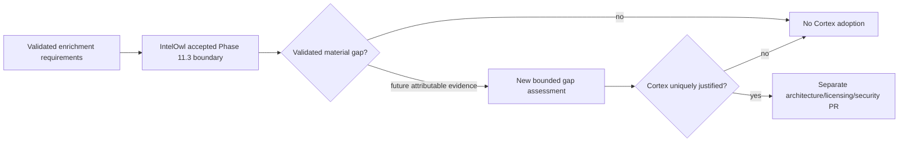

# DTMO Current Project State

Last reconciled: **2026-08-17**  
Software baseline: **16.0.0rc12 plus accepted post-RC13, E8 and Phase 11 repository enhancements**

## Executive summary

DTMO has completed Phases 1–7, RC13 functional acceptance and E8.1–E8.10 product evolution. RC13 is `PASS / OWNER_ACCEPTED`; E8.1–E8.10 are `PASS / REPOSITORY_COMPLETE`. Phase 8 is `PASS / OWNER_ACCEPTED` and Phase 9 is `PASS / EXTERNAL_ASSURANCE_ACCEPTED` for the earlier candidate. Phase 10 concluded **`NO-GO / BLOCKED — PLATFORM INDUSTRIALISATION REQUIRED`**. DTMO is **not production authorized**.

The active programme is **Phase 11 — Platform Industrialisation**. Phase 11.1–11.6 are `PASS / REPOSITORY_COMPLETE`. The active bounded objective is **Phase 11.7 Cortex decision gate**, currently `IN PROGRESS / EXACT-HEAD VALIDATION REQUIRED`.

## Lifecycle position

| Stage | Status |
|---|---|
| Phases 1–7 | `PASS` |
| RC13 + owner retest | `PASS / OWNER_ACCEPTED` |
| E8.1–E8.10 | `PASS / REPOSITORY_COMPLETE` |
| Phase 8 | `PASS / OWNER_ACCEPTED` |
| Phase 9 | `PASS / EXTERNAL_ASSURANCE_ACCEPTED` |
| Phase 10 | `NO-GO / BLOCKED — PLATFORM INDUSTRIALISATION REQUIRED` |
| Phase 11 | `IN PROGRESS / ACTIVE` |
| Phase 11.1–11.2 Taranis | `PASS / REPOSITORY_COMPLETE` |
| Phase 11.3 IntelOwl | `PASS / REPOSITORY_COMPLETE` |
| Phase 11.4 OpenCTI | `PASS / REPOSITORY_COMPLETE` |
| Phase 11.5 MISP | `PASS / REPOSITORY_COMPLETE` |
| Phase 11.6 TheHive | `PASS / REPOSITORY_COMPLETE` |
| Phase 11.7 Cortex decision gate | `IN PROGRESS / EXACT-HEAD VALIDATION REQUIRED` |
| Phase 11.8 integrated runtime industrialisation | `NOT STARTED` |
| Phase 12 | `NOT STARTED` |

## Accepted Phase 11 capabilities

Taranis provides governed collection/canonicalization; IntelOwl provides bounded human-authorized enrichment with immutable history; OpenCTI provides bounded graph integration and durable identity reconciliation; MISP provides governed inbound/outbound exchange with authoritative restriction state; TheHive provides minimal explicit human-authorized case handoff with durable mutation reservation/reconciliation and no blind replay after ambiguity.

All remain separate service boundaries. None gains DTMO human publication/share authority or establishes local compromise by itself. TheHive case-handoff authority remains distinct from publication/share authority.

## Active Phase 11.7 Cortex decision

Phase 11.7 is conditional: Cortex may be adopted only if an attributable, validated requirement remains unmet after the accepted IntelOwl integration. The current repository decision review finds **no validated IntelOwl capability gap for the approved DTMO enrichment scope**.

The accepted IntelOwl boundary already covers the defined generic enrichment needs: CVE/IP/domain/URL/hash analysis through approved analyzers/playbooks, explicit allowlisting, human authorization before disclosure, TLP/handling checks, stable job/analyzer identity, partial-result semantics, durable enrichment provenance, outage isolation and hard no-share/no-local-compromise invariants.

IntelOwl Connectors and external side-effect actions remain excluded deliberately. This is an authority and scope boundary, not evidence of an enrichment capability defect. Cortex responders would introduce a new mutation/response authority and are not justified by the mere presence of TheHive.

The authoritative decision record is `docs/architecture/CORTEX_DECISION_GATE.md`. No Cortex runtime, source, token, analyzer, responder, deployment configuration or production evidence is introduced in this slice.

## Runtime and licensing boundary

Accepted services continue to use separate service/API boundaries and runtime secrets. Repository CI cannot prove live provider coverage, external-service entitlements, deployed permissions, organization membership, privacy approval or production-equivalent behavior.

Cortex is not added to the composed runtime in Phase 11.7. Any future proposal requires a separate licensing and architecture review before source redistribution, service deployment or responder execution could be accepted.

## Governance and evidence boundary

Repository acceptance of Phase 11.7 proves only that the conditional decision is documented, attributable to the accepted IntelOwl requirement set and internally consistent. It does not prove live analyzer quality or that IntelOwl satisfies future requirements that have not yet been defined.

Historical Phase 8/9 evidence remains valid only for the earlier candidate and is not reused for the materially changed Phase 11 platform. Fresh Phase 11.10 production-equivalent validation and Phase 11.11 independent assurance remain required before Phase 12.

## Phase 11 fixed order

1. Taranis AI — `PASS / REPOSITORY_COMPLETE`;
2. IntelOwl — `PASS / REPOSITORY_COMPLETE`;
3. OpenCTI — `PASS / REPOSITORY_COMPLETE`;
4. MISP — `PASS / REPOSITORY_COMPLETE`;
5. TheHive — `PASS / REPOSITORY_COMPLETE`;
6. Cortex — active conditional decision gate; current proposed decision is no adoption because no validated IntelOwl gap is established;
7. Kubernetes/Helm/GitOps and integrated runtime hardening — next after protected Phase 11.7 acceptance;
8. migration/compatibility;
9. new production-equivalent validation;
10. new independent external assurance;
11. Phase 12 formal production GO/NO-GO.
