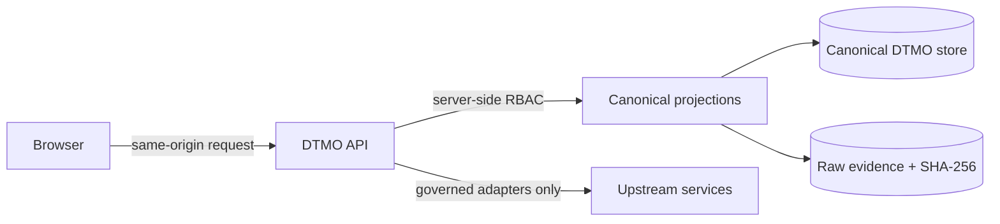

# DTMO Current Project State

Last reconciled: **2026-08-25**  
Software baseline: **16.0.0rc12 plus accepted post-RC13, E8 and Phase 11 repository enhancements**

## Executive summary

DTMO remains **not production authorized**. Repository-controlled CI, local or staging emulators and browser acceptance gates are repository evidence only; they do not establish production-equivalent behavior or independent external assurance.

Phase 11.10q Functional Recovery Acceptance was owner-authorized and merged to `main` on 2026-08-25. The historical owner rejection findings that triggered the recovery remain regression requirements. After that merge, additional bounded framework-integration hardening was completed for MISP, AIL, Taranis, IntelOwl, Cortex, OpenCTI and TheHive through canonical Administration and the existing governed runtime paths.

Phase 11 remains `IN PROGRESS`. Phase 11.10 remains `IN PROGRESS / FRESH CANDIDATE-BOUND EVIDENCE REQUIRED`: the repository recovery baseline is complete, but fresh production-equivalent evidence has not yet been executed for a newly frozen immutable candidate.

The current lifecycle priority is now **fresh candidate freeze and production-equivalent validation**. No prior Phase 8, Phase 9, staging, emulator or repository-CI evidence may be reused as proof for the new candidate. Validation and any later independent external assurance must identify the exact immutable candidate they evaluate.

## Lifecycle position

| Stage | Status |
|---|---|
| Phases 1–7 | `PASS` |
| RC13 + owner retest | `PASS / OWNER_ACCEPTED` |
| E8.1–E8.10 | `PASS / REPOSITORY_COMPLETE` |
| Phase 8 | `PASS / OWNER_ACCEPTED — HISTORICAL CANDIDATE` |
| Phase 9 | `PASS / EXTERNAL_ASSURANCE_ACCEPTED — HISTORICAL CANDIDATE` |
| Phase 10 | `NO-GO / BLOCKED — PLATFORM INDUSTRIALISATION REQUIRED` |
| Phase 11 | `IN PROGRESS` |
| Phase 11.1–11.2 Taranis | `PASS / REPOSITORY_COMPLETE` |
| Phase 11.3 IntelOwl | `PASS / REPOSITORY_COMPLETE` |
| Phase 11.4 OpenCTI | `PASS / REPOSITORY_COMPLETE` |
| Phase 11.5 MISP | `PASS / REPOSITORY_COMPLETE` |
| Phase 11.6 TheHive | `PASS / REPOSITORY_COMPLETE` |
| Phase 11.7 Cortex decision gate | `PASS / REPOSITORY_COMPLETE — HISTORICAL DECISION BASELINE` |
| Phase 11.7b Cortex analyzer connector | `PASS / REPOSITORY_COMPLETE` |
| Phase 11.8a runtime foundation | `PASS / REPOSITORY_COMPLETE` |
| Phase 11.8b workload identity / external secrets | `PASS / REPOSITORY_COMPLETE` |
| Phase 11.8c ingress/TLS + network segmentation | `PASS / REPOSITORY_COMPLETE` |
| Phase 11.8d HA / disruption hardening | `PASS / REPOSITORY_COMPLETE` |
| Phase 11.8e observability hardening | `PASS / REPOSITORY_COMPLETE` |
| Phase 11.8f backup / restore / recovery hardening | `PASS / REPOSITORY_COMPLETE` |
| Phase 11.8g software supply-chain hardening | `PASS / REPOSITORY_COMPLETE` |
| Phase 11.8h capacity / resource planning | `PASS / REPOSITORY_COMPLETE` |
| Phase 11.8i exercised upgrade / rollback | `PASS / REPOSITORY_COMPLETE` |
| Phase 11.9 migration/compatibility | `PASS / REPOSITORY_COMPLETE` |
| Phase 11.10 production-equivalent validation | `IN PROGRESS / FRESH CANDIDATE-BOUND EVIDENCE REQUIRED` |
| Phase 11.10a–11.10o | `PASS / REPOSITORY_COMPLETE` |
| Phase 11.10q Functional Recovery Acceptance | `MERGED / OWNER-AUTHORIZED MERGE` |
| Post-11.10q framework-integration hardening | `PASS / REPOSITORY_COMPLETE` |
| Fresh candidate freeze | `NEXT / REQUIRED` |
| Phase 11.10p fresh production-equivalent validation | `NOT YET EXECUTED FOR NEW CANDIDATE` |
| Phase 11.11 independent external assurance | `NOT STARTED` |
| Phase 12 | `NOT STARTED` |

The Phase 9 `EXTERNAL_ASSURANCE_ACCEPTED` status is historical and candidate-bound only. It is retained as audit history and is not evidence for the new candidate.

## Functional recovery baseline

The current canonical product baseline includes the following recovered operator paths:

- framework integration configuration/readiness in canonical Administration;
- governed source bootstrap, validation, activation and execution in Sources & Collection;
- Threat Intelligence population, recent/default discovery and canonical object pivots;
- persistence-backed IOC Explorer inventory and pivots;
- Knowledge Graph discovery plus governed population/reload;
- Vulnerability & Exposure population/reload and filtering;
- object-driven Analysis & Enrichment with persisted IntelOwl/Cortex history/results;
- object-driven Sharing & Exchange with separate human review/share authority;
- executable Automation & Playbooks with persisted operational state;
- object-driven TheHive Investigations handoff;
- same-origin Operations/Command Center telemetry and readiness surfaces;
- governed identity/RBAC and framework settings in canonical Administration.

Post-recovery integration hardening additionally made canonical Administration consistent with server-side readiness requirements for:

- MISP governed import execution;
- AIL explicit object scope and governed import execution;
- Taranis governed import execution;
- IntelOwl analyzer allowlist;
- Cortex analyzer allowlist;
- OpenCTI entity-type allowlist and checkpoint path;
- TheHive organization scope.

These controls do not grant publication, sharing, remediation, responder, production or external-assurance authority by configuration or UI presence alone.

## Governing trust boundaries

Taranis, IntelOwl, Cortex, OpenCTI, MISP, AIL and TheHive remain separate governed service boundaries. The browser remains an unprivileged same-origin DTMO client. Credentials remain server-side and RBAC, provenance, human review/share authority and fail-closed behavior remain authoritative.

A successful connector run proves only the recorded DTMO action and resulting persisted state. It does not prove upstream truth, local compromise, remediation success, production readiness or production authorization.

## Candidate-freeze boundary

The next candidate must be bound to one exact immutable application identity before production-equivalent evidence is accepted. The production-equivalent runbook requires one consistent candidate fingerprint containing at minimum:

- exact deployed Git commit;
- immutable application image digest;
- migration head;
- deployment revision;
- approved production-equivalent environment identity.

Supporting images must also be recorded by immutable digest where applicable. Mutable tags alone are insufficient.

Do not start the fresh production-equivalent exercise if candidate identity is missing or ambiguous. Do not substitute repository CI, staging-emulator evidence, synthetic browser tests or historical Phase 8/9 evidence for the new candidate's production-equivalent evidence.

## Production-equivalent validation still required

The new candidate must receive fresh evidence for the same immutable deployment identity covering:

1. candidate identity and fingerprint;
2. migration/compatibility;
3. upgrade from an approved prior immutable digest;
4. health/readiness and representative UI/API usability;
5. representative saturation/capacity behavior;
6. recovery/continuity;
7. exact-prior-digest rollback with post-rollback health and representative read/write validation.

The authoritative execution contract remains:

- `docs/qa/PHASE11_10_PRODUCTION_EQUIVALENT_VALIDATION_GATE.md`;
- `docs/operations/PHASE11_10_PRODUCTION_EQUIVALENT_VALIDATION_RUNBOOK.md`;
- `docs/evidence/PHASE11_10_PRODUCTION_EQUIVALENT_EVIDENCE.template.json`;
- `tools/phase11_production_equivalent_validation.py`;
- `.github/workflows/phase11-production-equivalent-validation.yml`.

## Independent external assurance boundary

Phase 11.11 may restart only after fresh production-equivalent validation is accepted for the same immutable candidate. Independent external assurance must then evaluate that same candidate identity. Any material candidate change invalidates the binding and requires fresh production-equivalent validation before assurance continues.

No current repository state is described here as fresh production-equivalent, penetration-tested, independently assured or production authorized unless separately supported by candidate-bound evidence and an explicit accountable acceptance decision.
