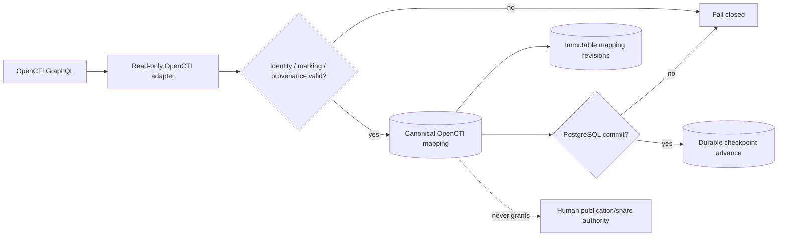

# DTMO Current Project State

Last reconciled: **2026-08-16**  
Software baseline: **16.0.0rc12 plus accepted post-RC13, E8 and Phase 11 repository enhancements**

## Executive summary

DTMO has completed Phases 1–7, RC13 functional acceptance and E8.1–E8.10 product evolution. RC13 is `PASS / OWNER_ACCEPTED`; E8.1–E8.10 are `PASS / REPOSITORY_COMPLETE`. Phase 8 is `PASS / OWNER_ACCEPTED` and Phase 9 is `PASS / EXTERNAL_ASSURANCE_ACCEPTED` for the earlier candidate. Phase 10 concluded **`NO-GO / BLOCKED — PLATFORM INDUSTRIALISATION REQUIRED`**. DTMO is **not production authorized**.

The active programme is **Phase 11 — Platform Industrialisation**. Phase 11.1–11.2 Taranis and Phase 11.3 IntelOwl are `PASS / REPOSITORY_COMPLETE`. The Phase 11.4 OpenCTI contract and read-only adapter are `PASS / REPOSITORY_COMPLETE`. The active bounded objective is **Phase 11.4 OpenCTI canonical mapping/persistence + operational integration**, currently `IN PROGRESS / EXACT-HEAD VALIDATION REQUIRED`.

## Lifecycle position

| Stage | Status |
|---|---|
| Phases 1–7 | `PASS` |
| RC13 + owner retest | `PASS / OWNER_ACCEPTED` |
| E8.1–E8.10 | `PASS / REPOSITORY_COMPLETE` |
| Phase 8 | `PASS / OWNER_ACCEPTED` |
| Phase 9 | `PASS / EXTERNAL_ASSURANCE_ACCEPTED` |
| Phase 10 | `NO-GO / BLOCKED — PLATFORM INDUSTRIALISATION REQUIRED` |
| Phase 11 | `IN PROGRESS / ACTIVE` |
| Phase 11.1 Taranis architecture/contract | `PASS / REPOSITORY_COMPLETE` |
| Phase 11.2 Taranis adapter | `PASS / REPOSITORY_COMPLETE` |
| Phase 11.3 IntelOwl contract | `PASS / REPOSITORY_COMPLETE` |
| Phase 11.3 IntelOwl adapter | `PASS / REPOSITORY_COMPLETE` |
| Phase 11.3 governed execution/persistence | `PASS / REPOSITORY_COMPLETE` |
| Phase 11.3 IntelOwl integration | `PASS / REPOSITORY_COMPLETE` |
| Phase 11.4 OpenCTI contract | `PASS / REPOSITORY_COMPLETE` |
| Phase 11.4 OpenCTI read-only adapter | `PASS / REPOSITORY_COMPLETE` |
| Phase 11.4 OpenCTI canonical mapping/persistence | `IN PROGRESS / EXACT-HEAD VALIDATION REQUIRED` |
| Phase 12 | `NOT STARTED` |

## Accepted integration capabilities

Phase 11.2 provides the repository-complete Taranis read-only canonical integration with durable checkpointing/reconciliation, detail/CTI retrieval, governed execution, canonical persistence/indexing and observability.

Phase 11.3 provides the repository-complete IntelOwl service boundary, bounded enrichment adapter, human-authorized `REVIEW_INTELLIGENCE` execution and durable enrichment history. IntelOwl results never grant external-share authority or prove local compromise.

The accepted Phase 11.4 OpenCTI read adapter performs bounded GraphQL `stixCoreObjects` retrieval with explicit stable OpenCTI/STIX identity, entity allowlists, markings, confidence, external references, provenance and durable checkpoint semantics. Retrieval alone never advances the checkpoint.

## Active Phase 11.4 persistence slice

The active slice adds PostgreSQL-backed canonical OpenCTI mapping and immutable reconciliation history. `opencti_object_mappings` stores current attributed mappings between a DTMO intelligence item and stable OpenCTI/STIX identity. `opencti_mapping_revisions` stores immutable snapshot history keyed by SHA-256 snapshot hash.

Reconciliation is idempotent: unchanged replay does not duplicate revisions; changed attributed state creates a new immutable revision. Identity drift fails closed when a known OpenCTI internal ID changes STIX identity or a known STIX ID changes OpenCTI internal identity.

Database constraints preserve `external_share_authorized=false` and `local_compromise_proven=false`. Markings, confidence, timestamps, external references and provenance remain attributable.

The persistence coordinator commits PostgreSQL before calling `commit_page(page)`. If the database commit fails, the checkpoint remains unchanged. If checkpoint replacement fails after database commit, replay remains safe through stable identity and snapshot-hash idempotency.

Migration `0012_opencti_mapping_persistence` follows `0011_intelowl_enrichment_history`.

## Data and persistence model

- **PostgreSQL** — canonical DTMO application/intelligence/RBAC state, IntelOwl enrichment history and OpenCTI mapping/revision history;
- **OpenSearch** — supporting search/index representation;
- **S3-compatible object storage** — raw source/evidence objects;
- **Redis** — queue/cache/runtime coordination;
- **Prometheus/Grafana** — operational observability;
- **OpenCTI** — separate STIX knowledge-graph service, not a replacement for DTMO canonical truth;
- **OpenCTI checkpoint** — durable cursor state that advances only after successful database persistence.

## Security and authority model

Server-side RBAC, least privilege, human/service separation, provenance, data minimization and explicit review/share approval remain authoritative. Taranis, IntelOwl and OpenCTI cannot grant DTMO publication/share authority. Graph presence, confidence or upstream labels do not prove local exposure, exploitability, compromise or attribution certainty.

Routine OpenCTI integration requires a dedicated non-human identity with minimum read capability and approved markings. Administrator/bypass capabilities and connectors are outside the routine boundary. Authorization, malformed identity/marking/STIX, ambiguous mapping and corrupt checkpoint state fail closed.

Phase 11.4 does not authorize OpenCTI connector registration, MISP synchronization, external enrichment, TheHive case creation, report publication, security/marking administration or arbitrary GraphQL mutations.

## Governance and framework model

Framework relationships remain explicit, versioned and provenance-backed. DTMO includes relationships to Normenkader IBP, MITRE ATT&CK and NIST CSF and uses CVSS as vulnerability-scoring context. OpenCTI graph context does not become a blanket governance/compliance claim.

## Phase 11 fixed order

1. Taranis AI — `PASS / REPOSITORY_COMPLETE` through Phase 11.2;
2. IntelOwl — `PASS / REPOSITORY_COMPLETE` for Phase 11.3;
3. OpenCTI — active Phase 11.4 canonical persistence/operational integration;
4. MISP consolidation;
5. TheHive;
6. Cortex only if IntelOwl cannot satisfy a validated requirement;
7. Kubernetes/Helm/GitOps and integrated runtime hardening;
8. migration/compatibility;
9. new production-equivalent validation;
10. new independent external assurance;
11. Phase 12 formal production GO/NO-GO.

## Licensing boundary

Taranis, IntelOwl and OpenCTI remain separate services under their applicable licenses. IntelOwl/pyIntelOwl remain AGPL-3.0 service/API boundaries. OpenCTI Community Edition is Apache-2.0 while Enterprise Edition is separately licensed. No Phase 11 slice implicitly authorizes vendoring or unapproved licensed features.

## Evidence boundary

Professional current-state documents describe the present controlled state. Historical records remain scoped to the candidate and time they originally covered. Repository/CI evidence for this OpenCTI slice can prove schema, synthetic reconciliation behavior, ordering and documentation synchronization only; it cannot prove live OpenCTI connectivity, deployed service identity/markings, production graph correctness/performance, privacy approval, HA/recovery, independent assurance or production authorization.

Fresh Phase 11.10 production-equivalent validation and Phase 11.11 independent assurance remain required before Phase 12.
